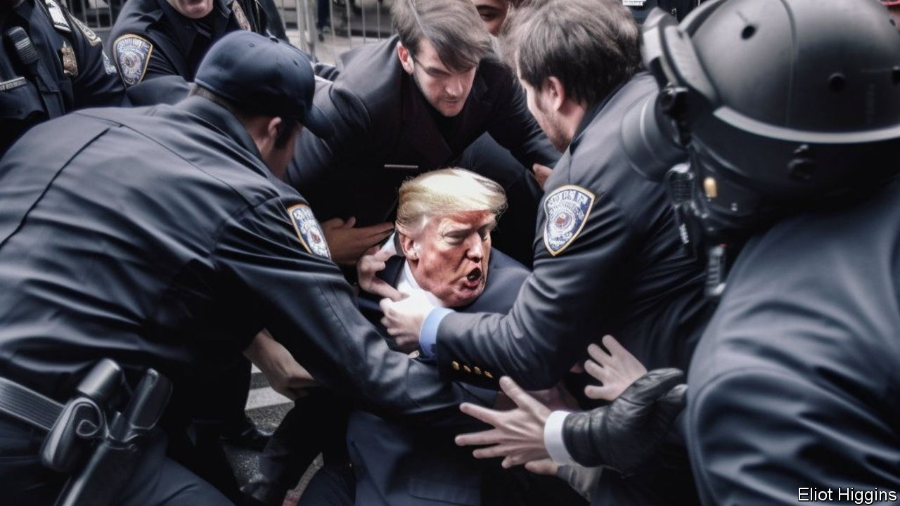
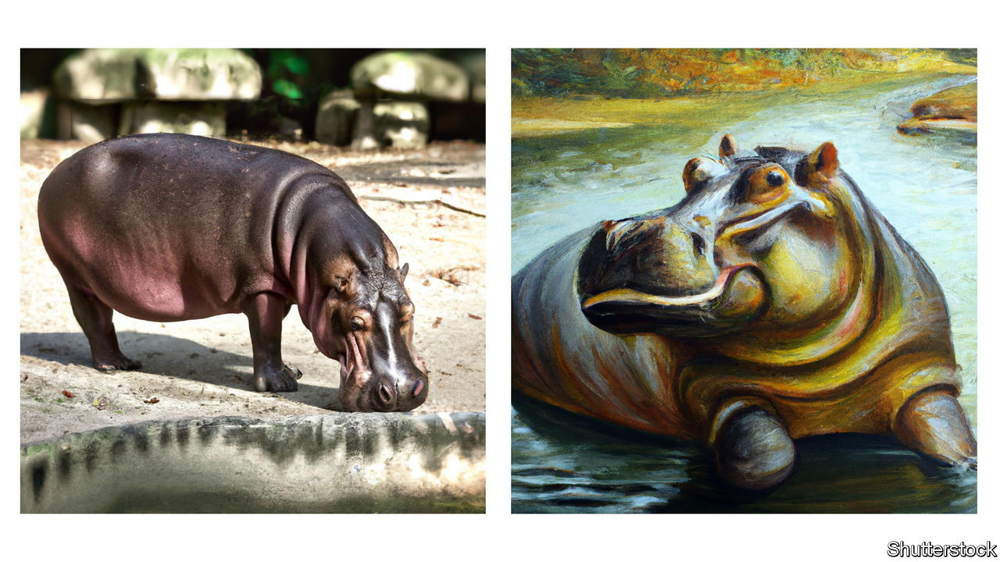

###### The Economist explains

# How AI image-generators work 

##### Some are getting good enough to fool humans 

 

> Jul 10th 2023 

THE FLURRY of images generated by artificial intelligence (AI) feels like the product of a thoroughly modern tool. In fact, computers have been  for decades. In the early 1970s Harold Cohen, an artist, taught one to draw using an early AI system. “AARON” could instruct a robot to sketch black-and-white shapes on paper; within a decade Cohen had taught AARON to draw human figures. 

Today “” models put brush to virtual paper: publicly available apps, such as Midjourney and OpenAI’s DALL-E, create images in seconds based on text prompts. The final products often dupe humans. In March AI-generated images of Donald Trump being handcuffed by police went viral online. And image generators are improving fast. How do they work—and how are they refining their craft?

Generative-AI models are a type of deep learning, a software technique that uses layers of interconnected nodes that loosely mimic the structure of the human brain. The models behind image-generators are trained on enormous datasets: LAION-5B, the largest publicly available one, contains 5.85bn tagged images. Datasets are often scraped from the internet, including from social-media platforms, stock-photo libraries and shopping websites. 

The most advanced image-generators typically use a type of generative AI known as a diffusion model. They add distorting visual “noise” to images in the dataset—making them look like an analogue TV still disrupted by static—until the pictures are completely obscured. By learning how to undo the mess, the model can produce an image that is similar to the original. As it becomes better at recognising groups of pixels that correspond to particular visual concepts, it starts to compress, categorise and store this knowledge in a mathematical pocket of code known as the “latent space”.

Let’s say you ask a generator app to create a picture of a hippopotamus. A model that has learned which types of pixel arrangement correlate to the word “hippopotamus” (see picture, left) should be able to sample from its latent space to create a realistic image of the mammal. Adding more detail to the prompt—for example, “a renaissance-era oil painting of a green hippopotamus, somewhere along the river Nile” (see picture, right)—requires the model to source additional layers of visual detail, such as image style, texture, colour and location, and to combine them correctly. 

 


The responses to complicated prompts can be erratic, particularly if the prompt is not clearly phrased or the scene it describes is not well represented in the training dataset. Even seemingly simple fare can trip models up. Human hands are often depicted with missing or extra fingers, or proportions that appear to bend the rules of physics. Because hands are usually less prominent than faces in photographs, there are smaller datasets for AI models to hone their technique on. Dodgy facial symmetry—especially inconsistencies in colour and shape between eyes, teeth and ears—is another sign of a machine’s work. And image generators struggle with text, often creating non-existent letters or imaginary words. 

Developers can help models to learn from their mistakes by refining the datasets that they are learning from or by tweaking algorithms. Midjourney was recently updated to improve the way it generates hands. Rapid improvements mean that telling an AI-generated image from a real photograph or painting may soon become impossible. ■

