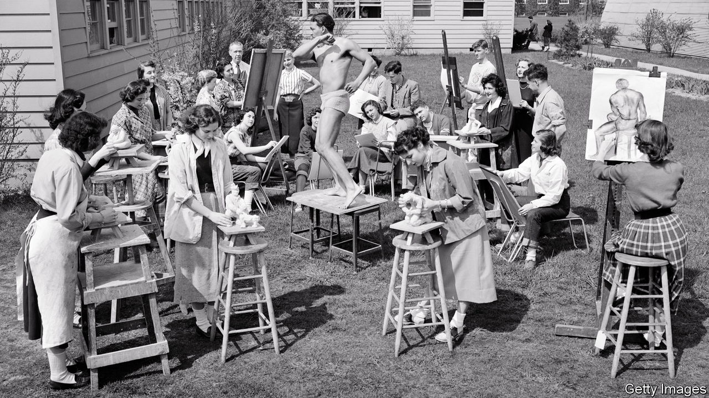

###### Promethean sparks

# What to read to become more creative 

##### Five books that define creativity and tell you how to inspire it 

 

> Jul 12th 2023 

CREATIVITY IS BOTH prized and puzzling. Although associated with certain qualities—imagination, originality, artistic flair—it defies easy definition. Many philosophers contend that if a product (an artwork, a technological invention, a mathematical solution or a mere idea) is creative, it must be both new and valuable. Intention is also important: most would agree that a snowflake is not creative, nor  composed by . But beyond that there is little consensus. Explanations for where it originates range from the dreaming subconscious to wide-eyed attentiveness; from ponderous reflection to the bright flash of insight; from godly inspiration to grinding toil. Plato wrote that poets are inspired by the Muses in a divine madness, whereas Aristotle considered their work to be rational and focused on outcomes. Immanuel Kant thought creativity had to be both “original”—since “there can be original nonsense”—and “exemplary”, born of an innate imaginative capacity. For Friedrich Nietzsche it was a balancing act between a “Dionysian” ecstasy and “Apollonian” robustness. 

Yet creativity is enormously . A poll of over 1,500 CEOs in 2010 ranked it as the most important leadership quality for success in business; the World Economic Forum has called creativity “the one skill that will future-proof you for ”. Nor is it just lucrative: creativity promises self-fulfilment, happiness and moral good in and of itself. These books provide clarity on what it is and where to find it. 

By Graham Greene. 

Graham Greene wrote 25 novels, several collections of short stories, and numerous plays and memoirs. Few people would associate him with “creative blockage”. Yet in his 50s that is what he experienced. Salvation emerged in the form of a “dream diary”, in which he let his imagination run unbounded by the strictures of external judgment. “There are no witnesses,” Greene wrote in the introduction to “A World of My Own”, a selection of his favourite dreams that was published in 1992, shortly after his death. “No libel actions. The characters I meet there have no memory of meeting me, no journalist or would-be biographer can check my account with another’s.” Despite featuring Prince Philip in a scoutmaster’s uniform and Pope John Paul II in a hotel room, the dreams are mostly quotidian: there is “never terror, never nightmare” writes Greene, nor “the erotic side of life”—which at points makes for rather dull reading. But the book is a reminder that it is possible to rise above the quicksand of creative block by freeing oneself from the impulses of perfectionism and self-doubt. 

By Julia Cameron. 

“The Artist’s Way” is something like a 12-step programme suffused with the spirituality of a yoga retreat, but readers should not let that put them off. As a creativity manual it is remarkably practical, sanguine and democratic. Ms Cameron recommends two practices for “artistic recovery”: the morning pages, a daily ritual of writing three sides of paper of stream-of-consciousness, and “artist dates”, solo expeditions to inspire creative connections through frivolity each week. The remaining 11 chapters, intended to be worked through a week at a time, include exercises to spur inspiration and mitigate self-doubt in a “teachable, trackable” manner. Anyone can be an artist, Ms Cameron passionately affirms, so long as they manage to unblock their artistic sensibility through practical exercises. The book is now something of a cult classic: it has sold over 5m copies, after a surge in sales during the pandemic, with creative types including Alicia Keys and Patricia Cornwell lauding it as the source of their success.

 By Scott Barry Kaufman and Carolyn Gregoire. 

When painting his masterpiece “Guernica”, Pablo Picasso created dozens of numbered sketches. These images, made of ruptures and returns, depicted versions of each of the figures that would appear in the final work. There was no clear progression: some of the first images he sketched appeared in the piece, and he reworked them even once he’d started painting. For Scott Barry Kaufman, a cognitive psychologist and scientific director of the Imagination Institute at the University of Pennsylvania, and Carolyn Gregoire, a science writer for the , Picasso’s process is symbolic of the chaotic act of creation: “It’s likely that Picasso did not quite know where he was going, creatively, until he arrived there.” In this fascinating tour of recent research into creativity, they find that its impulse is rarely, if ever, ordered or linear. Instead it “is a process that reflects our fundamentally chaotic and multifaceted nature”. Charting recent developments in neuroscience and psychology, they focus on ten things that highly creative people do differently, from daydreaming to cultivating solitude. The result is a lively, inspiring and scientifically rigorous glimpse into the workings of the creative mind. 

 By Albert Read. 

Albert Read, a director of Condé Nast Britain, a media company, is an egalitarian: in his eyes the imagination—and its expression, creativity—is a “muscle” that can “be trained and developed” and “will become supple once prodded into the rhythm of action.” This book is a beautifully written meditation on how to go about it. Sweeping from a 73,000-year-old drawing on a stone in the Blombos Cave, the world’s earliest known sketch, to the modern corporate world, Mr Read attempts to pin down the imagination’s “constant mercurial nature; how it evolves in power and shape”. He does not quite succeed: the book is more convincing when revelling in the imagination’s power and importance than when dissecting precisely how it works. But it is a moving hymn to creativity that can act as its own “Promethean spark that ignites the imaginative flame”. 

. By Samuel Franklin. 

Where did the concept of creativity come from? And why is it valued so highly? One answer is posited by Samuel Franklin’s provocative new book. Mr Franklin, a cultural historian at Delft University of Technology, argues that today’s idea of creativity was invented in the 1950s as “a psychological cure for these structural and political contradictions of the post-war order”. Although the idea of imagination has been around since time immemorial, the first known written instance of “creativity” appeared in 1875, and people only began to refer to it regularly from the mid-20th century. Mr Franklin cogently argues that creativity became a buzzword because it was a way to retool white-collar workers for a service economy—one that rewarded branding, research and development instead of Fordian manufacturing. “The concept of creativity,” he concludes, “never actually existed outside of capitalism.” Meanwhile it was adopted by politicians as a way to emphasise corporate America’s individualism in contrast with Soviet conformity, and by psychologists as a means of curing post-war feelings of alienation. Tracing its history, Mr Franklin maps how creativity became viewed by artists, CEOs, tech bros and kindergarten teachers as “a cult object, something we project all of our desires and anxieties onto, imbued with almost mystical powers, and beyond rebuke”. His book is an antidote for anyone who has sat, pen in hand, struggling to locate their “divine muse”. 


’s Bartleby columnist has argued that  is the best way to unlock creativity in the workplace. Last year we reviewed a book that examined . And in 2021 our culture correspondent looked at how the covid-19 pandemic .

