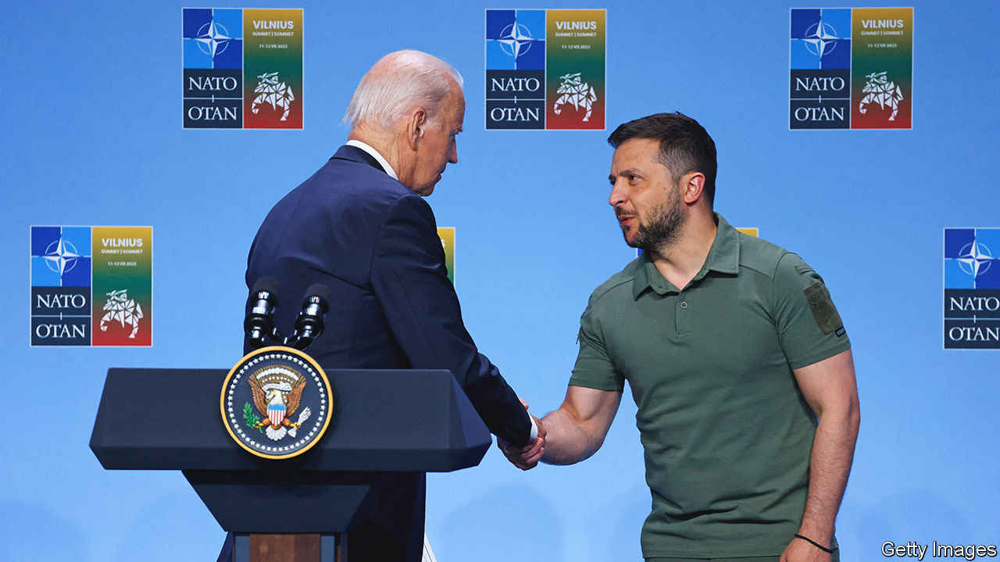

###### The world this week

# Politics 

#####  

 

> Jul 13th 2023 

 held a summit in Vilnius, the capital of Lithuania, which was dominated by Ukraine’s ambition to join the alliance. Amid resistance from some members, notably America and Germany, to give a firm timetable, NATO issued a pledge that Ukraine will join, but only when “allies agree and conditions are met”. It was, however, promised as an accelerated process. More important was a pledge by the G7 that its members will each offer Ukraine enduring commitments to provide it with the weapons it needs to defend itself from Russia during and after the war, as well as help with rebuilding its economy.

 president, Recep Tayyip Erdogan, said he would now support  bid to join NATO, reversing months of opposition as the last country in the alliance to resist its membership. Before changing course, Mr Erdogan was widely condemned for suggesting that he would only support Sweden if the EU opened new talks on Turkey’s ambition to join the bloc. America provided a different incentive, promising to “move ahead” with supplying F-16 fighter jets to Turkey. 

Before the  America announced that it would provide Ukraine with  to use in its fight against Russia. Joe Biden said the decision had been difficult, given the risk to civilians from their use. Ukraine’s defence minister gave assurances that the cluster bombs would not be used in urban areas. 

Vladimir Putin met Yevgeny Prigozhin just five days after the aborted mutiny of Mr Prigozhin’s , according to the Kremlin’s spokesman. The meeting, which Wagner’s top commanders also attended, was held in Moscow. 

Exit, stage centre-right

The  collapsed, after the parties in the ruling coalition failed to agree on immigration policy. Mark Rutte, the prime minister, had wanted to toughen the entry requirements for some migrants. He has said he will quit politics following a general election in November, ending the career of one of Europe’s canniest operators. Mr Rutte has been prime minister of the Netherlands since 2010, managing to hold often fractious coalitions together. 

The  population rose by 2m to 448m in 2022, the first increase since the for two years following the pandemic. More people still died than were born, but migration made up the shortfall. Germany’s population rose by 1.1m people, to 84.4m.

A month after hosting NATO’s biggest ever air exercise,  said it would for the first time send troops to  to participate in war games involving principally American and Australian forces that are held once every two years. The Talisman Sabre exercise, which includes troops from Japan, South Korea and elsewhere, always unnerves China.

China signed a “comprehensive strategic partnership” with the , which will include more Chinese help for the Pacific nation’s police force. China is also building a telecoms network across the islands. Last month the Solomons’ prime minister, Manasseh Sogavare, called for a review of his country’s defence arrangements with Australia, which has long been an ally and aid provider.

 test-fired an intercontinental ballistic missile, which fell into the sea short of Japanese waters. In its latest flurry of sabre-rattling, North Korea has ranted against what it describes as “air patrols” by American aircraft off the Korean peninsula.

Pita Limjaroenrat’s bid to become  prime minister failed in the first round of voting in parliament, which recorded around 200 abstentions. Mr Pita’s pro-democracy Move Forward party claimed the most seats in May’s general election and he has the support of other reformist parties. He needs the votes of half of the 749 lawmakers in parliament to become prime minister, but is being fiercely resisted by parties aligned with the conservative military establishment. 

At least ten people were killed in election-day violence in . The Indian state went to the polls to choose rural councils. Dozens of people have died in violence in the state since the election date was called a month ago. 

At the UN Security Council Russia used its veto to block a nine-month extension of a deal that allows aid to cross from Turkey to north-west . Others had pushed for a year-long extension but Russia, which is a key ally of the Syrian government, has said it will accept only six months. 

 


Mahmoud Abbas, the  president, went to the city of Jenin in the occupied West Bank for the first time in over a decade. His visit came a week after an Israeli incursion into Jenin refugee camp, which Mr Abbas vowed to rebuild. The Palestinian Authority has lost influence and power in the territory in recent years.

 Knesset approved the first reading of a controversial judicial-reform bill. Binyamin Netanyahu, the prime minister, had removed one of the most contentious parts of the bill that would have allowed parliament to overrule Supreme Court decisions with a simple majority. But protests still broke out around Israel.

The army-aligned faction involved in  civil war, which broke out in mid-April, said it would not attend a peace conference to be held under the auspices of the Intergovernmental Authority on Development in eastern Africa. America and Saudi Arabia, which had previously arranged a series of short-lived ceasefires, have suspended their peace efforts. So there is no sign of an end to the war.

In  a senior prosecutor persuaded a court to ban the party of Bernardo Arévalo, an anti-corruption presidential candidate who is to face Sandra Torres, a former first lady, in a run-off on August 20th. Mr Arévalo said the court’s decision was “spurious” and would not stop him from contesting the election. Confirmation of the results of the first round had been delayed, raising suspicions that the country’s elite is trying to thwart Mr Arévalo’s anti-graft campaign. 

Pemex,  state oil firm, will probably lose at least 2m barrels of oil this month after a huge fire at an offshore platform, according to reports, which also say that Mexico’s oil regulator failed to collect three fines issued against the company. President Andrés Manuel López Obrador sees Pemex as a vital part of the country’s attempts to become self-sufficient in energy. It is the world’s most-indebted oil company.

America applied sanctions to ten individuals and a firm in Mexico in an attempt to slow the supply of , one cause of America’s opioid epidemic. Some of those on the list are connected to the Sinaloa cartel, which is run by “Los Chapitos”, the collective name for the sons of Joaquín “El Chapo” Guzmán, who is in prison in America. 

The US Marine Corps was left without a leader because a Republican senator from Alabama is holding up the confirmation of  to their posts in a row over the Pentagon’s policy of supporting abortions for female personnel. Tommy Tuberville argues that he, and not the Defence Department, has been elected to represent his state. 

Huw and cry

Following days of intense media speculation, Huw Edwards, the BBC’s most famous , was revealed to be the man who allegedly made payments to a young person, who is now 20, for explicit photographs. The lurid affair has raised more questions about the state of British journalism. The young person’s lawyers said the claims, published in the  newspaper, were nonsense and the police ruled out any criminal charges. Mr Edwards has been admitted to hospital for mental-health treatment. 

