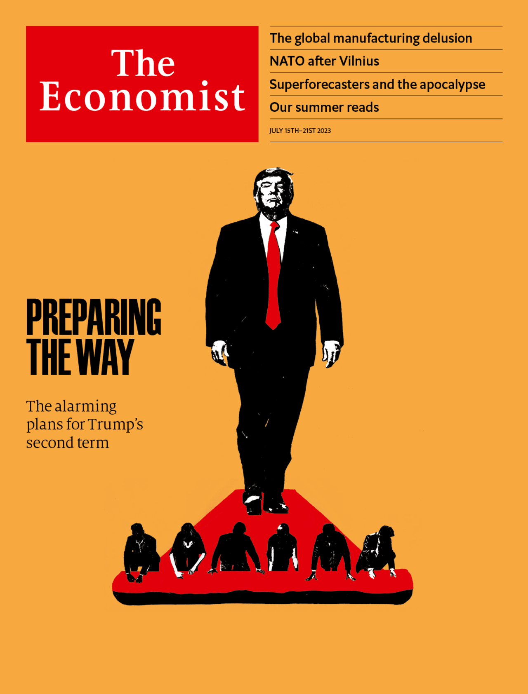

###### The Economist

# This week’s cover 

##### How we saw the world 

> Jul 13th 2023 

THIS WEEK’S cover ponders what a second Donald Trump presidency would look like. You might think victory in the general election would foreshadow even more chaos than last time. But in fact a professional corps of America First populists have been dedicating themselves to ensuring that Trump Two would be focused on getting things done. Policy documents set out ideas that were once outlandish in Republican circles but have now become orthodox. If these carefully laid plans were enacted, America would follow Hungary and Poland down the path of illiberal democracy. Should Mr Trump win, the deconstruction of the administrative state could begin.

 


: 

: 

