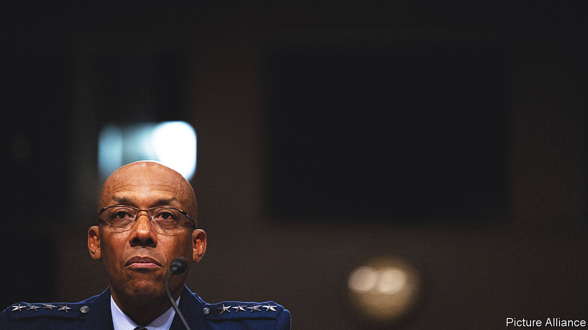

###### General disarray

# Abortion battle causes mayhem in America’s military ranks 

##### A senator takes the culture war to the armed forces 

 

> Jul 13th 2023 

The handsome white-painted house at 801 G Street SE, one of the oldest public buildings in Washington, DC, has been home to all but two commandants of the Marine Corps since 1806. This week, though, it has no occupant for the first time in more than a century. General David Berger, the outgoing chief, retired on July 10th. His deputy, Eric Smith, cannot move in because the Senate has not confirmed him. He holds the job in an acting capacity, with limitations, and has no deputy. 

Similarly his would-be boss, General Charles “CQ” Brown, the air-force chief, is in a holding pattern as the Senate delays his appointment to succeed Mark Milley as chairman of the joint chiefs of staff. All told, about 275 nominations of generals and flag officers, including front-line commanders, have been halted. About 650 are liable to be stymied by the end of the year, with a knock-on impact down the chains of promotion, not to mention the disruption to staff and families. 

The world’s mightiest fighting machine finds itself obstructed by a former college-football coach, Tommy Tuberville, a Republican senator from Alabama. A devotee of the former president, Donald Trump, he has struggled to decide whether white nationalists are racists. “Coach” Tuberville’s reason for running interference against military officers? To protest against the Pentagon’s policy of giving leave to, and paying the travel expenses of, servicewomen seeking abortions outside the states where they are deployed. 

His “hold” on senior appointments is the most disruptive act yet in Republicans’ efforts to take the culture wars to the military domain, after skirmishes over vaccines, race and transgender issues. Democrats accuse the senator of harming military readiness and morale. Mitch McConnell, the Republicans’ Senate leader, rejects his move; other Republicans have tried to talk him out of it. All to no avail.

Senator Tuberville claims his hold affects “only those at the very top”, not the fighting force. General Brown disagrees. “We will lose talent,” he told senators on July 11th. It is hardly the first time a senator has halted confirmations for political leverage. But Peter Feaver of Duke University notes that military appointments are treated with greater regard than civilian ones. They may be blocked over allegations of improper behaviour, say, but not usually on a matter of policy or on such a scale. “This senatorial privilege is meant to be surgical. Instead it’s being used as a broadaxe,” he says.

The Supreme Court’s overturning last year of , allowing states to ban or curtail abortion, affected many servicewomen deployed to conservative states. Under federal law the Pentagon can still offer abortions in cases of rape, incest or when the mother’s life is in danger. Senator Tuberville objects to the Pentagon’s decision in February to “facilitate” travel for out-of-state abortions. This amounts to using federal funds to “subsidise” elective abortion in contravention of the Hyde amendment, he argues.

Military appointments are usually confirmed briskly in batches by “unanimous consent” of the Senate. If a member voices an objection, as Senator Tuberville has done 11 times, the Senate can still confirm nominees by the more laborious means of individual votes on each candidate. That takes up valuable floor time from other priorities, such as legislation. Another option, formalising the Pentagon’s policy through legislation, is unlikely to pass in a divided Congress. With both sides dug in, Democrats will hope to gain if Republicans soil their reputation as champions of the armed forces.

Mr Feaver proposes giving “military non-combatants immunity in the culture wars”. Politicians can challenge civilians who decide on policy, but not serving officers who implement it. In return, military folk should stay out of politics. General Brown, the second African-American officer ever to be nominated for the top job, promises to do just that. “I didn’t want to be the best African-American F-16 pilot. I wanted to be the best F-16 pilot,” he told his confirmation hearing. If Coach Tuberville has his way, though, General Brown will be grounded for some time. ■


