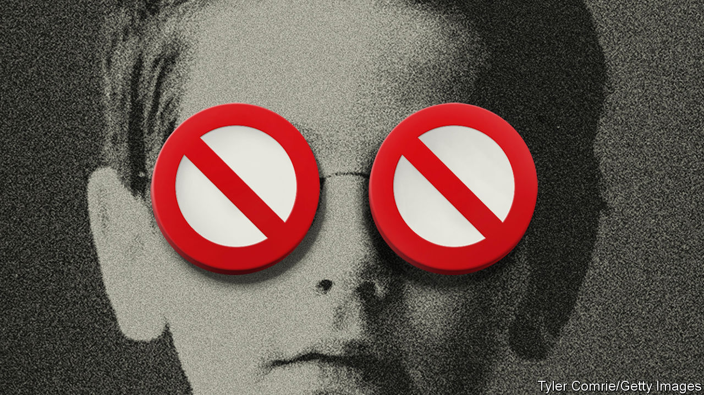

###### Age verification on porn sites

# America’s state lawmakers are passing ineffective anti-porn laws 

##### Bills that do not do what they advertise have bipartisan support 

 

> Jul 13th 2023 

“Is anyone else’s Pornhub not working?” tweeted the mischievous grey-haired grandma and state senator L. Louise Lucas of Virginia on June 30th. Mrs Lucas knew that the website would stop working for her and millions of Virginians that weekend. Virginia, along with Mississippi, Utah and Louisiana, passed a law this year requiring users to prove they are an adult before accessing pornographic websites. Arkansas, Montana and Texas have similar policies that will go into effect over the coming months.

Supporters of these laws claim that they will protect children. “This is about not putting children in harm’s way,” says William Stanley, junior, a Virginia state senator and the bill’s author. There is just one problem: the laws do not seem to work.

Lawmakers hoping to stop minors from watching pornography face several obstacles. First, porn enthusiasts of all ages seem intent on getting around the new laws. The day before Virginia’s policy went into effect on July 1st, interest in the search term “VPN” (a virtual private network allows users to appear as if they are watching outside a state with age-verification laws) spiked in Virginia.

Those users who might be willing to follow the laws seem worried about companies or governments keeping records of their proclivities. In Louisiana, a state-run identification programme called LA Wallet verifies a user’s age. The other three states–Mississippi, Utah and Virginia–require websites to collect the sensitive data.

Few adults want to out themselves as porn enthusiasts by offering up an ID (with full name, address, and photograph). In any case, MindGeek has now pre-empted that by blocking access in some states that require age verification. “We will not operate in jurisdictions that require that we put people’s private information at risk,” says Solomon Friedman, one of the owners of MindGeek, which owns several pornographic websites (and therefore has a commercial interest in making users feel as anonymous as possible online).

Why are state legislatures passing these ineffective laws, mostly with bipartisan support (and at times, unanimous backing)? It is just too awkward for politicians from either party to be seen to be casting a vote for porn. “I think they’re concerned that someone’s going to accuse them of supporting…children seeing pornography,” says John Edwards, a Virginia state senator. He and only two other legislators voted against Virginia’s bill. 

Mandie Landry, a Louisiana state representative, says that her colleagues are afraid of negative campaign headlines. “I can take a vote like that,” says Ms Landry, who represents a heavily Democratic district. “But my colleagues from rural areas can’t do it.” She was the lone dissenting vote in Louisiana’s legislature.

American states are not alone in their struggle to come up with laws that work. A similar law passed in Britain in 2017 has yet to be enforced. Australia’s government is struggling to find suitable methods to verify age for its new policy. On July 7th a French court postponed enforcement of a law that would have blocked porn sites. “The intention behind these laws is good,” says Amanda Lenhart of Common Sense Media, which advocates for child safety in the media. But making them work is another matter. ■


