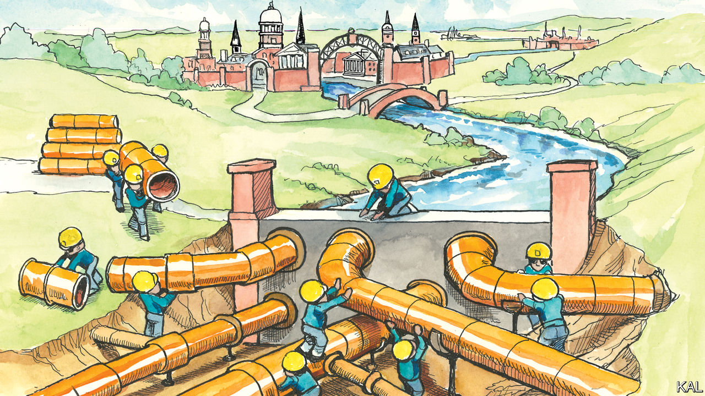

###### Lexington

# Joe Biden should run against the Ivy League 

##### The Supreme Court has given him the chance to restore his party’s commitment to uplift for all 

 

> Jul 12th 2023 

One evening many years ago, when his sons were in grade school, Joe Biden was sitting around with old friends in a backyard in his home town of Wilmington, Delaware. He startled the group by asking one of them where he planned to send his own child to college. The boy was just eight, protested one of the friends. Another observed there were plenty of good universities. 

“Lemme tell you guys something,” Mr Biden replied with sudden intensity, according to “What It Takes”, by Richard Ben Cramer. “There’s a river of power that flows through this country.” Most people did not even know about this river, while others could only stand by its banks and gawk. But a few Americans, Mr Biden continued, got to swim in the river of power their whole lives, and go wherever they wanted to. “And that river”, he concluded, “flows from the Ivy League.”

Mr Biden, a mediocre student at the University of Delaware and Syracuse University College of Law, has always exhibited a mix of reverence and disdain for America’s educated elite and the system that credentials them. He has surrounded himself with graduates of the Ivy League—and did indeed send his sons to such schools, one for college and the other for law school—but he has boasted about going to a state university himself. Since his first campaign for Senate, in 1972, he has prided himself on resisting the pull of progressive orthodoxy he associated with elites from Harvard. 

Over the course of Mr Biden’s career, for the best of reasons, diversifying access to the river of power, and to college in general, became core ambitions of his party. Yet something went wrong with this project: diversifying access turned out not to be the same as democratising it. Barack Obama incarnated the vision of the multiracial meritocracy that affirmative action could yield, whether or not he benefited from it, yet this meritocracy began courting hypocrisy by reinscribing itself. As Mr Obama has noted, it was not obvious his children merited such intervention. And people without a college education, or the means or interest to pursue one, began to feel out of place among Democrats. Yet the Democrats’ growing identity as the party of the college-educated, and their orthodoxies about college, proved mutually reinforcing.

Now, by striking down both affirmative action in university admissions and Mr Biden’s bid to forgive a portion of students’ loans, the Supreme Court has handed the president a chance to reset his party’s priorities. He seems to recognise half the opportunity. Mr Biden said he strongly disagreed with the ruling on affirmative action in remarks at the White House in late June. But he was at least as harsh in condemning the existing admissions system for not achieving diversity. 

“For too many schools, the only people who benefit from the system are the wealthy and well-connected,” he said, noting that children of the wealthiest 1% of families were 77 times more likely than those of the poorest 20% to attend an elite university. “The odds have been stacked against working people for much too long.” Quite right: before conservatives beat him to it, Mr Biden should campaign against the Ivy League’s inconstant piety about diversity and inclusion, given its veneration for inherited privilege when it comes to alumni scions, its excessive preference for athletes and its tolerance for intolerance, which is rotting the old timbers beneath the Democratic Party. 

Mr Biden made no such pivot in reaction to the court’s dismissal of his plan to forgive $10,000 in student debt for all borrowers making less than $125,000 a year, and up to $20,000 for those who received Pell grants, mostly awarded to applicants from poor families. This is strange, since the court saved Mr Biden from what he once suggested would be an unconstitutional stretch of presidential authority. Democrats would not have liked to see a Republican president exploit the precedent, had the court blessed it. 

Student debts can be crushing. Relieving them is a goal cherished within the party. But Mr Biden’s plan would not fix the college-financing system. And in trying to give hundreds of billions of dollars to people who invested in their long-term prospects, Democrats lay themselves open to Republican attacks that they want to transfer money from the working class to elites, which should properly be understood as the Republicans’ stock in trade.

The “diploma divide” has become the dominant reality of American politics. In 2016 Hillary Clinton became the first Democrat since 1956 to win among white college graduates, and she carried them by 17 points, according to Doug Sosnik, a Democratic analyst. That bloc was central to Mr Biden’s victory in 2020, even as Donald Trump augmented his big majorities among white working-class voters with gains among black and Latino voters who lacked college degrees.

Can Democrats add?

Back in 2016, Chuck Schumer, the Democrats’ Senate leader, argued that “for every blue-collar Democrat we lose in western Pennsylvania, we will pick up two moderate Republicans in the suburbs in Philadelphia.” As Mr Trump’s election later showed, this is a perilous swap: many more voters lack college degrees than have them, so slight shifts against Democrats in this group have outsized impact, the analyst Ruy Teixeira has noted. This trade also dooms the Democrats to struggle for congressional majorities and to contest knife-edge presidential elections among a dwindling number of persuadable voters in a handful of states.

It is also creepy arbitrage for a party committed to diversity and uplift. The paradox of the Democrats’ success in the past half-century in helping advance female, black and gay Americans is that, over that time, the party drifted from its concerns about class, its impatience with the idea that only a select few should swim in the river of power. Given his instincts and credentials, his investments in rebuilding America and this assist from the Supreme Court, Mr Biden has the chance to start setting that right. ■


