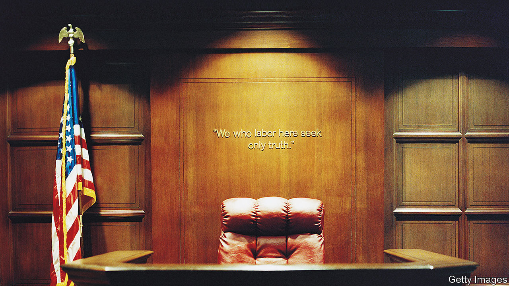

###### Justice delayed

# Judge and staff shortages are leaving Americans in limbo 

##### Many are not getting their day in court 

 

> Jul 13th 2023 

“CHILDREN are suffering,” says Toni Belford Damiano, president-elect of the Passaic County Bar Association. Judge shortages in New Jersey have caused trial delays, adding to a pandemic-related backlog. Families going through a divorce are struggling with uncertainty as they have to wait longer for custody hearings. In cases of domestic abuse, safety is a concern. “I’ve been doing this almost 40 years,” says Ms Damiano, a family-law practitioner. “Fairness requires timeliness.”

But a lack of judges—and, in many other states, a shortage of other staff needed to keep courts going—are clogging up the system. Tim McGoughran, head of New Jersey’s bar association, says that, pre-pandemic, most divorce cases going to trial did so within a year. Now some are entering their third or fourth year. For the past three years, the court system has operated with an average of more than 60 judicial vacancies. Stuart Rabner, the state’s chief justice, has said the number should be no higher than 25 or 30 for the judiciary to best serve the public. Of 463 positions on the trial-court bench in the state, 55 are vacant. 

And by the end of the year another 11 judges are due to retire. In February Justice Rabner suspended civil and matrimonial trials in six counties. On July 5th he suspended trials in a seventh, Passaic County, except for very limited circumstances, from July 31st. 

About half of America’s states appoint their judges, and half elect them. Vacancies tend to be low in election states. New Jersey is not one of them: the governor nominates judges and the state Senate confirms the nominees. Phil Murphy, the governor, is not making enough nominations and the state Senate is not confirming the nominees it does have fast enough. Some also blame an unwritten rule of senatorial courtesy, which allows senators to block nominees who live in their home county from being considered, without giving a reason. Glenn Grant, the court’s administrative director, warned a Senate committee that the system was in crisis. In the meantime petitioners are in limbo. Some lawyers have begun motioning for a change of trial venue. 

Even without the pandemic, a generational flip was under way. That has led to calls to raise the retirement age from 70 to 75, to relieve the pressure. But Mr McGoughran says more than 50% of those leaving are retiring early, “which says to me they are not enjoying judging”. Those judges who remain are burnt out.

“It is a cascading problem,” says Danielle Hirsch of the National Centre for State Courts (NCSC). New Jersey is not the only state that is feeling the pinch. Maine also has a shortage. Maine’s chief justice recently said that she met a judge who was discouraged “because she cannot make headway regardless of how many cases she jams into dockets or how late she works.” Poor pay plays a role in recruitment and retention: Maine’s judges are among the lowest-paid in the country. The state also has a shortage of court staff. Clerks work nights and weekends to catch up. Amy Quinlan, Maine’s court administrator, says the pandemic revealed that courts were struggling; it is now abundantly clear that more help is needed. 

Other states are also suffering from staff shortages. The gaps include court reporters, interpreters, attorneys, clerks and police. The NCSC found that 14 state chief justices raised staff shortages and the need for pay raises to recruit and retain talent as the most pressing issues facing state courts. Courts in Louisiana, Missouri and North Dakota have had to close or reduce hours. The turnover rate for court staff in Florida has more than doubled since the 2020-21 financial year. In New York, the acting chief judge said during his state-of-the-judiciary message this year that “staffing shortages slow down our dockets and burden our already-strained workforce.” 

These troubles are causing cases to remain on hold for long periods. A backlog in criminal cases will make it hard for states to meet their constitutional obligations. The Sixth Amendment requires that the accused “shall enjoy the right to a speedy and public trial”. Lately, there is nothing speedy about trials. ■ 


