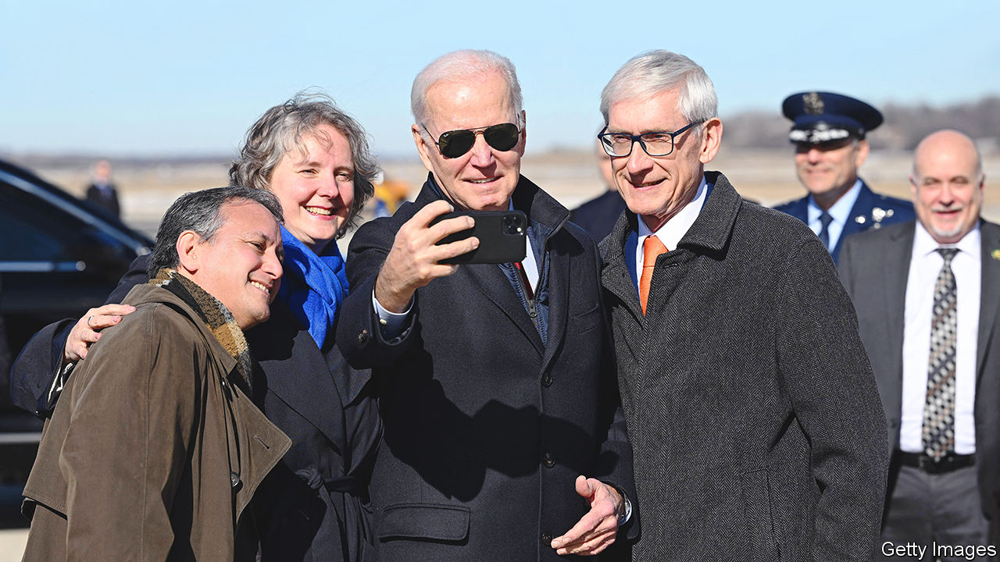

###### Veni, vidi, veto

# Tony Evers’s veto shows the growing power of Midwestern Democrats 

##### Will aggressive policymaking help or hinder the party? 

 

> Jul 13th 2023 

In an episode of “The Simpsons”, Lionel Hutz, a lawyer, takes a pen to a business card to wheedle out of a commitment. Instead of “no money down”, he inserts a comma and an exclamation mark to change the meaning: “No, money down!”. On July 5th Tony Evers, the white-haired Democratic governor of Wisconsin, took inspiration from Mr Hutz, when he used his veto pen to excise seven words, four numbers and a hyphen from the Republican-controlled state legislature’s proposed budget. In doing so, he changed a two-year increase of $325 in per-pupil school funding (and property taxes) into one that will instead last until 2425. This, Mr Evers’s office noted in a statement, would guarantee the uplift “effectively in perpetuity”.

The ability to exercise such a “line item” veto, transforming the meaning of a law by deleting individual words, is a quirk in Wisconsin law that gives unusual power to governors. Under the state’s constitution, a governor can choose to approve parts of a law, rather than merely rejecting or assenting to the entire thing. Mr Evers’s creative use of his pen is not new. Indeed until 1990, governors in the Badger State could delete not just whole words but individual letters, in effect to create entirely new laws. Yet in a state where the legislature is dominated by Republicans, it shows a level of assertiveness to get Democratic priorities into law. In that, it is typical of a newly emerging willingness across the Midwest by Democratic politicians to use the power they have as much as possible.

In Minnesota, the legislative session that ended in May was described by the state’s governor, Tim Walz, as the most successful “maybe in Minnesota history”. With a slim House majority and a majority of just one in the state Senate, the Democratic-Farmer-Labour Party (DFL), the state’s Democratic affiliate, passed laws to strengthen abortion rights and gun control, create a family-leave programme, legalise marijuana and pour money into education, green-energy infrastructure, public transport and housing. In Michigan, which has an equally thin Democratic trifecta, the legislature overturned a decade-old Republican “right to work” law (which constrains unions), expanded tax credits for low-income households and repealed the state’s 1931 ban on abortion.

This rush of legislation sets such states apart from more traditionally Democratic ones, such as New York, where plans by Kathy Hochul, the governor, to allow more housing construction broke down in April, or California, where internecine fighting over the budget dragged on until last month. According to Ken Martin, the chairman of the Minnesota DFL, the difference in the Midwest is that Democrats have tiny majorities they only recently acquired. That has acted as a unifier: “Power is fleeting,” and so “we have to use it where we can,” he says. That is true in Michigan too—a state that helped to deliver Donald Trump’s victory in 2016. 

John Mark Hansen, a political scientist at the University of Chicago, says Democrats in the region are “on a roll”. Years of Republican control in places like Wisconsin helped to motivate activists to get back power. Even when Democrats are not in power, they are finding innovative ways to assert themselves, says Mr Hansen. For example, in Ohio, on July 5th, activists dropped off 700,000 signatures calling for a referendum on abortion rights in the state—enough to ensure a vote will be held in November. In Michigan last year a referendum on abortion bolstered Democratic turnout, though unluckily for the party, Ohio holds only local elections this year. 

Can this assertiveness last? For now, Republicans are reeling. “They’re focused on these very divisive culture wars,” says Mr Martin, of his opponents. In Michigan, such is the state of discord among Republicans that on July 8th a meeting of party officials ended in a physical fight. Even in Wisconsin, the long-standing Republican control of the legislature is threatened by a shift in the balance of power on the state’s Supreme Court. Yet as Mr Martin says, power can quickly switch back. That is why it has to be used. ■


