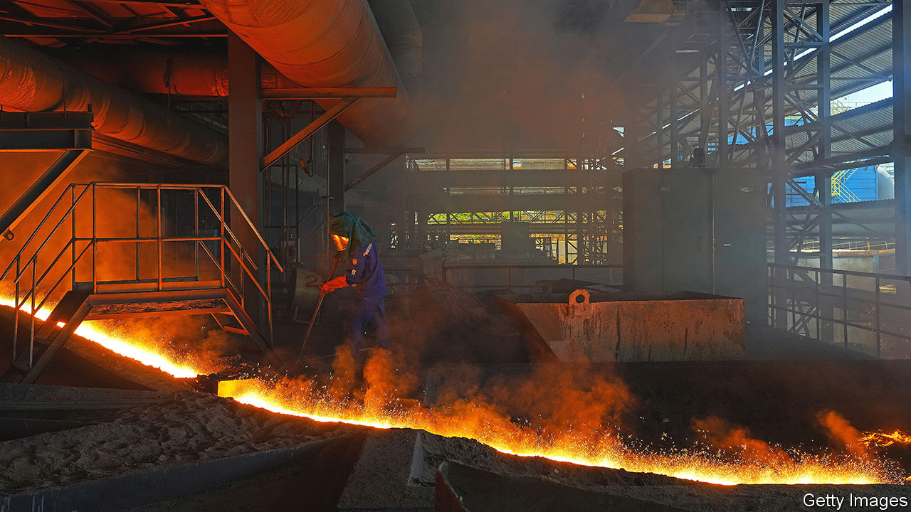
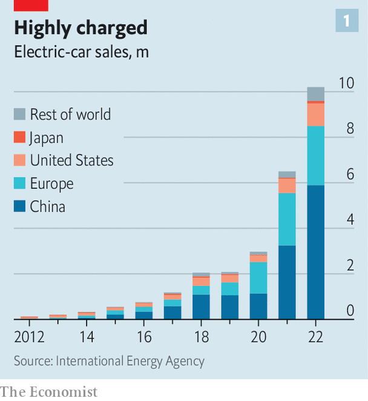
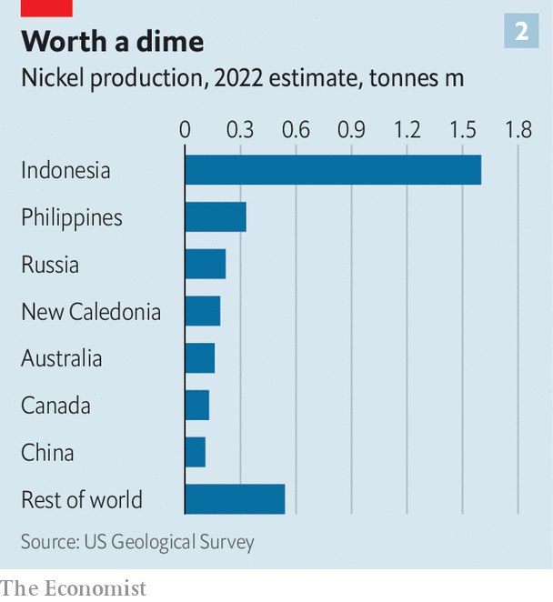

###### Asia’s battery battlefield

# A battery supply chain that excludes China looks impossible 

##### Green industrial policy and hawkish security policies are clashing 

 

> Jul 17th 2023 

“I’d like to get all the gas emissions off the highways of the world,” said John Goodenough, one of the Nobel-prize winning scientists who developed the lithium-ion battery four decades ago, during an interview in 2018. Goodenough died on June 25th before his dream could become reality. But governments around the world are scrambling to make it so, with remarkable results. Global sales of  quintupled between 2019 and 2022, surpassing 10m units last year.

Yet the speed of the transformation is running into supply constraints and geopolitical headwinds. The supply of the minerals required to make lithium-ion batteries must grow by a third every year this decade to meet the estimated global demand. Tens of millions of batteries will be needed in America alone to meet its ambition to ensure half of all American vehicle sales involve electric vehicles by 2030. And yet its great rival, , is by far the biggest processor of battery metals, producer of battery cells and manufacturer of finished batteries.

Even where production is done overseas, Chinese firms dominate the process. American policymakers see that as a threat to the resilience of America’s supply chains. All of this makes Goodenough’s technology one of the most important industrial battlefields of the new cold war.

The outcome will be determined in Asia, where most battery supply chains are based. The first bottlenecks are in materials production and processing—including two of the most crucial battery materials, lithium and nickel. Capturing a consistent supply of both metals will be crucial for producers globally. Almost half of the lithium produced in 2022 came from Australia, 30% came from Chile and 15% from China. In the case of nickel, Indonesia’s production amounted to 48% of the global total last year, with the Philippines making up another 10% and Australia 5%.

So far America is pursuing narrow trade agreements with some of those countries in order to gain access to minerals and production capacity, and it is offering enormous subsidies to producers through its Inflation Reduction Act. To benefit from America’s $7,500 credits for new EVs, producers must meet tightening requirements on the share of minerals processed and batteries produced in America or in a country with which America has a free-trade agreement. China is meanwhile building a parallel battery supply chain.

Indonesia’s dominance in nickel is itself a potential bottleneck. An estimate last year by PWC, a consultancy, suggests that 2.7m tonnes of the stuff will be needed annually for EVs by 2035. Indonesia currently produces only 1.6m tonnes, most of which is used for stainless steel. A huge amount of capacity to mine and process the metal is being planned, or under construction. The processing may be the most difficult segment of the supply chain to make China-free. By one estimate, China smelts and processes about three-quarters of the world’s nickel. It also has about two-thirds of the capacity for lithium processing. Even those figures underestimate Chinese heft, because a lot of processing outside China involves Chinese companies.

The three operational plants in Indonesia use high-pressure acid leaching, an advanced process that extracts nickel from its ore without melting it. All are based on Chinese technology, operational prowess, or both. To secure supplies of nickel, Ford, an American carmaker, formed a venture with a Chinese mining company, Huayou Cobalt, to invest in an Indonesian nickel-processing plant. The Chinese firm hailed the partnership for its contribution to China’s Belt and Road Initiative, a sentiment unlikely to have been popular in Washington. Ford is already facing political heat at home over a different venture with a Chinese firm: a new plant in Michigan, manufacturing both nickel-based and lithium-based batteries, for which it has joined forces with a Chinese battery giant, Contemporary Amperex Technology Co. Limited (CATL). The Chinese firm makes more than a third of the world’s electric-vehicle batteries, measured by their total capacity. 

 


The overwhelming presence of Chinese firms is not just a result of their impressive industrial expertise. It also reflects their ability to move quickly and take risks, according to mining executives and experts. The comparatively small number of Western companies working in mining and nickel processing spend more time conducting preparatory studies and work. Sumitomo Metal Mining, a Japanese minerals firm, withdrew from a nickel-processing project last year, citing disagreements with its partner, PT Vale Indonesia, another resources firm. The feasibility study into the project had been going on since 2012. 

Chinese firms also dominate the production of battery parts. Among the components for battery cells, China accounts for at least half of production and more than 70% in some categories. The rest of the industry is concentrated in South Korea and Japan. Between them, the three East Asian countries make up between 92% and 100% of the mid-stream parts of the industry. Even if America secures enough processed minerals, meeting its goals will require a massive deployment of Korean and Japanese battery-manufacturing know-how into North America. 

 


LG Energy Solution, based in South Korea, is the second-largest battery manufacturer after CATL. The company is expanding in America, with joint ventures under way with Hyundai, Honda and General Motors. LG aims to produce 278 gigawatt-hours (gwh) worth of storage capacity in North America by 2030, up from just 15Gwh in 2022. That may be too optimistic. Kim Myung Hwan, the company’s chief procurement officer, notes that the rising cost of construction, shortages of skilled personnel and volatility in the price of the materials needed for batteries are all barriers to rapid growth. 

Some Asian manufacturers worry that the cost of overseas production could be prohibitively high for years. “It’s much more important to think of how we make the business profitable for 10, 15, 20 years,” says Hideo Ouchi, director of W-Scope, a Japanese company that manufactures separators used in battery cells. Mr Ouchi estimates that to meet its goals on electric vehicles by 2030, America alone will need as much battery-separator material as was manufactured globally in 2021. 

Government policy represents another uncertainty—especially as many Asian battery manufacturers are counting on decades’ worth of financial support. Last month America’s United Auto Workers union criticised the Biden administration for failing to attach strict labour-rights conditions to a loan of up to $9.2bn to Ford and SK ON, a Korean battery-maker, for a new plant in Michigan. Future Republican administrations might reduce or simply scrap the current EV targets.

This amounts to a sobering picture. Expanding the battery supply chain to match the enormous global demand for electric vehicles represents one of the greatest industrial challenges ever attempted. Even the current order of bottlenecks in the industry will make it difficult. Pulling it off—for the good of the climate, human health and much else—without the country that, by most measures, dominates the battery industry may very well be impossible.■


