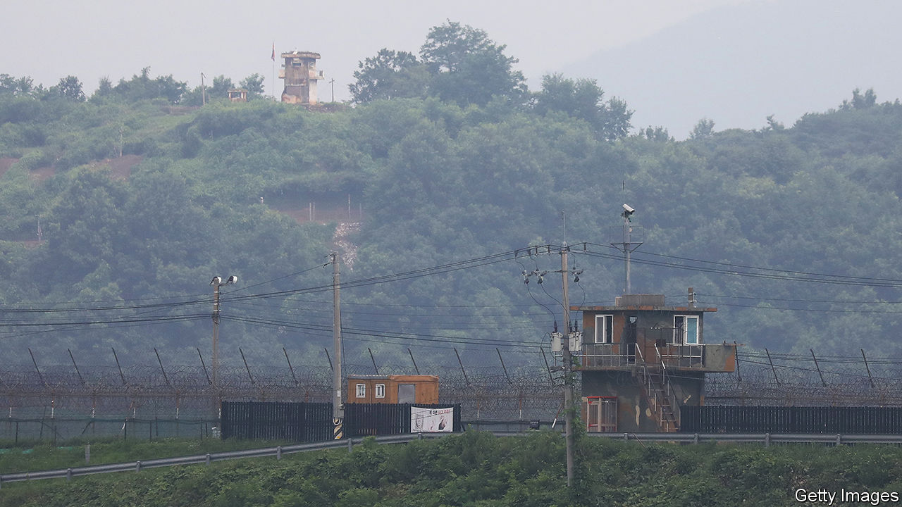

###### Crossing the line

# An American soldier has deserted to North Korea 

##### Travis King, an American soldier and criminal, is now in Kim Jong Un’s custody 

 

> Jul 19th 2023 

The PREVIOUS time someone crossed the border between the two Koreas at the Joint Security Area (JSA), an enclave along their heavily armed frontier, he did so through a hail of bullets. Oh Chong-song, a North Korean soldier, was shot and wounded five times by his comrades in 2017 as he sprinted into South Korea. A crossing this week was less dramatic but more surprising. On July 18th Travis King, an American soldier of the 1st Armoured Division, ran over to  while on a group tour of the JSA.

Like many defectors to Kim Jong Un’s prison-state, Mr King has a troubled past. He recently spent almost two months in a South Korean prison for assault. After his release, he was returned to America’s armed forces in  to be sent back to America to face possible additional punishment. He was escorted to Incheon airport, outside Seoul. He then went missing, appearing next at the JSA, 48km (30 miles) north of South Korea’s capital.

Also known as Panmunjom, the enclave was carved out of the front line as part of the armistice that paused the Korean war in 1953—70 years ago next week. Consisting of a huddle of buildings, the JSA is the only direct point of contact between the two Koreas along their 240km frontier, and a popular tourist destination in the South. According to an American official who spoke to the and other reports, Mr King was on a guided tour of the enclave when he gave a sudden hoot of laughter and ran at top speed towards the border. Tour guides chased after him in vain. He was last seen being taken into custody by North Korean soldiers. 

America’s defence secretary, Lloyd Austin, confirmed that Mr King had crossed into the North “wilfully and without authorisation”. The soldier’s reason for doing so is unclear, as are his prospects. North Korea loves detaining Americans, often on skimpy pretexts. Otto Warmbier, a college student from Ohio, was arrested in 2016 for allegedly stealing a propaganda poster. He was sentenced to 15 years in prison with hard labour, suffered a serious brain injury soon after, and died after he was permitted to return to America in 2017. Jeffrey Fowle, another Ohioan, was arrested in 2014 and convicted of proselytising (a crime in North Korea) after he deliberately left a Bible containing his contact details in a bar toilet. He was imprisoned for six months before being permitted to leave.

The handful of Americans who have deliberately defected have sometimes been treated better. Another ne’er-do-well soldier, James “Comrade Joe” Dresnok, was originally viewed with suspicion in the North after he fled there across a minefield in 1962, in order to dodge a court martial. Yet he ended up becoming a minor celebrity by playing evil American imperialists in propaganda films. He was popularly known as “Arthur” after one of his most famous characters—an American army officer called “Arthur Cockstud” in a TV series called “Unknown Heroes”, about the struggles of a North Korean spy in Seoul.

More recent American defectors have fared less well, however. Matthew Miller, a 26-year-old Californian visitor to Pyongyang, was arrested in 2014 for espionage and sentenced to six years’ hard labour after he tore up his tourist visa and declared he wanted to claim political asylum. He was released, eight months later, after James Clapper, then America’s director of national intelligence, went to North Korea to spring him and another American.

Mr King’s best hope may be the treatment meted out to Arturo Martinez, a mentally ill Texan, who allegedly entered North Korea from China by swimming the Yalu river in 2014. After declaring his desire to defect, Mr Martinez was unveiled by the North Koreans at a crowded press conference in Pyongyang. After making some perfectly reasonable criticisms of the American justice system, he began spouting deranged conspiracy theories. He accused America of using UFOs and “weaponised satillital Octocopters” to carry out mass mind control and drug-running. Mr Martinez was quietly allowed to leave North Korea shortly afterwards.

Yet Mr King’s status as a serving and apparently sane American soldier may make him a richer prize. When the North Koreans feel like talking to America, prisoner releases can help get them face time with senior Americans. Jimmy Carter and Bill Clinton both flew to Pyongyang after their presidencies to secure the release of American hostages. Three more were released to Mike Pompeo, the then secretary of state, in 2018, as part of negotiations that led to a meeting between Donald Trump and Mr Kim later that year. Whether Mr King could be another bargaining chip will depend, however, on whether North Korea is interested in talking to America. 

There is scant sign it is. On July 19th North Korea fired two ballistic missiles into the sea, apparently to protest against the arrival in South Korea of an American submarine carrying ballistic missiles. Western officials also claim to have observed preparations for a possible North Korean nuclear test, its first since 2017.

On July 17th Mr Kim’s sister, Kim Yo Jong, rejected America’s oft-repeated offer of a “dialogue without preconditions” towards denuclearising the Korean peninsula. She compared American officials’ parroting of the phrase to an “answering machine”. This is bad news for South Korea and the world. And perhaps also for the sprinting Mr King. ■

