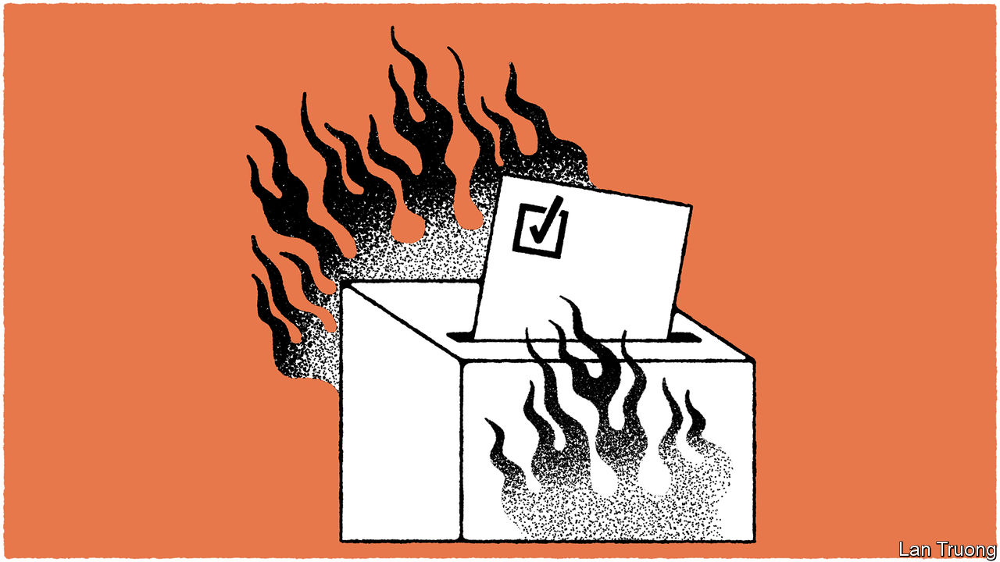

###### Banyan

# Why are politics in West Bengal so violent? 

##### The political stakes are even higher in the east Indian state than elsewhere in India 

 

> Jul 20th 2023 

Last month police in the east Indian state of West Bengal took 11,000 people into “preventive detention”. They confiscated more than 20,000 licensed weapons, along with piles of ammunition and explosives. The election commission asked the central government in Delhi to deploy 80,000 paramilitary troops across India’s fourth-biggest state, home to more than 100m people.

The purpose was not to fight an insurgency. It was to prepare for local elections in the sweltering Bengali countryside, which typically see eye-watering levels of violence. Despite the measures, bloodshed ensued. Some 50 people have been killed in clashes involving rival party activists since the announcement of the polls in June, with many killed on or after polling day. The violence was so disruptive the vote had to be re-run in some places. It eventually produced a landslide victory for the Trinamool Congress, a regional party led by West Bengal’s charismatic chief minister, Mamata Banerjee, whose activists accounted for many of the dead.

Even by Indian democracy’s roughhouse standards, West Bengal stands out. According to the Armed Conflict Location and Event Data Project, an NGO based in America, the state recorded 3,338 incidents of political violence, including political murders, between 2016 and July 2023, the highest number of any state except militancy-riven Jammu and Kashmir. This is despite the fact that West Bengal’s underlying crime rate is not especially high. It is much lower than in the vast and lawless nearby states of Bihar and Uttar Pradesh. 

What explains such extreme political violence in one of India’s most important and culturally rich states? Non-Bengali Indians might attribute it to Bengalis’ stereotypical penchant for politicking and quarrelling, a counterpart to their equally fabled love of intellectualising. (The region has produced many of India’s greatest artists, including Rabindranath Tagore and Satyajit Ray.) “Two Bengalis is an argument, three is a political party, four is a riot,” goes an old joke. A look at next-door Bangladesh, whose mostly-Bengali population was joined to West Bengal’s until 1947, suggests there might be something to this. It is a similar case. Hundreds of Bangladeshis are killed and thousands injured in political brawls each year.

This points to a deep historical explanation for the bloodletting. Bengalis had a reputation for revolutionary agitation dating back at least to armed resistance against the British Empire, which had its capital in Kolkata (then known as Calcutta) until 1911. The violence then continued seamlessly into the post-independence era in the form of peasant uprisings and leftist insurgencies. Yet even if Bengalis’ history initiated their violent politics, it is being sustained by contemporary factors.

One is the importance of Bengali politics as a form of social organisation, says Dwaipayan Bhattacharyya of Jawaharlal Nehru University in Delhi. The entrenchment of communist rule in the state in the 1970s pushed alternative forms of sorting, including religion and Hindu caste, to the margins. The Bengali countryside became so politicised it was as hard to marry across the political divide there as it was to marry across caste lines elsewhere in India. In a patronage-based political system, zero-sum politics of this kind is played for high stakes—often the difference between poverty and relative prosperity. Local political leaders can thereby summon mobs of foot-soldiers to fight to the death against their rivals’ goons. And they do.

This murderous system is further enforced by the way political and economic power is distributed in West Bengal. It is one of only two Indian states (the other is communist-run Kerala) to have devolved significant power to the village-level administrative units, or panchayats, that Bengalis voted in this month. Devolution is supposed to bring decision-making close to home. In West Bengal it also brought the violence close, creating local political economies in which access to government jobs and other local resources are contested both at the ballot and in the streets.

The violence is now starting to erode the democratic system that helped create it. Gangsterish local satraps increasingly defy their party leaders. Violence within parties is therefore becoming almost as common as violence between them. No wonder the bloodletting is impossible to police. Mitigating it would be hard even if the state’s two main parties, Trinamool Congress and its communist rival, made a serious commitment to ending the violence. So far, neither has.■


