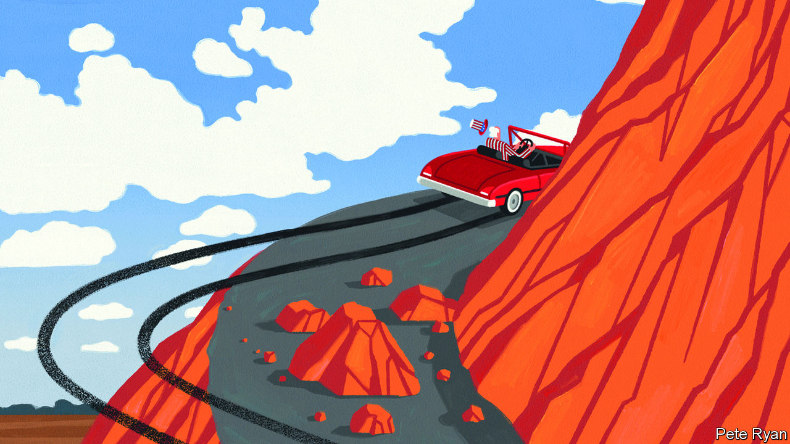
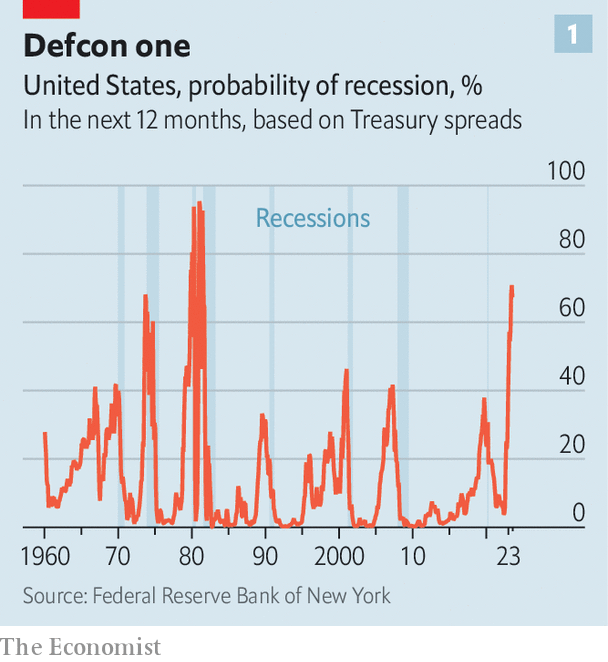
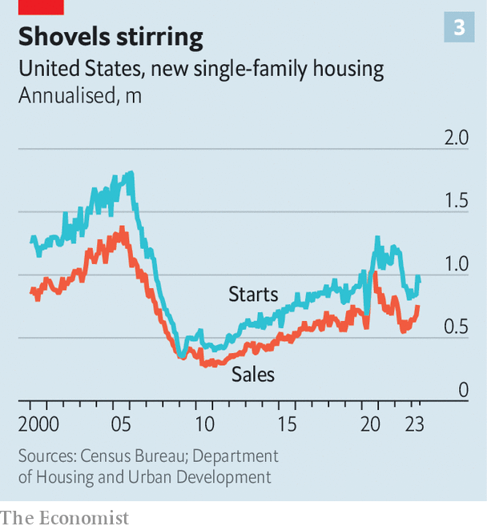
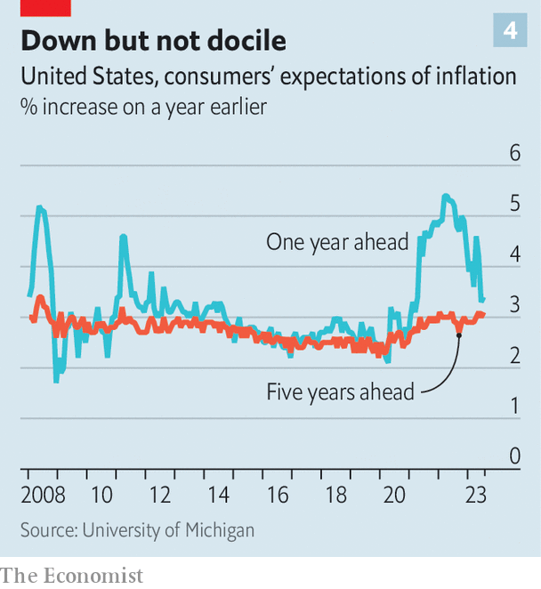

###### Turning a corner

# Could America’s economy escape recession? 

##### The route to a soft landing is narrow 

 

> Jul 20th 2023 

As covid-19 spread throughout the world three years ago, many pored over the history of a previous pandemic, the Spanish flu of 1918-19, for clues about how the disaster would unfold. Now that the plague has abated, history may also provide a few lessons for the aftermath. As the first world war and the Spanish flu receded, interest rates were low and government spending high. Inflation surged. In order to bring prices back under control, America’s central bankers cranked rates up, triggering a severe recession. The Federal Reserve described its actions in 1921 as “painful but…unavoidable” following “an unprecedented orgy of extravagance”.

These days Fed officials tend to avoid the word orgy, but they are wrestling with similar circumstances. They have been raising rates at the fastest pace since the early 1980s. Hawkish economists argue that, to quell inflation, the Fed will have to raise them yet higher, even though that would certainly raise unemployment and probably induce a recession. Doves counter that the Fed has already gone too far and that further economic pain is unnecessary. A third possibility, that the Fed is getting things just right, and that the economy will slow and inflation dissipate without a recession (a “soft landing” in the jargon), was until recently seen as nigh on impossible.

An orgy of tightening

The odds are still stacked against it. Since March 2022 the Fed has lifted short-term interest rates from 0% to 5%. Such rapid jumps tend to go hand-in-hand with recessions. As higher rates raise the cost of borrowing, they drag down both spending by consumers and investment by companies. As a general rule, the bigger the increase in rates, the bigger the drag. Thus, for much of the past year, the dominant view on Wall Street and in corporate boardrooms has been that America’s economy would end up in a funk. As of June, the median forecast of economists surveyed by Bloomberg pegged the probability of a recession in the next 12 months at about 65%. The Conference Board, a business group, put the probability at 99% in February. Stanley Druckenmiller, Silicon Valley’s favourite macroeconomic prognosticator, recently said that he expects a “hard landing”, involving a slump in corporate profits and a big rise in unemployment. 

 


The gloomiest portent has been an extreme inversion of yield curves. Normally, rates on long-term bonds are higher than on those with short terms because investors expect extra compensation for the risk of holding securities that mature well into the future. When short-term yields are higher, the implication is that investors expect the central bank to cut rates, typically because they think growth is set to weaken. Inversions have a nearly perfect record in foreshadowing recessions in America over the past half-century, and they have been screaming trouble for some time now. Yield curves inverted for the first time in this economic cycle in October 2022, and are now deeply upside-down. The lag from the onset of inversion to the dawn of recession averages about 350 days, which would put the start of a potential recession in September. The Fed’s New York branch calculates the probability of a recession based on the yield curve. In May it put the odds of one at more than 70%, the highest since 1982 (see chart 1).

Other indicators confirm this bleak outlook. Consumer sentiment, as measured by a closely watched survey from the University of Michigan, plunged to an all-time low last year. The collapse of Silicon Valley Bank and a couple of other financial institutions in March provided evidence that the rapid rate hikes are harming vulnerable firms, and the ensuing financial instability added to economic headwinds. Banks have made their lending standards much stricter, another sign of a looming recession. Smaller businesses—the lifeblood of America’s economy—remain extremely pessimistic. Manufacturing is already contracting, with output down since late in 2022. The debate among economists has been less about whether a recession is coming and more about whether it will be long or short, deep or shallow.

In the past couple of weeks, though, the mood has shifted. Despite the many ill omens, the most important indicator of the economy’s health—the labour market—has remained amazingly resilient. The unemployment rate sits at just 3.6%, a smidgen above a five-decade low. A brief rise in claims for unemployment insurance during the spring has petered out. America has added new jobs for 30 consecutive months, lifting total employment to about its pre-pandemic level.

At the same time, inflation is receding. In the year to June 2022 consumer prices leapt by 9.1%. In the year to this June they rose by just 3%, the smallest increase in more than two years. Core inflation, which excludes energy and food, is higher, but after a few months of stasis is moving in the right direction again. As post-pandemic supply-chain snarls untangle, the cost of most goods is rising only slowly, and in some cases falling. Rents, hitherto a big element of inflation, are falling according to private indices, and are likely to start declining soon in the official data, too. Labour costs are still rising, but the rate of increase has slowed, which bodes well for the prices of restaurant meals, car repairs, tax accounting and more.

To say that the combination of ebbing inflation and a robust labour market is unexpected is an understatement: many economists had assumed it was impossible. They had believed that there was a short-term trade-off between jobs and prices: that, all else being equal, a low unemployment rate is associated with a rising inflation rate, a relationship known as the Phillips curve. In the decade before the pandemic the Phillips curve had come into question, because inflation remained quiescent even though the jobless rate plunged. But the resurgence of inflation last year brought the Phillips curve back into fashion, in part because the labour market appeared to have become less efficient after the pandemic. Debate focused not on whether unemployment would need to go up for inflation to come down, but rather on just how many people would need to lose their jobs before prices were brought under control. In one much-discussed speech last year, Larry Summers, a former Treasury secretary, said the jobless rate might need to climb as high as 10%. 

A bacchanal of employment

America does have an ultra-tight labour market: too many companies competing to hire too few workers. That would normally lead to sharply rising wages and thus higher inflation. The obvious way to curb that inflation, in turn, would be to inflict enough pain on companies through higher interest rates that they resort to widespread lay-offs. But another way to bring the labour market into balance is to increase the supply of workers. That has happened to a certain extent: fully 84% of those of those aged 25-54 have jobs or are looking for work, the highest share since 2002. It also helps that immigrants—a vital, if politically contentious, part of the American labour force—have returned: more than 1m arrived last year, the highest figure since 2017. Since February 2020 the economy has added nearly 4m jobs, much faster growth than the long-term trend. 

 


Employers, meanwhile, have been hesitant to fire workers. Some may well be hoarding them, having found it very difficult to recruit enough over the past couple of years. Instead of firing staff, they are cutting back on hiring. The net result of more workers and fewer help-wanted ads is a slightly calmer labour market, despite the lack of lay-offs. Goldman Sachs calculates that there are roughly 3.2m more jobs than workers in America at the moment. That is still above 2m, which it considers the maximum for a not-too-tight, not-too-loose jobs market, but the overshoot is well down from its peak of 5.7m early in 2022. As the number of vacancies has declined, the relentless upward march of wages has eased somewhat (see chart 2). Economists at the doveish end of the spectrum are beginning to trumpet these achievements, if not quite declare victory. “The economy is defying predictions that inflation would not fall absent significant job destruction,” Lael Brainard, head of the National Economic Council, said on July 12th.

Two additional things help explain America’s run of good fortune. First, the looming problems were probably overstated because of pandemic oddities. Economists’ models of the probability of a recession have for months been flashing red. But there is reason to think the models may be giving unreliable signals. They are designed to predict trouble whenever there are abrupt shifts in the data. Recently, though, such shifts have reflected a return to normal after the pandemic, rather than incipient economic weakness. People are buying markedly fewer laptops and exercise bikes than they did in 2020, for instance, not because they are cutting back sharply on spending but because they are not working from home as much. It may be, therefore, that manufacturing’s weak spell is less a harbinger than a hangover. 

The yield-curve inversion could also be misleading. Long-term rates may have fallen below short-term ones not because a recession is imminent, but for a far more pleasant reason: that as inflation melts away, the Fed will be able to lower rates. Provided it can make those cuts before growth gives out, it will have a good chance of guiding America to a soft landing.

The second factor relates to the economy’s underlying strength. Monetary policy may be tight, but there are countervailing forces. One is government spending. America is running a budget deficit worth over 5% of GDP—unheard of outside recessions and wars. That is putting money in people’s pockets. There are plenty of reasons to worry about the sustainability of such fiscal largesse, but, for now, it is a cushion for the economy.

Several big pieces of legislation from the first two years of the presidency of Joe Biden, enacted before Democrats lost control of the House of Representatives, are also starting to affect the economy. Spending on highways, ports, power plants and more, enabled by an infrastructure law passed in 2021, is worth about 0.25% of GDP a year. Subsidies for electric vehicles, renewable energy and semiconductors appear to have catalysed a surge in private-sector investment: spending on manufacturing facilities is up 70% this year in real terms compared with pre-pandemic levels, hitting a record high.

Another countervailing force is households, whose spending accounts for about two-thirds of GDP. They entered the era of high inflation and rising rates well prepared. During the pandemic they had accumulated “excess savings” worth about $2trn, a consequence both of having fewer opportunities to spend their money and of receiving three rounds of stimulus cheques as well as other forms of government support. Many people have drawn down these savings as the cost of living has risen. Nevertheless, researchers with the Fed’s branch in San Francisco estimate that there is still a residual amount of extra savings—$500bn or so—enough to last for most of this year. In any case, these savings matter less than they used to: for the first time in a few years nominal wage growth is eclipsing the rate of inflation, meaning that most Americans now have rising incomes in real terms.

 


What could go wrong? Policy lags are a known unknown that could yet trip up the economy. Lags refer to the length of time needed for changes in monetary policy to start affecting business activity. Economists used to think that it could take more than two years for a rise in interest rates to ripple through the economy. Stricter credit standards have yet to make their impact fully felt: for instance, interest rates on credit cards have just started to shoot up, and it may be another few months before delinquencies follow them higher. 

But cutting against that is evidence that, in some respects, there is much less of a lag than there used to be, thanks to twitchy financial markets. For example, mortgage rates rose sharply in early 2022 prompted solely by the expectation that the Fed would soon begin raising rates, as indeed it did. The housing industry, arguably the most rate-sensitive part of the economy, is now in the throes of a mini-rebound, with both sales and construction beginning to rise (see chart 3). A new financial-conditions index developed by the Fed suggests that, on balance, the drag on growth arising from higher interest rates has actually diminished in the past few months, in part because investors in American stocks have anticipated an end to the cycle of rising rates.

A debauched degree of listlessness

It is crucial to note that a soft landing does not equate to roaring growth. Far from it. What is needed to help bring inflation to heel is a period—potentially a long one—of subdued growth, which would lower the economic temperature. Such an interlude may, in fact, be well under way. Although gdp growth has held up well over the past few quarters, its close relative, gross domestic income (GDI), has been anaemic. In theory the two ought to be aligned. GDP tracks all final expenditures in the economy, summing up consumption, investment, government spending and net exports over a specific period. GDI tracks the earnings associated with that expenditure, summing up wages, profits and any other income. In reality the two never match perfectly, since they are derived from different sources. Recently the gaps have been unusually large—perhaps another consequence of distortions related to the pandemic. Whereas GDP increased by 2% on an annualised basis in the first quarter of this year, GDI fell by 1.8%. It is not clear which number is more accurate, but one common approach to reconciling the two is to split the difference. That would imply that growth is already very low which, in turn, may further sap inflation.

There are big risks to this rosy outlook. Inflation could prove stubborn again, as it has for the past two years. Much of the recent optimism has been tied to a better-than-expected inflation reading in June. Drawing sweeping conclusions from a single datum is never a good idea, not least when underlying trends are so volatile.

Even if inflation falls again in July and August, there are also questions about how low it will go if the number of vacant jobs continues to outstrip the number of available workers to such a large extent. Olivier Blanchard, a former chief economist of the International Monetary Fund, and Ben Bernanke, a former chairman of the Fed, estimated in a paper in May that, at the current level of tightness in the labour market, the unemployment rate would need to rise above 4.3% for some time to bring inflation down to the Fed’s target. That would imply that roughly 1m people would have to lose their jobs—no small dislocation.

 


The resilience of the economy is, in this respect, discomfiting. If the rebound in housing gains steam, it could easily spur an increase in rents and goods prices (all those new homes need sofas, fridges, carpets and more). If wages continue to grow at about 5% annually, they, too, will put a floor under prices in the service sector. Expectations of inflation, although declining, do not suggest the Fed has everything under control (see chart 4). A feedback loop between a strong economy and sticky inflation would pose a stiff challenge for the Fed, leaving it with little choice but to raise rates to new heights—at which point fears of a tightening-induced recession might well come true.

The absence of a downturn to date has allowed the Fed to avoid confronting any serious trade-off in its tightening. Jerome Powell, the Fed’s chairman, and his peers deserve high marks for raising rates as quickly, albeit belatedly, as they have. But it has been easy for them to be resolute given the health of the jobs market. Were conditions to deteriorate, their resolve would be sorely tested. Richard Clarida, a former vice-chairman of the Fed, says the central bank may ratchet down rates next year with inflation headed to a “two-point-something destination”, instead of actually back to its target of 2%. That might help to avoid a recession. But it would also represent a shifting of the goalposts, with the Fed tolerating a higher rate of inflation because it does not want to inflict wrenching economic pain. That, in itself, would make it harder to fight inflation in the future.

All these risks notwithstanding, it remains remarkable that America has so far avoided a hard landing. The economy is winding its way down a treacherous road from the highest peak in inflation in 40 years. Defying conventional wisdom, it has managed to add millions of jobs during the hair-raising ride. Its descent is far from over. But a soft landing, once a faint hope, is now among the plausible outcomes. ■

