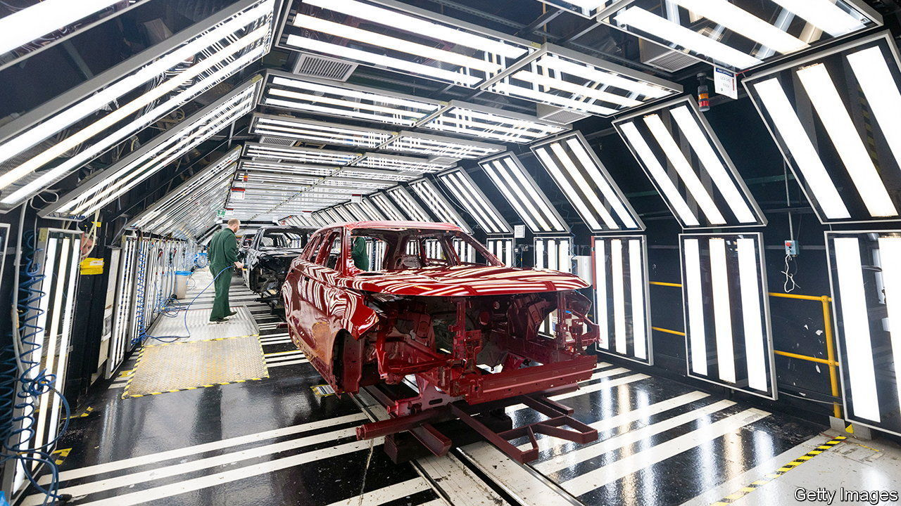

###### Charge sheet

# A big battery investment is good news for British carmaking 

##### But Jaguar Land Rover’s expansion may not stop long-term decline 

 

> Jul 20th 2023 

A “shot in the arm” for the car industry was how the Society of Motor Manufacturers and Traders, an industry body, described the news on July 19th that Tata, an Indian conglomerate that owns Jaguar Land Rover (jlr), would locate a new battery “gigafactory” in Britain. The choice of Somerset over Spain, also considered by Tata, lifted the mood among carmakers in a country where the shots have largely been aimed at the foot of late. 

Covid and Brexit made 2022 the worst year for car production since 1956. In the year to May output from British factories—810,000 vehicles—was roughly half that achieved five years ago. Any hope of a revival relies on British-based firms remaining in the driving seat as the industry switches from internal combustion to electric power. That means attracting more battery-makers.

Tata chose the West Country for several reasons. One is that Tata is keen to break the battery stranglehold of firms from other parts of Asia, especially Chinese ones. That is pressing as rules-of-origin requirements, negotiated as part of post-Brexit trade agreements, demand that from next year 45% of the value of an electric vehicle (ev) must originate in Britain or the eu to qualify for tariff-free trade. 

Another is that while carmakers have long relied on complex global supply chains, they prefer to source as close to production sites as possible. This makes for easier management and cuts the risk of disruptions such as the covid-related shutdowns, for example in China. For batteries this is especially important, as they make up a big chunk of the value of new cars and are bulky and expensive to shift around. 

Perhaps the greatest draw for Tata is that the government has belatedly concluded it must pay—and heavily—if mass-manufacturing of cars is to have a future in Britain. No details have been confirmed but it is rumoured that Tata asked for £500m ($644m) towards an investment of over £4bn for a factory that should provide 4,000 jobs when it opens in 2026. Grant Shapps, the energy secretary, would not deny that the eventual cost, including indirect subsidies such as infrastructure upgrades, might come to £1bn. Tata may have linked this deal to cash it wants to help its British steel business go green, which could cost taxpayers another £300m. 

The government was desperate for a deal. It had stood on the sidelines as vast subsidies from America’s Inflation Reduction Act drew battery investment across the Atlantic, and as European handouts spurred the building or planning of up to 40 battery plants across the continent. The bankruptcy in January of BritishVolt, another battery-maker, was a blow that left Nissan’s plant in Sunderland, due to open in 2025, as the only other gigafactory in Britain. But as David Bailey of the University of Birmingham points out, this deal merely gets Britain “off the starting line”. A big car industry will require many more such gigafactories.

Beyond jlr and Nissan, other carmakers have more concerns. Toyota, which has a plant in Derbyshire that mostly makes hybrids (which combine petrol and battery power), wants clarity over Britain’s plans to ban sales of new fossil-fuel cars by 2030 and to go to zero-emission by 2035. Stellantis, a European car giant (whose biggest shareholder, Exor, also part-owns ’s parent company), has threatened to pull out of Britain. It had planned to make electric vans under its Vauxhall brand, but wants those rules-of-origin terms renegotiated with the EU. Mini, owned by bmw, in Germany, said last year that it would shift its ev business to China. It may be persuaded to build its next generation of evs in Britain but will now expect Tata-scale largesse. Pricey shots in the arm will have to keep coming—or Britain won’t cling on to its dwindling car industry.■


