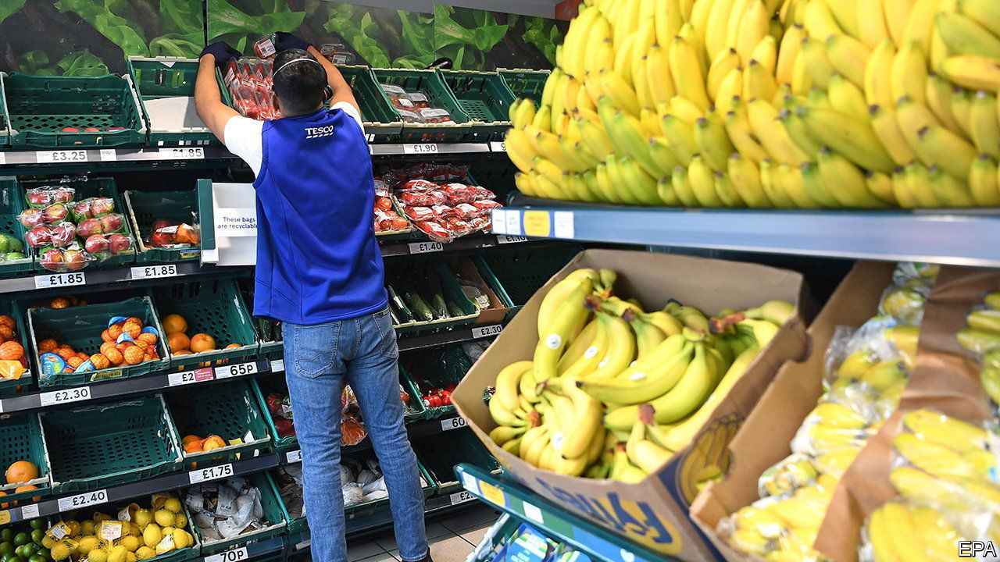
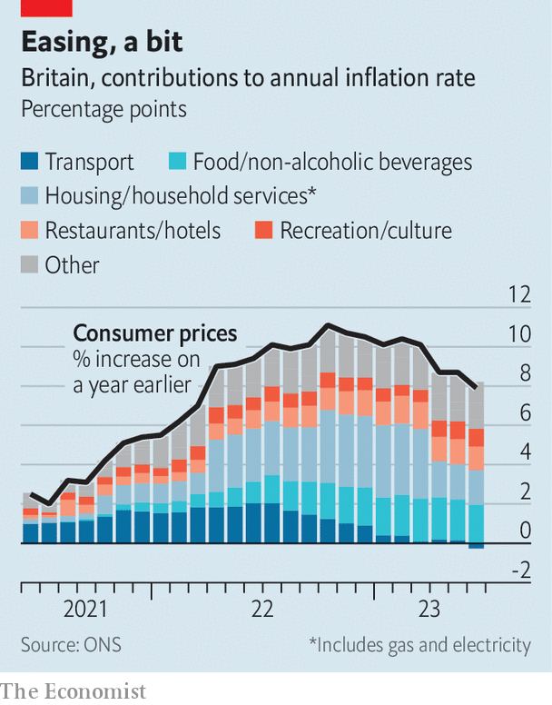

###### Inflation dips

# British inflation may not be as sticky as thought 

##### Some welcome news for the economy 

 

> Jul 19th 2023 

BRITAIN’S SPUTTERING economy was overdue a bit of good news. On July 19th it arrived, at last: inflation figures covering the year to June showed that the rate of price growth is not proving as stubborn as it had previously appeared. A particularly sharp drop in the headline rate of inflation was accompanied by welcome signs that underlying price pressures are moderating. Together they grant  to workers, , the Bank of England and the government.

The headline rate of inflation fell from 8.7% in May to 7.9% in June, a bigger drop than the fall to 8.2% that economists had been expecting. That was partly thanks to : changes in the cost of transport fuel cut the headline rate by 0.26 percentage points, according to the Office for National Statistics. The agency, meanwhile, saw no hefty movements the other way. Most encouraging for the bank’s attempts to tame inflation was a drop in the core rate, which excludes volatile food and energy prices, from 7.1% to 6.9%. Forecasters had expected the core reading to remain flat. Services inflation similarly slipped from 7.4% to 7.2%, the first slowing since January. 

 


Even after the drop—the second-largest month-to-month fall in inflation this century—Britain remains an outlier. Its 7.9% reading is the highest in the G7 group of large rich countries. Among members of the oecd, a club of mostly rich countries, only a handful have a higher rate. Yet at least the situation is no longer deteriorating: the core measure had risen to 7.1% in May from 5.8% in January. “After today it merely looks bad rather than a basket case,” said James Smith of the Resolution Foundation, a think-tank. 

Neither was this the first indication that Britain’s inflationary fever may be breaking. Figures published the previous week suggested the jobs market is at last starting to cool. The ratio of vacancies to unemployment, a measure of labour-market tightness, declined sharply thanks to a simultaneous reduction in labour demand (as measured by vacancies) and an increase in the number of people looking for jobs. 

Traders have consequently scaled back their bets on the central bank putting up interest rates. Before the publication of June’s inflation data markets had given its rate-setting committee a roughly even chance of raising its main policy rate by half a percentage point at its next meeting on August 3rd. They now expect a quarter-point increase, from 5% to 5.25%. Overall, markets now expect rates to peak at 5.8% in early 2024, rather than the 6.5% they had been predicting at the start of July. 

This offers a measure of relief to mortgage-holders. The cost of five-year interest-rate swaps, which are used to price fixed-rate mortgages, has fallen by around half a percentage point from a peak early this month, when it reached levels that were last seen during the disastrous premiership of Liz Truss. The share prices of housebuilders rallied in the hours following the inflation data. Persimmon, one of Britain’s largest property developers, enjoyed a 8% bump.

The inflation news was a rare source of comfort for the embattled prime minister, Rishi Sunak, on the eve of three by-elections on July 20th. At the start of 2023, when inflation was above 10%, Mr Sunak pledged to halve it by the end of the year. That seemed to be a modest goal to aim for: most independent forecasters had expected inflation to fall as a collapse in prices for wholesale energy and for food were fed through. Unusually persistent core inflation, which seemed immune to previous interest-rate increases, risked spoiling that. If the latest trend in the data continues, then lower interest-rate costs will help public finances, too.

According to experimental real-time indicators, pay packets were already growing faster than prices in the 12 months ending in June. That is likely to accelerate over the coming months; inflation will drop even more when the figures are released for July. The energy-price cap, which regulates how much households pay for gas and electricity, fell by 17% at the start of the month, providing some disinflationary pressure. Good news is still hard to find for Britain’s economy—but the outlook is looking a bit brighter.■


