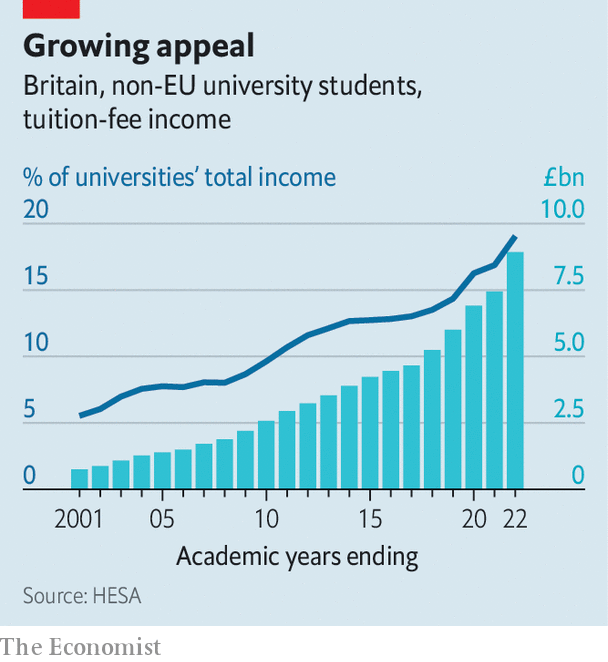

###### Universities’ funding

# Muddled policies are harming British universities 

##### They are headed towards a crunch 

 

> Jul 18th 2023 

SPARE A Thought for students graduating from British universities this summer, after three grim years. In 2020 the pandemic forced the cancellation of their school-leaving exams, compelling them to make do with simulated grades. Lockdowns and remote learning tarnished their first years at university.  and  have been the latest buzzkill: because of a marking boycott, thousands will graduate late or without a proper classification. At Cambridge, one of the worst-affected places, half of final-year undergraduates are in that boat.

Students are not alone in feeling morose. The Office for Students (OfS), which regulates the sector, is monitoring finances at 31 universities. These undoubtedly include the University of East Anglia, in Norwich, which is seeking £30m ($39m) in annual savings by September. Tuition fees paid by English undergraduates are capped by the government and have barely risen in ten years. Inflation has eaten away at their value. The maximum charge was set at £9,000 in 2012; by September the fee will be worth only about £6,500 at 2012 prices. It is not set to be reviewed until 2025. Universities are heading towards a crunch.

By most measures they still rank among the best in the world. Britain produces far more than its share of highly cited research. Only America (with five times the population) wedges more universities into the top slots of global league tables. Drop-out rates for English students are among the lowest anywhere. Britain is in the  for foreigners seeking swanky certificates.

On taking office,  saw universities as engines of growth. In 2012 the coalition government gave them a huge boost by agreeing to triple domestic tuition fees. At a stroke, funding per student rose by around 25%. The idea was in part about fairness, with more of the costs of doing a degree covered by graduates whose salaries are boosted by it. It was also to help universities expand faster—while keeping quality high—without being reliant on government grants. Expand they have: the share of English 18-year-olds going to university was about 38% last year, up from about 28% in 2012. For disadvantaged youngsters, it was up to 24% from about 15%.

Today the government has a chillier view of the sector. One reason is money. Student borrowers in England enter a national repayment system that collects a share of earned income over a given threshold (graduates this year will start paying when their earnings hit £27,295). Any debt outstanding when borrowers approach retirement is forgiven. The designers of this system have always assumed that sizeable sums will be written-off in this way, writes Sam Freedman of the Institute for Government, a think-tank. But recent projections suggest taxpayers will be on the hook for much more than had been expected—perhaps half of all that students have recently borrowed. 

One reason is that, once the cap on fees was raised, almost all universities sold degrees at the maximum price permissible (the hope had been that at least some would try to compete on price). Government tinkering is also to blame: in 2017 Theresa May, then prime minister, loosened repayment terms to appeal to young voters. But what has really hurt is a banal but crucial accounting change. In 2018 the Office for National Statistics forced the government to start booking expected losses on student loans in the year they are issued (it could previously boot them far into the future).

Money worries compound other concerns. Education has an intrinsic value, but the government is struck by research suggesting around one-fifth of graduates would be better off financially over their lifetimes if they had not gone to university (that is particularly true among students of creative arts). It worries that Britons are less keen than other Europeans to do apprenticeships, or courses that require just one or two years of post-school study. Those might be as useful as degrees, and be cheaper. Ministers are also drawn into debates about “Mickey Mouse” degrees and “no-platforming”, perhaps hoping to please voters irritated by woke lecturers and students.

Muddled thinking on universities has led to muddled policies. One big reform was the creation in 2018 of the OfS. The regulator aims to give youngsters certainty that their degrees are worth paying for. It puts useful pressure on those universities that have done a poor job of ensuring students finish their studies and find decent jobs. On July 17th the government confirmed that the regulator can limit recruitment to courses that fail to get at least 60% of students across those thresholds. But ministers have, over the years, also handed the OfS an assortment of tasks, such as monitoring policies on sexual misconduct and policing free-speech on campus. This distracts from original priorities, such as a goal of nurturing “challenger” universities to compete with incumbents. The regulator’s rule-setting may, instead, be making it trickier to launch new outfits.

The biggest worry among vice-chancellors is the long-standing erosion of fees. These have been pushed up only once in a decade. Last year analysts for the Russell Group of universities, which includes many of Britain’s best, said institutions in England were on average losing £1,750 a year per home undergraduate—this could become a £4,000 loss by the 2024-25 academic year. 

Lots of universities have tightened their belts. They also seek more foreign students, who may be charged whatever the market will bear. In 2021-22 foreigners made up 30% of all new undergraduates and postgraduates in England, up from less than 24% four years before. At the start of this century fees from non-EU students contributed about 5% of all university income. Now foreigners hand over more than 20% of their revenues. In 2020 foreign students spent £18bn on fees and living expenses.

One study using data from 2017-18 found that foreigners were on average paying £5,100 a year more than their courses cost to run. For years universities used these surpluses to subsidise research. Needs in that sphere are only growing: for more than two years the government has been failing to negotiate Britain’s re-entry into Horizon, a European research collaboration programme that it left because of Brexit and that scientists say is essential to rejoin. But profits from foreigners are also having to be used to cover shortfalls in the cost of teaching English students. This year Vivienne Stern of Universities UK, an industry group, told a House of Lords committee that international recruitment “should be the cherry on the cake” for the higher education system, but has become “more like the flour”.

 


Educating foreign students brings benefits. Yet relying on them to keep universities solvent is unwise. Until recently China sent more students than any country: institutions that take a lot of money from Chinese youngsters may become less likely to encourage teaching and research on topics that might displease Chinese officials. In the past few years arrivals from China have plateaued, as students from India and Nigeria make up the numbers instead. The newcomers bring less geopolitical baggage—but also less money. They are likelier than East Asians to fund studies with borrowed cash and so seek out lower-cost institutions. An average student from India pays about half as much in fees as a Chinese one, reckons the British Council, a government body that promotes culture abroad. They are also likelier to want to bring along a spouse or children.

Even that source of income could be in jeopardy. The government worries that too many foreign students hurts its efforts to look tough on immigration. Universities fear it might reverse a policy, from 2019, that lets foreigners work in Britain for two years after their courses end (this is especially attractive to Indian students). Britain, meanwhile, may have to compete harder against rival destinations for foreign students. Australia said this year it would let some foreigners hang around for up to five years after graduation.

A muddled income trap

All this is going to get harder to handle if British parents start believing that foreigners are squeezing their children out of places in their first-choice universities. Rejection rates at the most prestigious ones have been rising. That is more to do with the national increase in university-going than with foreigners. But the crunch will only continue: because of a demographic boom, the number of 18-year-olds in Britain will be 25% higher in 2030 than it was in 2020. Bigger-spending international students may become the focus of more gnarly debates.

What comes next? The government has tightened loan-repayment terms for new borrowers. The new rules will somewhat cut government spending on higher education, increasing the share of debt that future students will be asked to repay. In effect this reverses Mrs May’s attempt to please the crowd six years ago. But there is no stomach to let fees float up. In May Robert Halfon, the universities minister, said putting up fees was “the last thing I can do”, given the cost-of-living crisis. Fees are likely to remain frozen for at least another couple of years. Labour, which may form the next government, has only just junked its long-held opposition to any tuition fees, so sudden increases are unlikely.

As money grows shorter, universities may make some efficiencies. But they will not necessarily shed their least useful activities. Tighter budgets could mean they promote courses they find cheapest to deliver (generally not the rigorous technical degrees the government believes will make Britain more productive). That might end up increasing bills for government, if more graduates reach their twilight years without paying off their debts.

The decline in real fees feels like “a trap we don’t know how to get out of”, says Ms Stern of Universities UK. Universities may forgo investments in equipment and support services that gradually lower the quality of the degrees on offer. The big risk, she says, is not that a swathe of universities will go bust. “My worry is that we’re going back to the 1990s, where you get a system that is slowly run into the sand.”■


