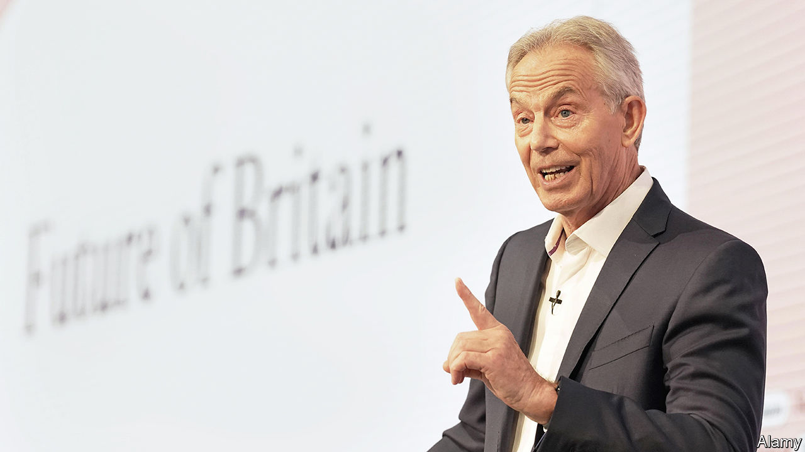

###### Back to the future

# Sir Tony Blair mesmerises the Labour Party, again 

##### The former prime minister still puts on the biggest, slickest show in Westminster 

 

> Jul 20th 2023 

SIR TONY BLAIR is now 70 years old. It is 29 years since he became Labour leader, and 16 since he left Downing Street. And yet still he puts on the slickest, most dazzling show in British politics. The Future of Britain conference, hosted by his Institute for Global Change in London on July 18th, had the aesthetics of an Apple launch and the speaker list of Davos. The audience mixed ageing New Labour ministers with the cream of parliamentary candidates for 2024 (the very bright and very loyal) for whom Sir Tony was their childhood. The event offered a relentlessly optimistic vision of a modernising Britain, fuelled by hope and technology. 

And, after a long froideur, much of his party is mesmerised again. Sir Tony was repudiated mostly because of the invasion of Iraq and because it grew unwilling to wear the compromises on high ideals that electoral success demand. His successors—Gordon Brown, Ed Miliband and Jeremy Corbyn—defined their own projects against his, to electoral defeat. So did Sir Keir Starmer, who campaigned to be leader in 2020 on an overtly anti-Blairite platform of higher taxes on the rich, state ownership and “no more illegal wars.” 

These days Sir Keir dresses in Sir Tony’s clothes. He has adopted the touchstones of New Labour: public-sector efficiency reforms; an authoritarian tone on crime and defence; a “prawn cocktail offensive” on business. He also borrows Sir Tony’s maxims (“the political wing of the British people”; “tough on crime, tough on the causes of crime”). And his verbless sentences (“Respect—my guide. Unlocking aspiration—my cause”).

The two men speak often, but this was their first joint appearance in public. It amounted to a mutual public blessing. Sir Keir defined his priorities as “growth, growth, growth”, in a homage to Sir Tony’s “education, education, education.” Sir Tony, meanwhile, told Sir Keir he had taken the party from the brink of extinction to the brink of government. “You’ve done an amazing job,” he said. 

Sir Tony has “been on a redemptive arc,” says John McTernan, his former political secretary. Britain’s current woes have given the party a new appreciation for his achievements of keeping the economy and hospitals ticking over. The war in Ukraine has not made the case for Iraq any stronger, but it has undone the widespread hostility towards America, interventionism and the arms industry that followed. He remains unmatched in his skill for succinct diagnosis and prescription. (It’s a risk for the ambling, dull Sir Keir to appear alongside him, says more than one delegate). Above all, say Sir Keir’s circle, they like him because Sir Tony is a winner, who believes in power over protest.

Westminster’s policy shops are often poor and parochial places of instant coffee in basement rooms. Sir Tony’s outfit has money, connections and strikingly good grub. President Emmanuel Macron of France sent the conference a video address; Henry Kissinger, the American diplomat, recorded an interview on China; a host of bosses of artificial intelligence firms spoke. Overseas, his institute acts as a consultancy to governments in Africa and Asia, and draws income from international agencies. It has expanded rapidly: it has more than 800 staff, and declared revenues in 2021 of $81m. In contrast, Policy Exchange, one of the biggest Tory think-tanks, declared last year it had 24 staff and an income of just under £4m.

The British arm of Sir Tony’s outfit is ostensibly independent and bipartisan, but it is evidently in-step with Sir Keir’s agenda. Many of its staff expect backroom jobs in a future Labour government. Its answers to Britain’s dire productivity are a mixture of the prosaic (reform planning rules and hug close to the EU) and the techno-optimistic (bring on mass digitisation of government services). Sir Tony gets into the weeds of reports, and sends long memos on “Where Britain’s At,” say staff. The goal is to stretch the horizons of a cautious Labour Party: to ask why the NHS shouldn’t have the analytical capacity of Google and the delivery of Amazon. Round the hall are graphics showing a futuristic Britain of glass-roofed trains and solar-powered towns. 

Sir Keir nods along. But both men acknowledge that a Starmer government would inherit none of the benign conditions that underpinned big-spending New Labour. (In December 1997, Jonathan Powell, Sir Tony’s chief of staff, sent him a memo warning of laughably trivial concerns of the time: a row over fox hunting; the state of the Millennium dome; a concern that economic growth could prove too strong.) The sort of constitutional reforms New Labour embraced—devolution, human-rights legislation—look scarcer now. The geopolitical backdrop is far more dangerous. And the public optimism that Sir Tony rode has been replaced by cold cynicism towards an entire political class. “It’s grim right?,” says Sir Tony. He smiles. ■


