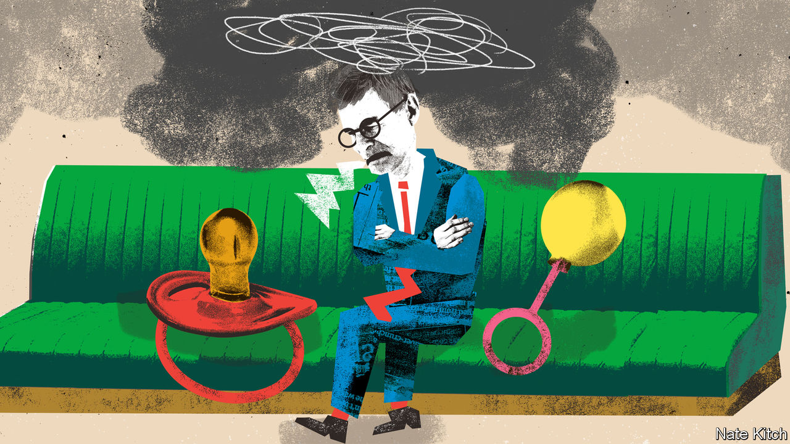

###### Bagehot

# The rise of the self-pitying MP 

##### Cheer up, Westminster! 

 

> Jul 20th 2023 

The House of Commons is designed to create conflict not consensus. Parliamentarians sit facing each other in the chamber and heckle. Coalitions are rare. Governments govern and oppositions oppose. Yet practically all mps agree on one thing, that being an mp is terrible. Speak to a parliamentarian for longer than a few minutes and the complaints will come fast: the pay is woeful, patronage trumps competence, constituency work is draining, online abuse is rife and mps are leaving in droves. The most powerful people in the country are now the most self-pitying. 

What is more, pundits agree. “Why We Get The Wrong Politicians” by Isabel Hardman, a journalist, explains the everyday iniquities of life in Parliament and has become a set text in SW1. Rory Stewart, a former mp and now a podcaster, said being a legislator was “bad for my brain, my body, my soul”. The  added to the pile: “All out! Why nobody wants to be an mp any more”. It is a miserable picture. Thankfully, it is an inaccurate one. Cheer up, Westminster: things are better than they look.

For starters, talk of an exodus is overdone. Almost 70 mps have said they will leave at or before the next election, with Ben Wallace, the outgoing defence secretary the latest. But this is no more than usual. Between 1979 and 2010, an average of about 90 MPs stood down at each election. At the last election 74 jumped. Many of those departing prematurely are doing so because they are likely to lose their seats anyway. 

Complaints among mps that incompetent bootlickers rise faster than their more talented and more principled peers are overdone. Parliament is, mostly, meritocratic. Those who are skilled rise quickly. Rishi Sunak became chancellor five years after entering Parliament; Sir Keir Starmer became party leader in the same stretch of time. Just because a few duds also reach the top does not mean that Parliament is stuffed with unused talent. This is tough to accept for anyone still on the backbenches, who gripe to journalists about it. Luckily, they have the time to do it. 

Working in a swanky palace by the Thames does peculiar things to one’s perspective. Pay, probably the biggest gripe for malcontent members, is only low when compared with industries where salaries have exploded, such as finance and law. At £87,000 ($113,000), it is around double the London average. Increasing salaries in Westminster may widen the talent pool, but it would not solve the fundamental problem: that the typical mp probably earns less than the best mate who went into the private sector. 

Telling an mp about to spend another weekend litter-picking in their constituency that their hours could be worse would win few friends. It is, however, true. Parliament no longer regularly sits into the early morning. Recess, which kicks off for six weeks on July 20th, is not technically holiday even if many parliamentary assistants hear nothing from their bosses bar the odd call with a foreign dial tone. There are few professions which allow people the time to write books, practise law and present television shows on the side. Managing that as a head teacher would be tricky. 

Other problems are self-inflicted. In recent years, mps have willingly taken on the role of social workers rather than mere lawmakers. Now a constituency mp is expected to be able to help with everything from asylum applications to damp-ridden council flats. It is big-hearted but boneheaded. Too much focus on individual problems leads to mps neglecting systemic ones. Politics is the quickest way to change a country; focus on that and the constituency mailbag will deal with itself. 

Some things have become worse for mps through no fault of their own. Abuse of politicians online is rife. Green-ink letters at least took effort; now nutters can send an insult at 1.13am on Twitter, confident it will be read by an MP “doomscrolling” in bed. At the same time, mild-mannered critique is sometimes painted as abuse. During a row over free school meals, Gary Sambrook, a Conservative mp in Birmingham, complained about graffiti that read “scum”, which is unkind, and “Gary Sambrook eats big dinners”, which is merely surreal.

Few people are willing to offer mps a reality check. Pitying the most powerful people in the country is common among journalists in Westminster. During reshuffles, hacks sympathise with the ministers and their aides who have lost their jobs. The fact that ministers can lose their livelihood quickly is a feature, not a bug. Moaning about it is akin to complaining about democracy, and a call for a world in which human resources trumps politics. 

Nobody goes to Westminster any more, it’s too crowded

For a supposedly terrible job, plenty of people still want to do it. Hordes of ambitious 30-something Labour activists are gouging each other for seats ahead of the next election. The Conservatives may be set for a hiding, yet each available seat has triggered a bunfight among wannabe mps. Opposition is an opportunity. The Conservatives who ran the country from 2010 were those who signed up for duty in the 1997 and 2001 elections, when the party received drubbings. Yet a certain type of prospective politician expects to flounce into government, without muddying their hands campaigning or enduring a stint in opposition. 

Complaining about life as an mp is the apogee of Britain’s shift from democracy to whingeocracy. Ministers sit atop the most unconstrained executive in the democratic world and complain about the “blob”, a cabal of civil servants and judges who supposedly thwart their will. Literal lawmakers claim that they are powerless to change Britain. 

All jobs have some drawbacks. But few come with the opportunity to wield power. Shaping a G7 country beats collecting a fat salary in the City. Britain has a centralised and responsive state. A good decision in Westminster can change the lives of millions for the better. Running a country is a privilege, not just a burden. There is no finer job.■


