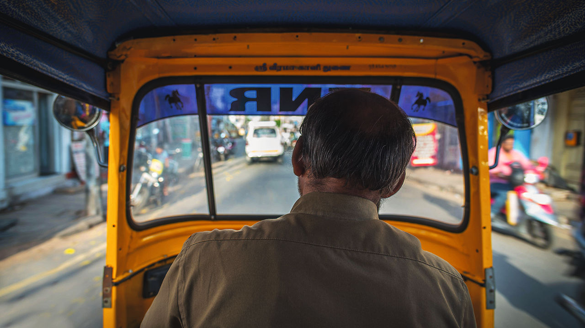

###### India’s rickshaw wars

# A battle of rickshaw apps shows the promise of India’s digital stack 

##### And its challenges 

 

> Jul 20th 2023 

IN INDIA’S STARTUP capital of Bangalore, auto-rickshaw drivers are no less prized than software engineers. Given the city’s chaotic traffic, rickshaws are sometimes the fastest way to get around. But finding one isn’t easy. Threats, pleas and moral appeals are necessary before a driver accepts a ride. The experience is no better with Ola and Uber, two ride-hailing firms which offer rickshaw services for a commission. 

Help is at hand. An app called Namma Yatri, launched in November by the rickshaw drivers’ union, directly connects riders to drivers, with no commission for digital middlemen. It averages around 68,000 trips a day, from only 2,000 at the start of the year, and boasts more than 78,000 drivers and 1.4m customers on its platform. 

Namma Yatri is built on a new open network that represents the next phase of the “India stack”—a set of digital services created by the state. With a national biometric system and a hugely successful payments network in place, the government has now set its sights on reshaping India’s e-commerce market. The Open Network for Digital Commerce (ONDC) allows smaller retailers to reach buyers, bypassing private marketplaces like Amazon. In theory, it unbundles every part of the shopping process, allowing shoppers to choose from thousands of sellers and select delivery options by different providers rather than rely on overweening incumbents.

ONDC is still new. Besides the ride-sharing app, early pilots have focused on food and local grocery deliveries. Questions abound about who bears responsibility when things go wrong, from fake products to payment disputes. No app has so far reached the scale to match the incumbents, which are also toying with the platform. In February Amazon announced that it would integrate its logistics services with ONDC. In April PhonePe, a Walmart-backed payments system, launched a local delivery app on the open network. Still, the Indian government’s aim seems clear: it desires a noisy digital bazaar instead of one with a few big monopolies. 

Or does it? Piyush Goyal, the commerce minister, wants big e-commerce firms to use ONDC for all their operations. Fence-sitters risk being banned from the platform. He has also vowed to use the “full force of the government” to promote it, putting Amazon and Flipkart on notice. So much for openness and competition. ■


