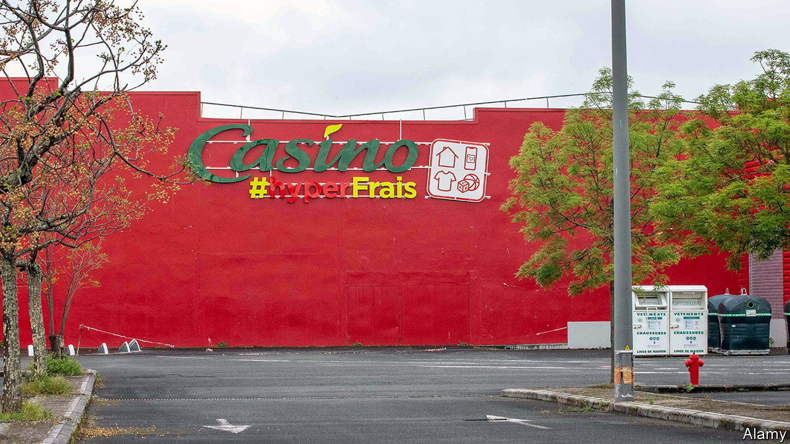

###### Last-chance saloon

# Can a Czech billionaire rescue Casino? 

##### The debt-laden French retail chain looks poised to get a foreign owner 

 

> Jul 20th 2023 

It is something of a revolution in the country which once deemed yogurt-making to be a strategic industry. For the first time in the history of the fifth republic one of France’s big retail chains will be in foreign hands. Daniel Kretinsky, a Czech tycoon who made his fortune investing in coal and natural gas, is on the verge of taking control of the Casino group, which includes a chain of hypermarkets, as well as Monoprix and Franprix, two other retail chains, and convenience stores.

In May Casino, collapsing under a mountain of debt, entered talks with creditors, shareholders and the French state to shore up its balance-sheet. Mr Kretinsky, whose existing 10% stake makes him the firm’s second-biggest shareholder, joined forces with Marc Ladreit de Lacharrière, a fellow billionaire whose holding company, Fimalac, is the third-biggest, to present a rescue plan. A trio of French tycoons, Xavier Niel, Matthieu Pigasse and Moez-Alexandre Zouari, came out with a rival offer, with the backing of Attestor, a hedge fund that owns a big slug of Casino’s debt. 

On July 15th Mr Kretinsky submitted a revised plan, this time with the backing of Attestor, which defected from its erstwhile partners. He and his collaborators are proposing to inject €925m ($1bn) into the ailing business in return for a 53% stake. A further €275m is likely to be provided by other creditors, but backstopped by Mr Kretinsky, Mr Ladreit de Lacharrière and Attestor. They will also convert €4.7bn of Casino’s debt into equity. 

Unable to match this proposal, Messrs Niel, Pigasse and Zouari withdrew their bid the following day. They blamed, among other things, unwarranted scepticism towards their offer from Casino’s management. In fact, says Clément Genelot of Bryan, Garnier &amp; Company, an investment bank, the trio put forth a less attractive proposition, with a more meagre capital injection and without explaining where some of the money would come from. 

With his competitors out of the picture, Mr Kretinsky looks poised to prevail. He wants to put Philippe Palazzi, a former executive at Metro, a big German retailer of which the Czech mogul owns more than 40%, and Jean-Paul Mochet, who used to run Monoprix and Franprix, in charge of the turnaround. 

The new bosses will have their work cut out. Mr Genelot thinks that reviving Casino will require a bigger cash injection than the €1.2bn proposed in Mr Kretinsky’s plan. The cost could be nearer €3bn, he reckons. To make its shops more attractive the company needs not just to remodel them but also lower its prices, which are 40% higher than in rival supermarkets as a result of Casino’s desperate effort to boost margins. It must also win back suppliers put off by late payments. Within a year the future owners may either need to cough up more cash or sell off a valuable asset such as Monoprix, a fixture of French city centres, where shoppers can stock up on quality garb and grub. 

One problem Casino may be able to avoid is meddling by the French government. In early 2021 Bruno Le Maire, the finance minister, balked at the proposed $20bn acquisition of Carrefour, another one-time French supermarket star, by Alimentation Couche-Tard of Canada. At the time he argued that the government wanted to preserve France’s food security and sovereignty. This time Mr Le Maire has stressed the need to be “vigilant” about Casino’s 53,000 jobs in France—which, together with Casino’s headquarters in the backwater city of Saint-Etienne, Mr Kretinsky has promised to preserve. But the state has so far mostly stayed out of it, possibly because it is keenly aware that the only remaining alternative to Mr Kretinsky’s bid is liquidation. 

“For shareholders this is a huge destruction of value,” says Tomás Mannion of Sarria, a research firm. They will be left with 1.8% of equity and a tiny fraction of their original investment. That includes Jean-Charles Naouri, Casino’s chairman, chief executive and majority shareholder, who will lose control of the group after 30 years. Despite a doctorate in mathematics, Mr Naouri, considered one of France SA’s most formidable intellects, was unable to make Casino’s sums add up. Mr Kretinsky is wagering that he can do better. ■


