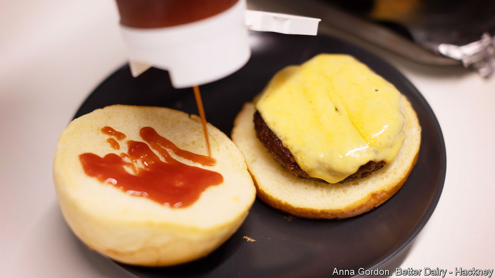

###### A new big cheese

# Startups are producing real dairy without a cow in sight 

##### Can precision fermentation eat plant-based milk’s lunch? 

 

> Jul 20th 2023 

IT LOOKS LIKE cheese. It smells like cheese. It tastes like cheese (specifically mature cheddar). And it is cheese—at least under the microscope. “Synthetic dairy” is made with the same ingredients as the conventional sort. But instead of getting the main ingredient from a live ruminant, Better Dairy, a three-year-old British cheesemaker, derives some of it from yeast. These microbes are fed sugar, which they then convert into milk proteins in a process which is similar to brewing. 

Plenty of milk  have hit café counters and supermarket shelves in recent years. Plant-based beverages made from things like soyabeans, almonds and oats make up 15% of all milk sales by value in America and 11% in western Europe, reckons the Good Food Institute (GFI), a think-tank. Yet lovers of real dairy, which plant-derived products cannot quite mimic, still need cows, goats and ewes. “Precision fermentation” companies like Better Dairy hope to change that—and take a fat slice of the $900bn global dairy market. 

Remilk, an Israeli startup, has recently received approval to sell its fare in America, Israel and Singapore. Perfect Day, a Californian one, already sells synthetic milk, ice cream and cream cheese. It recently signed contracts to sell its proteins to Nestlé, a food giant, and to Starbucks. In its latest funding round two years ago it raised $350m, valuing it at $1.6bn. All told, precision fermenters have raised nearly $3bn from investors since the start of 2021. 

Synthetic dairy dispenses with certain undesirable aspects of milk and milk-making. Lactose, to which some people are allergic, and hormones, which have been linked to some adult diseases, can be stripped out. Fermentation tanks do not need to be pumped full of antibiotics and can be set up anywhere—handy at a time of rising worries about food security and climate change. The process uses less water and, because it requires less energy and less land, emits fewer greenhouse gases than conventional dairy production, which is responsible for more than 3% of annual planet-warming emissions, almost twice as much as aviation (and a lot of it from belchy cows).

One challenge for the innovators is winning consumers’ trust. Steel tanks lack the familiarity of cows. A quarter of respondents to a survey in America aren’t keen to try “precision-fermented” fare (which may explain why producers prefer to call it “animal-free”). Regulators create hurdles, too. Although the startups are confident they will get the green light—the technique is already used for flavourings and insulin—they worry about the time this will take and about labelling disputes. According to GFI, even in America, the land of free enterprise, it takes about nine months. It Europe it takes twice as long; the first products will not reach European supermarkets until 2024.

The technology is also a work in progress. For now Better Dairy’s cheddar still uses bovine casein, one of the proteins in milk; the firm is working on a synthetic version that would make its cheese properly vegan. And the process remains costly. A fermenter that can hold about 30 litres of milk can cost £150,000 ($190,000). Buying a cow, which can produce about as much in a day, will set you back £1,600. ■


