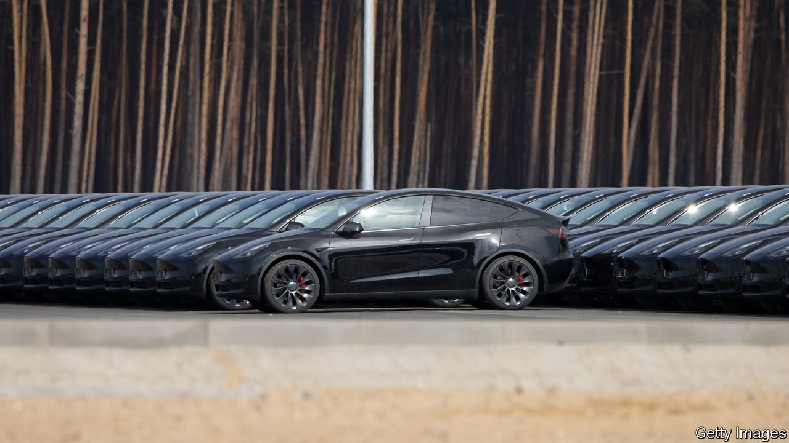
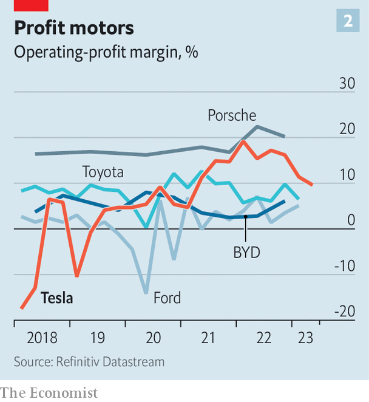
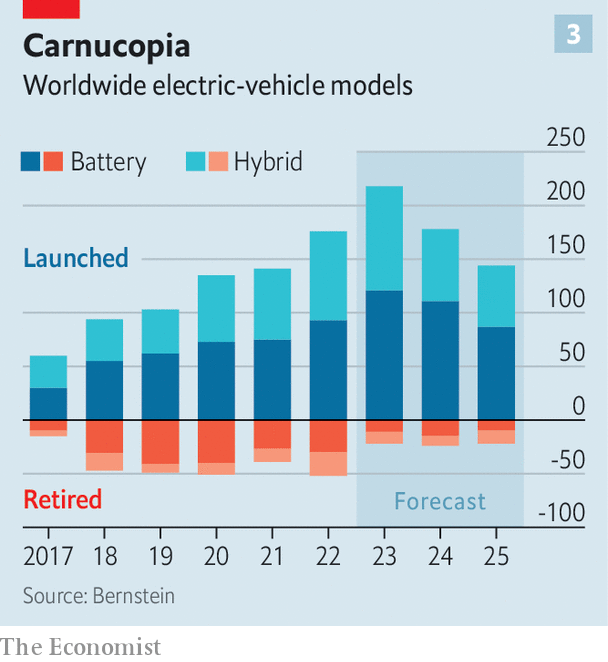

###### A new model

# Tesla’s surprising new route to EV domination 

##### Become more like the industry you disrupted 

 

> Jul 18th 2023 

IN 2011 TESLA stated an aim of becoming “the most compelling car company of the 21st century, while accelerating the world’s transition to electric vehicles”. At the time this was easy to dismiss as crackers. In the eight years since its founding in 2003 the firm had manufactured a piddling 1,650 EVs. Its first big-selling car, the Model S, had yet to hit the road. 

 


Today it is almost as mad to argue that Elon Musk, the carmaker’s boss since 2008, has not achieved that goal. His company, a rare insurgent in an industry with formidable barriers to entry, has grown at . In the first quarter of 2023 Tesla’s Model Y mini-SUV was the world’s . In the second quarter it delivered a total of 466,000 cars, beating analysts’ forecasts (see chart 1). Mr Musk’s promise of 2m sales this year, up from 1.3m in 2022, no longer seems fanciful. On July 15th the first Cybertruck, an angular, retro-futuristic pickup, rolled off the production line. Tesla has just unveiled an expansion plan for its German factory, where it wants to double capacity to 1m vehicles per year. 

Besides almost single-handedly reimagining the car, Mr Musk has done the same to the car industry. His focus on streamlined manufacturing of only a handful of models has kept costs at bay. Last year Tesla boasted operating margins of 17%; among non-niche carmakers only Porsche, which churns out fewer than 1m cars annually, matched its performance. 

Mr Musk’s ambition to dominate the auto business—by making 20m cars a year by 2030, double the current output of today’s top manufacturer, Toyota, and by creating the go-to self-driving system—certainly compels investors, who value Tesla at around $900bn. That is down from over $1trn in early 2022 but still more than the next nine most valuable carmakers put together. Incumbents are scrambling to electrify their product ranges and to copy Mr Musk’s vertically integrated approach to production, while fending off a wave of EV newcomers, many of them Chinese, all trying to be the next Tesla.

 


The question now is whether Tesla can keep growing as fast and as profitably as it has for much longer. In its latest quarterly earnings on July 19th, it reported margins of 9.6%, even lower than the 11.4% it eked out in the three previous months, as it slashed prices in order to compete with cheaper rivals (see chart 2). Its advantages as a disruptive tech firm with a Silicon Valley mindset are in danger of being eroded. To make even 5m-6m cars a year this decade, a more realistic target than Mr Musk’s goal of 20m, would require “embracing the techniques of legacy auto”, observes Dan Levy of Barclays, a bank. In order to remain a disruptive force, Tesla may, paradoxically, need to become a bit more like the stodgy car business it has shaken up.

Tesla maintains a lead over its more established rivals in batteries, software and manufacturing productivity, notes Philippe Houchois of Jefferies, an investment bank. But competitors are catching up. In some areas, like marketing and product planning, they have overtaken it, notes Mr Houchois. When it launched the Model S—large and pricey with big batteries and a long range—it had the EV market largely to itself. Nowadays motorists can choose between 500 or so EV models from dozens of marques. Bernstein, a broker, estimates that around 220 new models may be launched this year and another 180 in 2024 (chart 3). For Tesla to grow fast in the face of all this competition will be difficult.

Unlike incumbent carmakers’ “something for everybody” approach, Tesla manufactures just five models (if you count the Cybertruck) and relies heavily on two of them. The Model 3, a small saloon, and the Model Y account for 95% of the vehicles Tesla shifts. By comparison, Toyota’s two bestsellers, Corolla and RAV4, make up just 18% of the vehicles sold by the Japanese firm. For Tesla to hit its target of selling a combined 3m-4m Model 3s and Model Ys, each model would need to control 50% of the cars in its class ($40,000-60,000 mass-market cars and $45,000-65,000 SUVs, respectively). According to Bernstein, no carmaker has ever had more than 10% in those two segments. 

Off the marque

And both models are ageing. The Model Y is three years old and the Model 3 has just turned six, which makes them less desirable in a business where novelty has historically counted for a lot. Carmaking’s rule of thumb to keep sales chugging along is to refresh models every 2-4 years and redesign them completely every 4-7 years. Tesla’s planned “refresh” of the Model 3’s styling and its tech innards this year looks late by industry standards. 

The company will need to go well beyond its current strategy, of offering software updates that improve some of its cars’ features, or that add new ones. This may have done the trick for its original customer base of early-adopter techies but is unlikely to cut it with the average motorist. One solution is to offer more options for its existing range. Barclays estimates that the Model 3 comes in 180 configurations, a fraction of the 195,000 trims for a comparable (petrol-powered) BMW 3 Series saloon. But this would introduce the sort of complexity Mr Musk has hitherto shunned. 

Another route to higher sales is to launch new models, like the Cybertruck or a low-cost mass-market vehicle—unofficially called the “Model 2” and with prices starting at $25,000—which Mr Musk has promised to start selling in the next couple of years. New models, though, come with new challenges. The relevant pickup market, with global sales of 1.3m, according to Bernstein, is relatively modest—and the Cybertruck’s bold styling may limit its appeal. And though low-cost Teslas could expand the company’s market beyond America, China and Europe, they would almost certainly generate lower margins, further depressing the company’s overall profitability. Moreover, granting regional ventures greater autonomy to manage regional differences in taste, as established carmakers have historically done, again adds complexity and costs. 

Mr Musk may no longer be able to avoid other expensive industry practices. One is marketing. In contrast to all other big carmakers, which spend princely sums on ads, Tesla has depended on word-of-mouth and Mr Musk’s own larger-than-life persona to promote its products. Barclays reckons that eschewing ads and, by selling directly to buyers, bypassing dealers, currently saves the company $2,500-4,000 for every car it sells. As it seeks new customers, and as Mr Musk risks affecting Tesla sales with his polarising stewardship of Twitter, his $44bn side-project, the company is likely to forgo some of those savings. Mr Musk has conceded as much, saying that, for the first time, his company might “try a little advertising”. 

Another carmaking staple to which Tesla has belatedly come around is price cuts. Mr Musk had pledged never to offer discounts or allow inventory to build up. His company has lately done both. Production exceeded sales in the past five quarters. After growing at an average annual rate of 60% for years, quarterly sales volumes expanded by an average of 30-40% between the second quarter of 2022 and the first quarter of 2023. To shift more vehicles Mr Musk began slashing prices late last year, by up to 25% on some models. Sales duly ballooned, by more than 80% in the second quarter, compared with a year ago. The flipside was those duly contracting margins. Investors have tolerated Mr Musk’s price cuts more than in the case of his rivals: on July 17th Ford’s share price fell by 6% after it announced hefty discounts on its F-150 Lightning EV pickup. They may not stay so forgiving for ever.

As its various costs rise, Tesla will try to keep cutting them elsewhere, notably in manufacturing. In March it unveiled what it called the “unboxed process”, designed to make cars “significantly simpler and more affordable” by streamlining or even eliminating stages of production. It is unclear what exactly Mr Musk has in mind. Despite his record of engineering ingenuity, at least one previous attempt to up-end car manufacturing, by replacing people with robots for the Model 3, led to what Mr Musk himself candidly described as “production hell” and near-bankruptcy in 2018. 

 


Mr Musk’s last fresh challenge—and another one he shares with incumbent Western carmakers—is what to do about China. Tesla, which makes more than half its cars at its giant factory in Shanghai, no longer seems to hold its privileged position in the country. It was allowed to set up without the Chinese joint-venture partner required of other foreign carmakers, at a time when China needed Mr Musk to supply EVs for Chinese motorists and, importantly, to encourage China’s own budding EV industry to raise its game. 

That has worked too well. Tesla is thought to have sold 155,000 cars in China in the second quarter, 13% more than in the previous three months. But China Merchants Bank International Securities, an investment firm, reckons its market share may have slipped below 14%, from 16% in the preceding quarter, as buyers switched to fast-improving home-grown brands. In a sign that Tesla now needs China more than China needs Tesla, the company was obliged to sign a pledge on July 6th with other car firms to stop its price war and compete fairly in line with “core socialist values”. Tu Le of Sino Auto Insights, a consultancy, says rumours are rife that the Chinese authorities are pushing back against Tesla’s efforts to increase manufacturing capacity in China. And that is before getting into the increasingly fraught geopolitics of Sino-American commerce.

If Tesla is to sell 6m cars a year at an operating margin of 14% by 2030, which Mr Levy of Barclays thinks possible, it probably needs to avoid at least some of these pitfalls. It would be foolish to dismiss that eventuality, given Tesla’s knack for confounding sceptics. It could, for example, offset part of the decline in sales growth with new revenue streams, such as recent deals to open its charging network to Ford and General Motors customers. As brands become defined by the digitally mediated experience of driving rather than the body shell or handling, its superior software—including, one day, self-driving systems—may allow it to keep offering fewer models than its rivals. Mr Le thinks Tesla will mitigate the China risk by manufacturing more of its cars in Germany and other countries, including low-cost ones. Tesla has been by far the most compelling car company of the early 21st century. If it is to hold on to that title, it must work for it. ■


