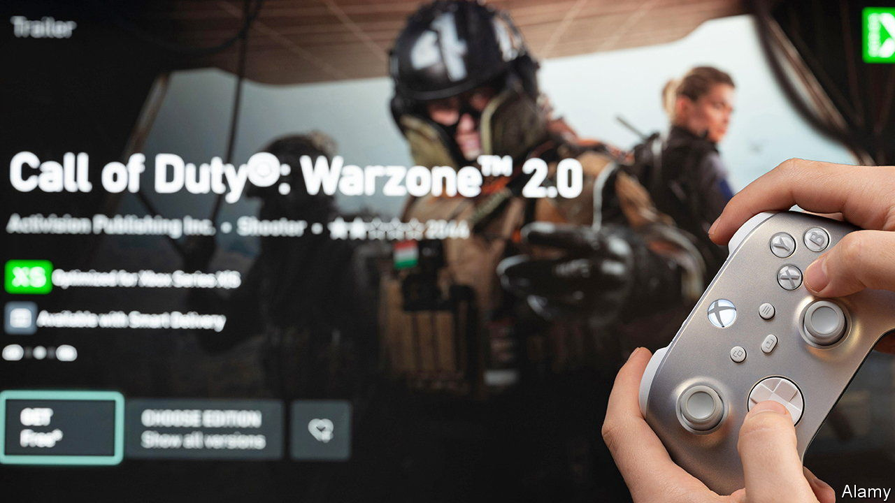

###### Shooter to win

# The winners and losers from the $69bn Microsoft-Activision mega-deal 

##### What’s next in the Candy Crush saga? 

 

> Jul 20th 2023 

THE GAME is on. Or so ruled an American appeals court on July 14th when it threw out another effort by the Federal Trade Commission to block Microsoft’s $69bn acquisition of Activision Blizzard, a games developer, which a federal judge had cleared three days earlier. A few days later Sony and Microsoft agreed to keep “Call of Duty”, Activision’s hit first-person shooter, on Sony’s PlayStation console, increasing the pressure on Britain’s trustbuster, the last holdout, to approve the merger.

Microsoft’s truce with Sony follows similar agreements with Nintendo, another Japanese gaming company, and Nvidia, an American chipmaker which also owns a cloud-based gaming service. It allays Sony’s fear that it would be cut off from “Call of Duty”, which reportedly generated $1.5bn in revenues for Sony in 2021. However, it is not a clear-cut victory for the PlayStation-maker. Its arrangement with Microsoft is limited to “Call of Duty”, and does not extend to Activision’s other blockbusters, such as World of Warcraft. 

For its part, Microsoft hopes the deal will help it Candy Crush it in mobile gaming. In 2023 global spending on mobile games is forecast to hit $125bn, around two-thirds of the industry’s overall revenues, according to Omdia, a research firm. Activision’s popular mobile apps, including Candy Crush and a smartphone version of “Call of Duty”, may enable Microsoft to conquer Asia, Sony’s historic stronghold. It had better, for the company is losing the console wars. Its Xboxes have consistently been outsold by PlayStations. This year Sony is expected to sell 22m PlayStation 5s, twice the forecast for the Xbox. Whether mobile supremacy is worth the $69bn price tag is another matter. Giant deals often destroy value in a way that puts the most trigger-happy “Call of Duty” pros to shame.

The biggest winners from the deal, besides Activision shareholders, may be other game developers, such as Take Two and Electronic Arts. Their popular franchises, Grand Theft Auto and FIFA, respectively, make the companies ripe targets for acquisition, which Microsoft’s regulatory success makes less likely to be challenged. Share prices across the industry have been rising since the American ruling, possibly in anticipation of a takeover spree. ■


