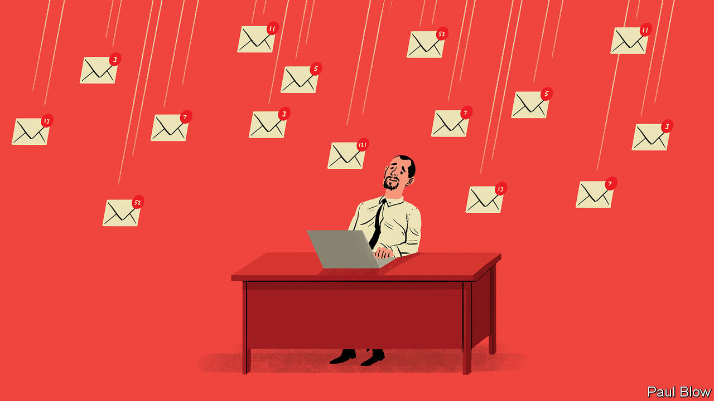

###### Bartleby

# Workplace advice from our agony uncle 

##### From hotdesking to nudity, your office questions answered 

 

> Jul 20th 2023 

Dear Max,   

Hmmm. I doubt you are in breach of any rules unless you have told specific individuals that you are thinking about what they look like without clothes on. But it’s probably wise not to repeat this piece of advice to anyone else. That’s not just because it sounds so dodgy. In my experience it’s also a hopeless tip: you will almost certainly end up feeling even more nauseous. It is better, and safer, to imagine people wearing many more clothes and ideally a balaclava, too. 


If your team are truly believers in psychological safety, then you should be able to tell them that gourd-handling is not what you came into the workplace to do. Perhaps you could suggest another way of giving the floor to people without interruption? Is there another object that you might find less absurd? If it is too difficult to have an honest conversation with them, then say, “Oh gourd, not this again,” when it comes your way and before you begin sniggering. With luck your colleagues will just think you have a lame sense of humour. 


It is true that the workplace has changed in recent years: empathy and compassion have become part of the lexicon of the modern workplace. But I want you to know that you are not alone; very many people share your lack of pain. There is no stigma attached to being unable to interrogate your own feelings or to trundling along in a state of emotional vacuity; it’s a condition also known as being male. It’s OK to feel invulnerable. 


The obvious answer is that you need to change either your job or your location. But really you need to re-examine the way you take decisions. You are terrible at it.


This is a surprisingly common complaint from my correspondents. Hotboxes have to be small enough to carry: that means there is usually room only for a couple of personal possessions. To be one of a crowd wandering around in search of a place to settle down, with your existence distilled down to a handful of mementoes and a cactus, is profoundly depressing. It’s like an episode of “The Last of Us” with chinos. My advice would be to ditch the hotbox altogether and sit at a bare desk. You will work just as well and suffer from much less angst. 


I followed up with this letter-writer directly to find out a little more. If the company in question had a fashionable brand, a logo might at least be passed off as a cool consumer choice. And with luck, the tattoo would be in a discreet place. No dice. It turns out that my correspondent works for an auditing firm. He has the letter “E” emblazoned on one eyelid, and the letter “Y” on the other. You can see how that might have seemed really clever at the time. I cannot help this poor wretch but I’ll be back with more of your workplace dilemmas as soon as I have made them up. ■


