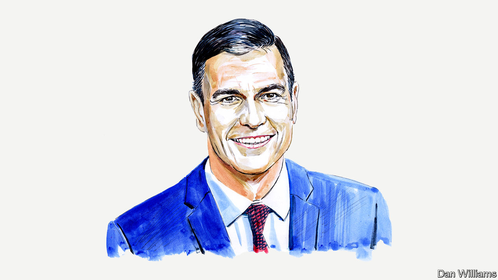

###### Spain’s election

# As Spain prepares to vote, its Socialist prime minister sets out the case for continuity 

##### Economic resilience is proof of policy success, says Pedro Sánchez 

 

> Jul 19th 2023 

WHEN I TOOK office in 2018, we inherited a country wounded by the previous government’s response to the Great Recession. The Spanish economy had gone through a rough recovery, based on an unfair austerity model that left millions behind, particularly young people and low-income workers. Inequality had reached extreme levels and corruption scandals had ravaged the outgoing right-wing government.

The challenge was enormous. At the gates of a crucial decade, marked by major economic transformations, Spain was at risk of being left behind once again, as in many other moments of our history. 

To add even more complexity, in 2020 the pandemic hit us tremendously hard, especially because of our heavy reliance on tourism, which was affected by the restrictions on international travel. And right after that, we witnessed a burst of inflation not seen in four decades, fuelled by Russia’s war of aggression.

Faced with these challenges, the only certainty we had was that we were not going to repeat the mistakes of the previous decade. The impact of the pandemic and of the war had to be dealt with by putting people at the centre—not just because it was right, but also because it was sound economic policy. Moreover, we had to ensure our policies were backed by broad consensus.

Time has proved us right. After five years in government, Spain’s economy is performing strongly, powerful proof of policy success. Despite the pandemic’s devastating effects, employment and economic activity recovered fast. Our social shield proved to be effective.

And while the government was dealing with the urgencies of the moment, it never lost sight of the longer-term goals—not least the transformation of our productive fabric to build a more resilient, inclusive and sustainable economy.

As part of the Recovery and Resilience Plan, one of the biggest financed by NextGenerationEU, the bloc’s post-pandemic support fund, Spain has embarked on a broad reform process to address structural deficiencies. Since the adoption of our reform of the labour market, employment has increased by 1m, the proportion of workers in temporary jobs has been halved to 15% and the minimum salary has been raised by 47%. 

The pension reform has guaranteed the purchasing power of retired people, while reinforcing the long-term sustainability of the system. We also undertook deep reforms in education, vocational training, science, entrepreneurship and gender equality, among other areas. These will raise productivity and long-term growth. Most reforms were negotiated with the European Commission and many were agreed with trade unions and employers, thus ensuring social peace and stability.

Spain has also dealt with inflation better than most European countries. From a peak of 10.8% in July 2022, inflation measured by the harmonised headline CPI went down to 1.6% in June 2023, compared with an EU-wide average of 6.4%. Key to this success has been our leadership in identifying innovative solutions to the energy crisis and price shocks, and our long-term vision for the deployment of renewables and the decarbonisation of the economy.

The modernisation agenda has been driven by the “twin transition”: the green and digital transformations. Nearly 70% of the NextGenerationEU funds are devoted to this. With the highest potential availability and quality of solar and wind power in Europe, Spain is well placed to become the continent’s industrial hub, powered by clean and cheap energy.

We will not miss this opportunity. Thanks to our strong green agenda, Spain ranks second in the EU in reducing greenhouse-gas emissions. It has quadrupled its installed photovoltaic capacity in four years and ranks second in the EU in installed renewable-power capacity. And last year Spain ranked third worldwide in numbers of new greenfield renewable-energy projects.

In addition, our new Energy and Climate Plan foresees the creation of more than half a million high-quality jobs, an increase in GDP of 2.5% and a €90bn ($100bn) reduction in fossil-fuel imports, all by 2030. Moreover, through our Just Transition Strategy, we want to ensure that the process of decarbonising the economy is fair and inclusive, one that creates jobs and opportunities for individuals and communities.

The government has also advanced an inclusive digital transformation, based on individual rights. Spain’s annual public budget for research, development, innovation and digitisation has risen from €7bn under the previous government to €16.3bn in 2023. Rural broadband coverage has increased from just 28% of households in 2018 to 72% in 2022.

In this context, Spain has taken on the rotating presidency of the Council of the European Union. We do so in an uncertain geopolitical climate, but with the ambition of contributing to the EU’s open strategic autonomy and reinforcing our relations with key trading partners. In particular, we want to advance a strategic partnership between Europe and Latin America and the Caribbean. Our two regions have shared interests and strong economic, social and cultural ties.

Looking ahead, the reforms and investments we are carrying out need to be consolidated in order to sustain strong economic growth and address the pending challenges. The goal of achieving full employment in the next four years is clearly within sight.

Ultimately, what is at stake in the upcoming general election is whether the country continues to move forward with modernisation or goes backwards, and whether Spain leads in the great global debates or turns into a self-absorbed country that accepts becoming irrelevant. 

I believe in a Spain that wants to lead and is not willing to back down.■


