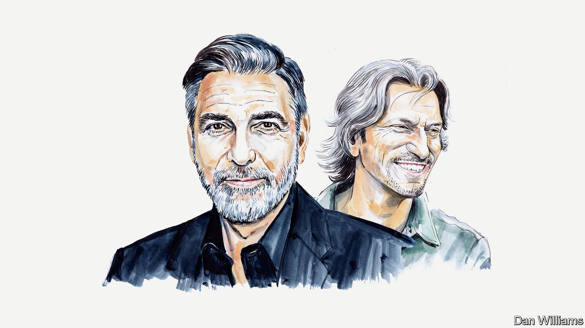

###### The Wagner Group

# George Clooney and John Prendergast on how the West can kill the Wagner virus 

##### Without stronger action, state capture in Africa and beyond will spread as the group mutates 

 

> Jul 17th 2023 

IN THE DAYS since the Wagner Group abandoned  on June 24th, speculation has grown about what will become of Russia’s notorious paramilitary company and its leader, Yevgeny Prigozhin. Amid reports of President Vladimir Putin poking around Wagner’s assets and troop deployments, and with the status and whereabouts of  himself cloaked in mystery, the future of the group—and its extensive business empire—is unclear.

What is clear is that Wagner has been one of Russia’s most successful foreign-policy initiatives during the past decade. The group has allowed Russia to expand its influence into unstable states, particularly in Africa, advancing its economic interests, often through violent means. Wagner’s perceived instability at the moment offers America and the broader international community an unprecedented opportunity to counter Russia’s use of this atrocity- and corruption-fuelled force abroad.

The Central African Republic (CAR) is where Wagner’s method can be seen most comprehensively. In the CAR, Wagner has created a manual for how to hijack a government, using a brutally simple transaction: protecting the regime in exchange for mineral concessions. Wagner helped the country’s president, Faustin-Archange Touadéra, to recruit, train and equip a parallel army dedicated to protecting a pro-Russian regime, and it used mass violence to quell opposition and gain control of vast mining concessions. With the CAR’s leaders providing a licence to loot, Wagner has used terror to privatise and drain the mineral wealth of the country, taking payment in conflict gold and blood diamonds. Wagner’s malign presence has exacerbated successive humanitarian crises in the CAR, contributing to a mortality rate that is more than double that of any other country in the world.

Wagner’s strategy in the CAR was to “leave no trace”, killing eyewitnesses and murdering civilians including women and children, according to a recent investigation by The Sentry, the organisation we co-founded that seeks to disable multinational predatory networks. Sentry investigators interviewed CAR soldiers and militiamen in Wagner’s chain of command who said they were trained to torture—to cut off hands and legs, remove fingernails, strangle and burn people alive.

This strategy—used in different forms in Libya, Mali, Sudan and elsewhere—serves Russia’s interests in several ways. A relatively small number of mercenaries helps expand the country’s global influence on the cheap, offering the Russian government implausible deniability as it supports pariah regimes and warlords with overwhelming force. The approach simultaneously creates a diverse set of black-market cash cows at a time when Ukraine-related sanctions have limited Russia’s access to foreign exchange and global markets. And Wagner serves an overarching Russian strategic objective: subverting democracy in Africa.

The structure of Wagner’s companies, contracts and mercenaries is likely to evolve. It all depends on how Mr Putin decides to manage these valuable assets and the degree to which he can control what will undoubtedly be a contentious transition period. Whether or not its name is retained or changed, or it is merged with one or more Russian private military contractors or folded into state institutions, Wagner remains a cost-effective way for Russia to expand its influence. The group’s arrangements are too lucrative for Russia and its authoritarian allies to alter.

In short, in whatever potentially modified form, the Wagner virus will live on. And the confusion of the current moment provides an ideal opportunity for America and the international community at large to take action against both the operation and its originator.

In June America’s Treasury imposed sanctions on Wagner-related companies trafficking in blood diamonds and conflict gold from the CAR. But a more robust strategy is needed to counter the threat the Wagner model poses to global peace, human rights and good governance.

America, the European Union and other allies should focus on holding Wagner financially and legally accountable. They should create an ad hoc coalition aimed at dismantling the group’s business empire, building on lessons from similar efforts focused on Islamic State and al-Qaeda. Ramping up sanctions on the networks involved in the CAR and other African countries, including the lawyers and financiers who enable them, could create a chilling effect on those considering future alliances with Wagner—or whatever its successor may be called—and make it more difficult for the system to finance itself.

The international community should also prioritise investigating and prosecuting those most responsible for war crimes and crimes against humanity, whether they are Wagner personnel or regime leaders and local warlords allied with Wagner.

There is great unfulfilled promise in going after those benefiting from Wagner’s ultra-violent plunder, from the companies owning the mines to the facilitators in neighbouring states, the Gulf and Russia. Not only would such an approach weaken a large cog in Russia’ s colonial looting machine, but it would also disincentivise African kleptocracies and the transnational networks that support them from entering into or maintaining such exploitative relationships.

It is time to create a measure of accountability for this brutal model of state capture, and to actively counter its expansion. No matter how the Wagner threat mutates, the international community can make its future clear.■


