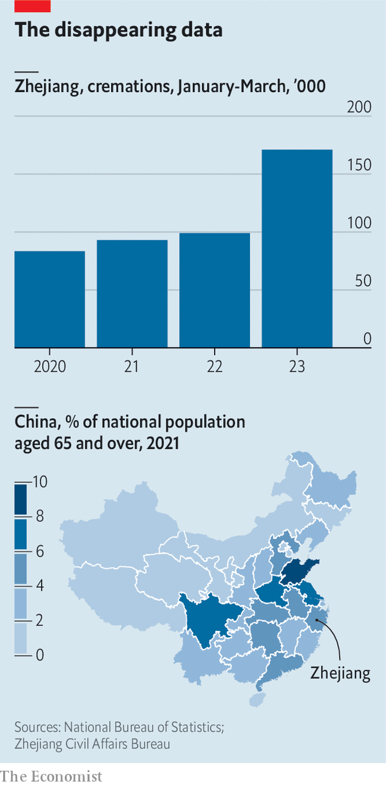

###### Data and the disease

# A clue to China’s true covid-19 death toll 

##### Some illuminating provincial data has quickly disappeared 

 

> Jul 20th 2023 

 


On July 13th the authorities in Zhejiang, a rich coastal province, released what they probably thought was innocuous data about cremations in the first quarter of 2023. Around 171,000 took place during that time, up by 73% compared with the same period last year. The jump was undoubtedly caused by a wave of covid-19; the central government lifted all covid controls in December 2022. Just under 5% of China’s population aged 65 or older lives in Zhejiang. If one assumes that its share of covid deaths is similar (the disease mainly kills the old), a simple extrapolation suggests that there were 1.6m excess deaths across China in the first quarter, which is roughly in line with our modelled estimate of the country’s covid death toll. The central government, though, has acknowledged fewer than 84,000 deaths from covid on the mainland since early December. The data from Zhejiang was quickly removed from the internet.■


