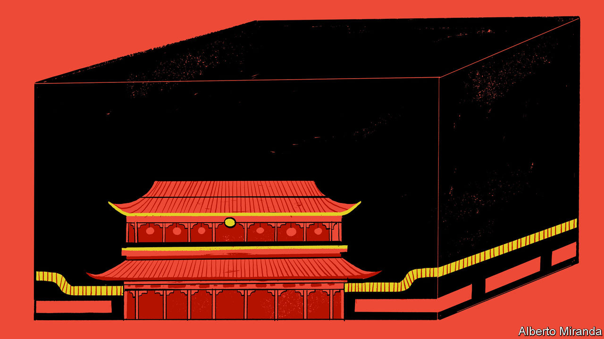

###### Chaguan

# China’s foreign minister goes missing 

##### Official silence about Qin Gang’s whereabouts speaks volumes about Xi Jinping’s China 

 

> Jul 20th 2023 

At some point the ill-explained, weeks-long disappearance of China’s foreign minister, Qin Gang, will come to an end. Quite possibly Mr Qin—a suavely confident diplomat of the iron-fist and velvet-glove type, rocket-propelled to high office by a spell as an aide to President Xi Jinping—will quietly resume his duties, just as suddenly as he stopped work after a day of meetings on June 25th. Perhaps he will explain the undefined health issues that remain the only official reason for his absence. Still, it cannot be excluded that Mr Qin’s career path is about to take a grimmer turn. That would vindicate Beijing’s elite gossip mill, which is currently seething with ever-wilder theories about Mr Qin, some of them worthy of a bad romantic novel or spy thriller.

However this episode ends, it is a reminder that China’s capital, for all its Tesla showrooms and Apple stores and outward marks of globalised modernity, remains a tough place. It is a city of secrets and rumours. Grandees do sometimes vanish, before reappearing to face charges of corruption, immorality or dissent. In an age when other countries’ leaders drop indiscretions on social media or in interviews, China’s ruling classes heed codes of silence that would be familiar to Communist Party cadres of the 1950s. As Beijing is pounded by a heatwave, Chinese elites and foreign ambassadors huddle in embassy gardens and drawing rooms to exchange theories about Mr Qin. Diplomats compare notes about when the foreign minister’s meetings first began to be cancelled, and how far ahead, looking for evidence of a sudden, severe health crisis. Analysts scour China’s tightly policed internet for signs of censors deleting comments about Mr Qin, or about an alleged friend with a boastful, indiscreet presence on social media. According to the brutal rules of Chinese politics, it would be a bad sign if Mr Qin were becoming a non-person. But a lack of censorship might also signal that powerful allies are deserting him.

Even with the mystery unresolved, a few lessons may be drawn about how power is wielded in China. Some are simple. If Mr Qin really is unwell, a formal statement about his health would help calm the rumour mills. But physical infirmity is a political taboo. This goes beyond a preference for privacy. Leaders are expected to be vigorous. Any sign of frailty is risky: party gatherings are a sea of dyed black hair. While China’s strict zero-covid rules were in force, no senior official admitted to catching the virus.

Other lessons about Chinese power are less simple. Take Mr Qin’s job as foreign minister. That is one reason why his disappearance matters, but not the most significant. Chinese job titles map poorly onto those used elsewhere. Foreign ministers are outranked by the head of the party’s Foreign Affairs Commission: a post held by Wang Yi, who is China’s top diplomat. More importantly, when Chinese insiders assess an office-holder’s clout, they look at not just that one individual but all his or her patrons and allies and even family members, as if connections can be glimpsed like a spectral halo of influence. In Mr Qin’s case, his absence is a big deal because he is seen as Mr Xi’s protégé. Provoking envy as he rose, Mr Qin was fast-tracked to ministerial rank and into the party’s central committee in 2022, not long after being made a vice-foreign minister and ambassador to Washington. In Beijing, that ascension is linked to Mr Qin’s stint as head of diplomatic protocol from 2014 to 2017, which involved lots of contact with Mr Xi.

As a result, Mr Qin’s rapid rise should offer clues about Mr Xi’s worldview, or at least about the sort of diplomacy that he values. The foreign minister is sometimes called a “wolf warrior”, but that is misleading. Some Chinese diplomats deserve that tag, which comes from a jingoistic Chinese action film. Truly wolfish envoys are often crudely anti-Western. They repeat conspiracy theories about alleged American misdeeds, harvested from shady corners of the internet or from Russian disinformation agencies. 

A West-scorning warrior, but not a wolf

Mr Qin is a more sophisticated warrior, capable of charm and pragmatism when the national interest calls. As the protocol chief charged with delivering a successful state visit by President Donald Trump to Beijing in November 2017, Mr Qin cleared away red tape and de-escalated crises, including, it is said, a brief physical altercation between the White House’s then chief of staff, John Kelly, and a Chinese security official. Yet Mr Qin has a talent for menace, too. He showed it in March 2021, when the European Union’s ambassador was called in for a midnight dressing-down over EU sanctions relating to repression in Xinjiang. When the EU envoy resisted that late-night summons to the foreign ministry, he was warned to think of the consequences for his delegation, and by implication for the safety of his Chinese staff, diplomats relate. During the meeting, Mr Qin harked back to China’s last imperial dynasty and specifically 1900, when eight foreign powers invaded Beijing to crush an uprising by anti-foreign fanatics, the Boxers. His message was that today’s China would not be bullied in the same way that a Qing dynasty diplomat, Li Hongzhang, was by foreign governments seeking reparations. I am not Li Hongzhang and you are not the eight powers, Mr Qin told the EU ambassador. More substantively, European governments blame Mr Qin for recommending sweeping, disproportionate counter-sanctions that continue to blight EU-China relations.

In encounters with foreigners, Mr Qin shows deep knowledge of the Western world, gained during several postings abroad. That familiarity appears to co-exist with disdain for a West seen as declining, arrogant and hypocritical. Indeed, some claim that Mr Qin reserves a special scorn for Western reporters, dating back to his first job out of university, as a government-supplied researcher for an American news agency in Beijing. Still, his absence is a source of regret on the capital’s diplomatic circuit. In Mr Xi’s China, the black box of elite politics is only getting more opaque. When clever, candid officials vanish, they are missed. ■


