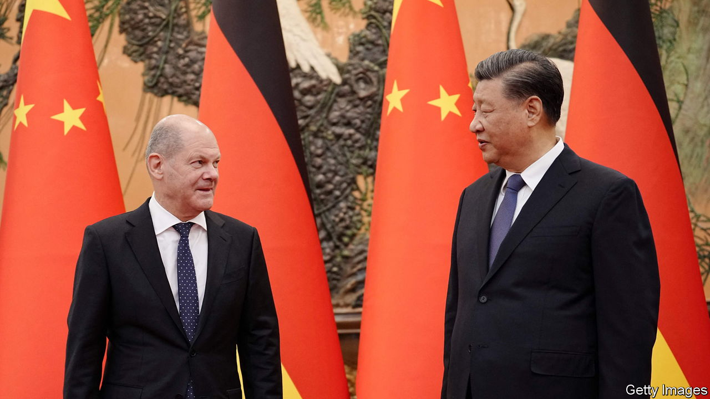

###### The wind of change

# Germany’s new strategy for dealings with China 

##### The plan reflects a hardening of attitudes in Europe 

 

> Jul 20th 2023 

Three years ago, Angela Merkel, then Germany’s chancellor, said it was important to have a “relationship of trust” with China. On July 13th the government that succeeded her published a long-awaited paper laying out how it plans to handle those ties. It did not echo Mrs Merkel’s belief. “China has changed,” it said, adding: “As a result of this and China’s political decisions, we need to change our approach to China.” Governments across Europe have long been saying much the same. But for Germany to set out a detailed case for China-scepticism was striking. 

After Mrs Merkel handed over the chancellery to Olaf Scholz in December 2021, Germany’s new ruling coalition promised a rethink of the country’s China strategy. Drafting a document setting out the fresh approach—the first paper of its kind produced by Germany—was a tortuous effort. There were differences to reconcile between the views of Mr Scholz, whose instincts on China are redolent of Mrs Merkel’s with their emphasis on business interests, and those of the foreign and economic ministries, which are led by more hawkish members of his three-party coalition. There were also the views of the European Union and America, among others, to take into account. 

During the drafting, many questions were raised about how much of a change was under way. Last October Mr Scholz pushed through the sale of a stake in one of Hamburg’s port terminals to a Chinese state-owned firm: a smaller share than had been proposed, and with no voting rights for the Chinese side, but still controversial among the hawks. When Mr Scholz paid a visit to Beijing in November, the first by a Western leader since the start of the covid-19 pandemic, he took a big delegation of businesspeople, including 12 CEOs of German blue-chip firms. In June he rolled out the red carpet for Li Qiang, China’s new prime minister, acquiescing to Chinese demands that there be no questions at a joint press conference. 

But the strategy paper confirmed a shift. It did not talk of hope of “Wandel durch Handel“ (change through trade), once a motto of the Merkel era. “De-risking is urgently needed,” the document said, using the now standard language of EU and American officials when referring to the dangers of over-reliance on economic ties with China. It echoed the EU’s labelling of China as a “systemic rival” and said China’s friendly relations with Russia had “direct security implications for Germany”. It warned that military escalation by China in the Taiwan Strait would “affect German and European interests”. The paper promised that Germany would co-ordinate “more closely” with its partners in the EU on China matters. It did mention a relationship of trust: with America. Andrew Small of the German Marshall Fund of the United States, a research centre, calls the language “markedly different from where we were with Merkel and the way she was willing to frame things”. 

Business decisions

Mr Small says that, though large German firms have expressed support for the strategy, “they haven’t jumped in to embrace it”. They have much at stake. According to the Rhodium Group, a research firm, Germany’s three big carmakers—BMW, Daimler and Volkswagen—plus BASF, a chemicals giant, accounted for more than one-third of all European direct investment in China between 2018 and 2021. But the paper is softer than a version that was leaked in November: no more talk of “stress tests” of German companies that are heavily involved in China, or making them “specify and summarise relevant China-related developments”. De-risking, it appears, will be up to businesses themselves. Some of them may not share the government’s sense of urgency. ■


