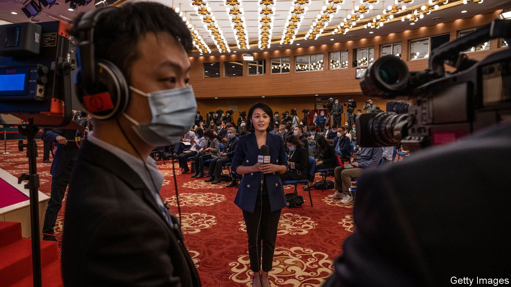

###### What would the party say?

# How China trains its journalists to report “correctly” 

##### A new app tells them all they need to know 

 

> Jul 20th 2023 

Some years ago China’s leader, Xi Jinping, issued instructions to the reporters working for state-run newspapers and television stations. He demanded “critical reports with accurate facts and objective analysis”. But he also told the journalists that they must “love and protect the Communist Party”. He did not explain what they should do if one instruction conflicted with the other. 

A new educational app for China’s journalists, introduced on June 30th, makes it clear that the party comes first. One hour-long tutorial is titled “Ensure that the politicians run the papers, the magazines, the TV stations and the news websites”. Another talks about how to “correctly guide public opinion”. “It’s like a drumbeat,” says David Bandurski of the China Media Project, a research programme in America. “They want to remind them that the party is in control.”

China locks up more journalists than any other country. But the training app is one of many softer forms of coercion. Since 2014 all reporters have had to pass an exam to get a press card. It tests knowledge of the trade—and of the party’s ideology. One former journalist failed the exam on her first try because she forgot the meaning of “the four great things”, one of Mr Xi’s impenetrable nationalist slogans. She had read his speeches beforehand. “But he’s made a lot! I just wrote four things at random,” she says. (Two were right.)

Before Mr Xi took power in 2012, journalists were more probing. Some investigated corruption, pollution or oppressed groups, such as migrant workers. In 2008 candid reports about a devastating earthquake in the south-western province of Sichuan laid bare the failings of local officials. Some of this spirit lives on in commercially run publications such as , a magazine that focuses on business and economics (less politically sensitive topics). 

A journalist for state media insists that he and his colleagues are still “revealing the truth”. He cites recent reports about a furore involving a college canteen in southern China that served rat head in a meal (the authorities had claimed it was duck neck). Also, among the winners of China’s national journalism awards last year was an investigative piece on the illegal trade in rich black soil in northern China. 

But when the All-China Journalists Association, which is overseen by the party, handed out that award, it noted that Mr Xi had once expressed great concern over protecting northern China’s soil. Most of the other winners were puff pieces about the party. One was titled “Without the Communist Party there is no happy life for China’s people”.

A number of frustrated reporters have left their jobs. In late June a heated debate erupted on Chinese social media over whether it was still worth studying journalism at university. Many argued that it was not. Critics of the industry lamented state media’s relentless pro-government positivity. Journalism degrees, said one commenter, “only teach you one thing: to be obedient.”■


