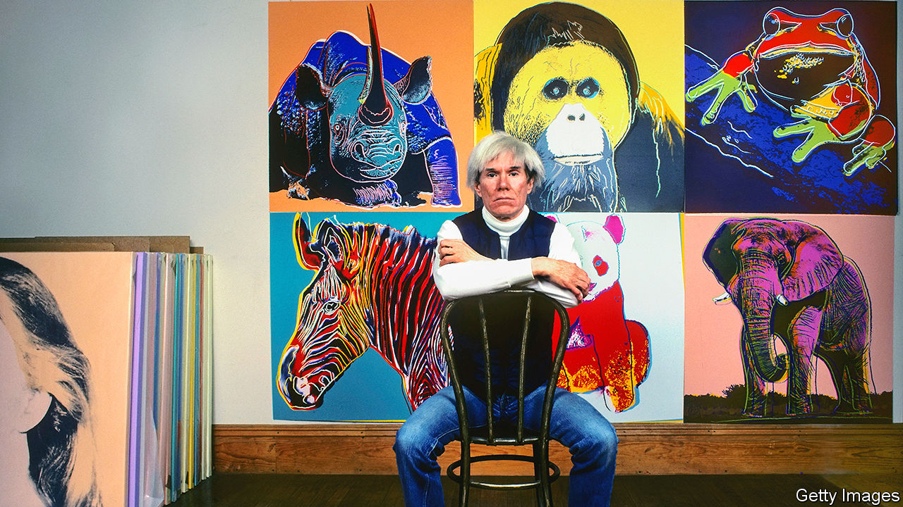

###### Opposites that never meet

# A new novel imagines life in Andy Warhol’s studio 

##### Nicole Flattery’s “Nothing Special” depicts the art world’s inequities 

 

> Jul 20th 2023 

 By Nicole Flattery. 

When Mae, 17 years old and adrift, is offered a job as a typist for , she is given instructions. “Don’t become invested in how good you are at this,” says Anita, the head secretary. Her role is to listen to tapes and transcribe them, no more. In “Nothing Special”, Nicole Flattery, a raucously talented young Irish writer, takes inspiration from the imagined lives of the young women who were never credited but worked on “a, A Novel” (1968), an experimental book the Pop Art supremo compiled from unedited conversations with his stable of muses, whom he called his “superstars”.

Betrayed by her best friend, ostracised by her peers and ignored by most around her, Mae is a lifelong outsider who takes more comfort in objects than people. , Warhol’s studio, reminds her of a doll’s house, “with girls arranged everywhere, spread on every surface, lying across the couch, the faded carpets”. Her father is absent, and she lives with her mother, a charming but self-centred waitress with a fondness for booze. A “moody, prickly girl”, she persistently mistakes cruelty for care and tells a doctor, “I keep doing things that are nothing like the way I want to behave.” Ms Flattery took dead-end jobs, female friendship and power imbalances as themes in “Show Them A Good Time”, her acclaimed short-story collection from 2019, and “Nothing Special” ventures into that familiar terrain.

Warhol plays the role of an extra, rather than a lead, in the novel. As is true of many of today’s “superartists”, such as Jeff Koons (who once had 120 artists working in his studio), Warhol’s work, brilliant as it was, did not emerge from his singular talent. He relied heavily on others’ toil. He appears to Mae in dreams, but she is never introduced to him. When he enters the room, everything brightens as if “suddenly everybody knew exactly where to direct the beam of their attention-seeking”. A spectral figure, he is “vast and untouchable”, but when he speaks to people, they become “more alive, more human, in that moment”. “Nothing Special” expertly captures the hold celebrity artists exert over peons and patrons alike. 

Through Mae, Ms Flattery also limns the “internal disorder” and “gloomy impatience” of adolescence and early adulthood vividly. Like ’s Holden Caulfield and ’s Esther Greenwood, Mae is a lonely but memorable character. Friends disappoint her, school is dull, boys are unreachable. Puberty seems “both boring and disgusting”. Attention is intoxicating but elusive. “It was so beautiful to be filmed by someone who had loved you,” she says twice in the book, once of her mother, and later, of Edie Sedgwick, Warhol’s tragic addict-muse. With a style like ’s, Ms Flattery is witty, propulsive and darkly delightful to read. ■


