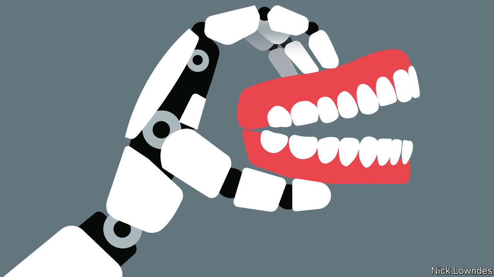

###### Johnson

# AI is making it possible to clone voices 

##### That could help fraudsters and disrupt creative industries 

 

> Jul 20th 2023 

JENNIFER DESTEFANO answered a call from a number she did not recognise. “Mom, I messed up,” her daughter’s voice told her, sobbing. “These bad men have me.” A man proceeded to demand money, or he would drug her daughter and leave her in Mexico. But while she kept him on the phone, friends managed to reach her daughter, only to discover that she was, in fact, free and well on a skiing trip in Arizona. The voice used on the phone was a fake.

Ms DeStefano, still shaken, told this story to a US Senate subcommittee hearing on  in June. The dangers that voice-cloning technology pose are only now starting to be uttered aloud. In recent months, most of the attention paid to artificial intelligence (AI) has gone to so-called “” like ChatGPT, which churn out text. But voice cloning’s implications will also be profound. 

A brief sample of a voice can be used to train an AI model, which can then speak any given text sounding like that person. Apple is expected to include the feature for iPhones in its new operating system, iOS 17, due to be released in September. It is advertised as helping people who may be in danger of losing their voice, for example to a degenerative disease such as .

For those eager to try voice cloning now, ElevenLabs, an AI startup, offers users the chance to create their own clones in minutes. The results are disturbingly accurate. When generating a playback, the system offers a slider that allows users to choose between variability and stability. Select more variability, and the audio will have a lifelike intonation, including pauses and stumbles like “er…” Choose “stability”, and it will come across more like a calm and dispassionate newsreader.

Taylor Jones, a linguist and consultant, took a careful look at the quality of ElevenLabs’s clone of his voice in a YouTube video. Using statistical tests he showed that there were a few things off in “his” pronunciation of certain vowels. But a lower-tech test, a “conversation” with his own mother, fooled the woman who raised him. (“Don’t you ever do that again,” she warned.) Johnson repeated the experiment with his own mother, who did not miss a beat in replying to clone-Johnson. 

For several years, customers have been able to identify themselves over the phone to their bank and other companies using their voice. This was a security upgrade, not a danger. Not even a gifted mimic could fool the detection system. But the advent of cloning will force adaptation, for example by including voice as only one of several identification factors (and thus undercutting the convenience), in order to prevent fraud.

Creative industries could face disruption too. Voice actors’ skills, trained over a lifetime, can be ripped off in a matter of seconds. The a British broadsheet, recently reported on actors who had mistakenly signed away rights to their voices, making it possible to clone them for nothing. New contracts will be needed in future. But some actors may, in fact, find cloning congenial. Val Kilmer, who has lost much of his voice to throat cancer, was delighted to have his voice restored for . Others may be spared heading to the studio for retakes. It is the middling professional, not the superstar, who is most threatened.

Another industry that will have to come to grips with the rise of clones is journalism. On-the-sly recordings—such as Donald Trump’s boast of grabbing women by a certain private body part—have long been the stuff of blockbuster scoops. Now who will trust a story based on an audio clip?

Slightly easier to manage might be the false positives: recordings purporting to be someone but which are fakes. Sophisticated forensic techniques could be of use here, proving a clip to be AI, say, in a courtroom. The opposite problem—the false negatives—will arise when public figures deny authentic recordings. Proving that a clip is genuine is hard, perhaps even impossible. Journalists will need to show how they obtained and stored audio files—unless, as so often, they have promised a source anonymity.

During his first presidential run, Mr Trump did more than anyone to popularise the term “fake news”—and that was well before voice cloning, deepfake videos, and the like were widespread. Now, ever more people caught up in wrongdoing will be tempted by the defence, “It wasn’t me.” Many people will have even more reason to believe them.■


