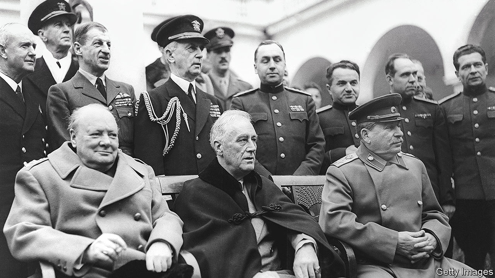

###### Hi, spy

# Calder Walton’s “Spies” is a riveting history of espionage 

##### A new book looks at the men who knew too much—and too little 

 

> Jul 20th 2023 

. By Calder Walton. 

In June 1941  received a warning from the NKVD, the forerunner of the KGB, that a Nazi attack on the Soviet Union was imminent. “You can tell your ‘source’ in German air force headquarters to go fuck himself,” was the Soviet leader’s response. “He’s not a ‘source’, he’s a disinformer.” The invasion came a week later. The anecdote is one of many gems unearthed from the archives in “Spies”, a lucid history of the intelligence contest between America, Britain and Russia.

The author, Calder Walton, is an accomplished historian, having contributed to the authorised history of MI5, Britain’s domestic security service. He is also the assistant director of an intelligence programme at Harvard University that attracts current and retired spooks, lending his book both scholarly clout and an insider feel. “Spies” explains how espionage and covert action shaped the cold war, but its enduring message is the folly of failing to realise you are in an intelligence war in the first place.

In December 1917  founded the Cheka, the secret police, to terrorise the enemies of the Bolshevik revolution and steal secrets abroad. It quickly grew to be 100,000-people strong and used news agencies, trade missions and companies to spy across Europe. In the early 1930s Russian spies burrowed deep into Western governments. The most notorious moles were the Cambridge Five, who rose high in MI6. (One of them, , briefly wrote for )

Western democracies were often oblivious. In 1929 Henry Stimson, America’s secretary of state, shut down the country’s codebreaking agency on the basis that “gentlemen do not read each other’s mail”. In 1936 Britain’s ambassador in Moscow refused to allow MI6 to open a station in the embassy because “it was liable to cause embarrassment”. On the eve of the second world war, notes Mr Walton, “Soviet intelligence perversely had more graduates of British universities than Britain’s own intelligence services, MI5 and MI6.”

During the second world war, Britain’s Foreign Office went so far as to ban espionage against its new Soviet ally. British codebreakers at Bletchley Park were not permitted to monitor, let alone decrypt, Soviet communications. When America bought a Soviet code-book from Finnish officers in 1944, the president ordered his spooks to return it to the Soviets. 

Stalin, meanwhile, intensified his efforts, placing a higher priority on espionage against his allies than against Nazi Germany. When Stalin met  and Roosevelt at Yalta in 1945 to hash out the post-war European order, his intelligence on them “probably surpassed that of any leader in history”, writes Mr Walton. Remarkably, Stalin knew about both Bletchley Park’s successes and the American atomic-bomb project years before Harry Truman, who learnt of those momentous secrets only on becoming president. 

It is hardly news that the Soviet Union spied a lot. But there are few accounts as comprehensive as this one, spanning the Bolshevik revolution to the present day, while weaving in new archival material, some declassified as recently as 2022. 

There are also lessons for the present. The final chapter of “Spies” persuasively draws a comparison between the West’s previous contest and its new one. Mark Kelton, a former head of counter-intelligence at the CIA, suggests that the scale of current Chinese espionage against America’s government at least matches Soviet activity in the 1930s. It may even exceed it. A report published on July 13th by the British Parliament’s intelligence committee said China “almost certainly maintains the largest state intelligence apparatus in the world—dwarfing the UK’s Intelligence Community”.

Much as in the 1930s, America and its allies were lamentably slow to recognise and then blunt the threat. As late as 2017, counter-terrorism, not the risks posed by China or Russia, received the most funds among American intelligence priorities. All that has changed. In 2020 the FBI said it was opening a new China-related counter-intelligence case every ten hours. In a speech on July 1st, Bill Burns, the director of the CIA, said that he had doubled the share of the budget devoted to China-related activity in the previous two years. But recognising a challenge is different from containing it. Mr Walton reckons that American intelligence agencies are unlikely to have penetrated the Chinese leadership as they did that of Vladimir Putin prior to the . More worryingly, some intelligence insiders believe that a Chinese mole might have sabotaged the CIA’s operations in China a decade ago.


America and its European allies insist they do not want a cold war with China. “That, of course, overlooks one of this book’s central conclusions,” argues Mr Walton: “Western powers can be in a cold war irrespective of whether they seek one and before they recognise it.”■


