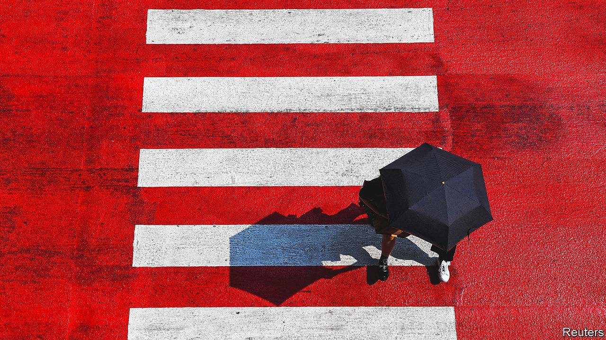

###### The heat also rises

# Extreme temperatures separate “the cool and the damned” 

##### A new book on heatwaves reads like a horror story 

 

> Jul 17th 2023 

 By Jeff Goodell.

IT May BEGIN with a cracked throat, lips that stay dry no matter how many times they are licked. As  overwhelms the body, the head throbs and vision goes blurry, before the world turns black. This is probably how Sebastian Perez felt on the day he died.

In late June in Willamette Valley, Oregon, where oak and Douglas fir trees dot the state’s lush wine country, top temperatures usually hover around 25°C (77°F). On the morning of June 26th 2021 it hit 38°C, but Mr Perez still went to work as usual, to try to ensure that the young trees at the nursery where he was employed had enough water to withstand the searing heat. By 3pm the temperature had risen to 41°C, and Mr Perez had collapsed. A migrant farmworker, he had journeyed to Oregon to make enough money to build his wife Maria a house back in Guatemala. “I promised I would wait for him,” she says, “and now he’s coming home in a box.”

“The Heat Will Kill You First”, a new book by Jeff Goodell, a longtime climate journalist, reads like an anthology of horror stories. A couple and their one-year-old daughter die of overheating on a hike in northern California. A Parisian woman returns to her flat after  in 2003 to find her home caked with blood and urine. Her upstairs neighbour had died, and no one found the body for more than a week. 

The book is a remarkable exploration of the deadly consequences of rising temperatures wrought by humans pumping greenhouse gases into the atmosphere. Unlike  and —which create whirls of flame, paint skies an apocalyptic orange and drown cities—heatwaves cannot easily be captured on film. Heat slaughters silently, snuffing out more American lives each year than any other type of weather. “How do you make visible the story of an invisible killer?” asks Mr Goodell. Some policymakers are trying, by creating new heat-warning systems and naming heatwaves as they do hurricanes. 

The book’s biggest takeaway is that the harm from heat falls unfairly on those least able to protect themselves. “A heatwave is a predatory event,” writes Mr Goodell, “one that culls out the most vulnerable people.” Rich places and people can plant trees for shade, paint heat-absorbing asphalt to reflect more sunlight, retile zinc roofs, make their cities oases of air-conditioning or move to colder places. But adaptation is much harder for poor people and places. At the end of a chapter devoted to “cheap cold air”, Mr Goodell concludes that “the most enduring legacy of air-conditioning may be the divide it has created between the cool and the damned.”

The book isn’t all fire and brimstone. Unlike some climate-science writers who drown readers in data and seem to write only for other activists, Mr Goodell tells his story colourfully. Readers meet many memorable people working to raise awareness of climate change by figuring out which extreme weather events can be attributed to it, and helping its victims by leaving water for migrants crossing the Arizona desert or campaigning for safer conditions for farmworkers. 

The author’s intrepid reporting will make some readers feel lazy. To illustrate the effects of melting , Mr Goodell faces down polar bears in the Canadian Arctic and crosses a treacherous passage on the way from Chile to Antarctica by boat. In West Texas he scales a rock formation made of the skeletons of ancient sea creatures, which 260m years ago was under water. 

Other readers may feel frightened after reading this book. In July the average global air temperature broke records . A third of Americans live in areas where the government is currently issuing warnings about extreme heat, and Europe looks poised to break previous temperature records. “The Heat Will Kill You First” could not be more timely. ■


