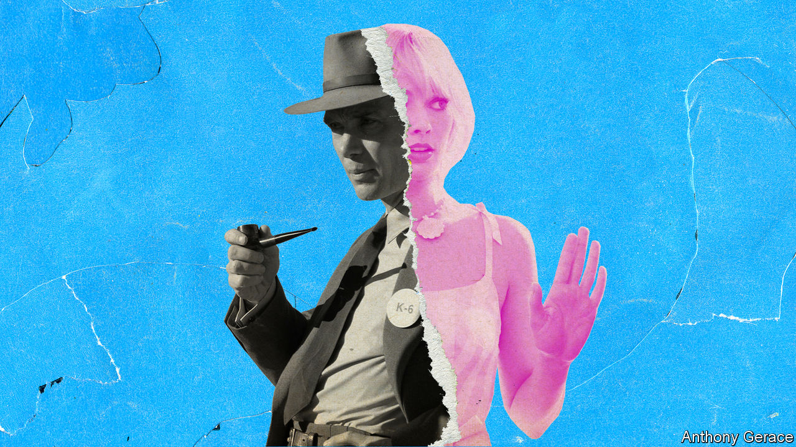

###### Bombs and a bombshell

# Realism with “Oppenheimer”, or escapism with “Barbie”? 

##### What the fortunes of this summer’s blockbusters will reveal about our times 

 

> Jul 14th 2023 

THEY MAKE an intriguing pair of rivals: he in a dark suit and porkpie hat, she in a gingham dress and matching hair bow. His domain is a vast scientific-research facility in New Mexico; hers is a fluorescent-pink party house with a slide.  (played by Cillian Murphy, an Irish actor) spends his days corralling the finest scientific minds in America to create a nuclear bomb—work a colleague calls “the most important fucking thing to ever happen in the history of the world”.  (played by Margot Robbie, an Australian actress) may seem like she has the perfect life, but she has existential worries too. Do her friends and fellow dolls, she wonders, “ever think about dying?”

No recent movie matchup has been as eagerly awaited as “Barbie” and “Oppenheimer”. Released on July 21st in America and Britain, the two films will serve as a test of whether viewers can be coaxed off their couches to return to cinemas. The incongruity in the films’ subject and tone has delighted the internet. People have created memes, remixed the trailers into jarring “Barbenheimer” hybrids and debated whether to see the biographical drama or the fantasy comedy first. 

The brouhaha is partly a result of the film-makers. Christopher Nolan, the writer-director of “Oppenheimer”, is the closest thing Hollywood has to a mad scientist. He shoots on film and mostly eschews computer-generated imagery, blowing up an actual Boeing 747 for a previous film. The nuclear reactions in “Oppenheimer” were also created by producing actual explosions (albeit not nuclear ones), brightened by aluminium and magnesium powder. His films toy with narrative conventions and tricksy subjects, such as the unconscious mind and theoretical astrophysics. They have earned a combined total of around $5bn in ticket sales; “”, released in 2017, is one of the highest-grossing films ever made about the second world war.

Greta Gerwig, the director and co-writer of “Barbie”, has her own large fan club. She started out in the “mumblecore” genre of independent film (so named for its focus on dialogue) but has since had hits with “” (2017) and an adaptation of “” (2019). Her work claims humbler gross ticket sales of $300m. For “Barbie”, she has cited old Hollywood musicals and films about the afterlife, such as “Heaven Can Wait” (1943), as inspiration.

The two films encapsulate some of the caprices of the modern movie industry. “Barbie” is one of many productions to exploit decades-old intellectual property. , a toymaker, has sold roughly a billion dolls since it first introduced Barbara Millicent Roberts (call her “Barbie”) to consumers in 1959. Ms Robbie, who is also a producer of the film, has said she was drawn to the project because the Barbie name is “more globally recognised than practically everything else other than Coca-Cola”. It is easy to imagine that a sequel is already in the works. 

“Oppenheimer”, by contrast, holds no such franchise potential. The scientist may be “one of history’s most essential and paradoxical” figures, as Mr Nolan has put it, but he is not likely to return for “Oppenheimer 2: Learning to Love the Bomb”. It is a serious, standalone drama—the kind of film made less frequently as studios focus on sequels and spin-offs. Its opening weekend is predicted to fetch $40m-50m in ticket sales, compared with around $80m for “Barbie”. 

Though “Oppenheimer” features stars such as Emily Blunt and Matt Damon, the sombre story is not obviously a crowd-pleaser. That it has also been made with a large budget of $100m reflects the faith that studios have in certain film-makers and the risks they allow them to take. “There have been films previously about the development of the atomic bomb in the 1940s and 1950s, and they haven’t been box-office successes,” says Sheldon Hall, a film historian and co-author of the book “Epics, Spectacles and Blockbusters: A Hollywood History”. “This film is being hinged on Nolan’s reputation,” he adds.

The “Barbenheimer” rivalry brings a more serious question for the public: whether to favour realism or escapism. As war rages on in Europe, and countries including China and North Korea continue to develop their nuclear arsenals, the origin story of these weapons of mass destruction may feel too real and raw. “Oppenheimer” is not a film that will ease viewers’ anxieties. It explores the physicist’s concerns about the horrifying power of his weapon and other bombs; it also shows how the American government attempted to silence him when those opinions became politically unpopular. Oppenheimer has disturbing visions of the bomb’s victims in excruciating pain, their skin peeling. “Some people leave the movie absolutely devastated,” Mr Nolan has said. “They can’t speak.”

From Hiroshima to Barbie Land

Ms Gerwig’s production is much more playful. She has described the set—which contributed to a global shortage of pink paint—as “a dopamine generator”. The film’s tone is witty and slyly self-referential: it pokes fun at Mattel, here run by a team of men, and the vexed history of the toys. (The Barbies mistakenly assume that all women revere them as role models.) It has the kind of plot that only makes sense if a viewer does not think about it deeply.

“Barbie” recognises the alluring comfort of dream worlds. At one point Weird Barbie, a doll that has been handed around and mistreated, offers Barbie a choice, symbolised by a high heel and a clunky Birkenstock sandal: “You can go back to your regular life, or you can know the truth about the universe.” Barbie chooses the stiletto and is quickly chastised. “You have to want to know, OK? Do it again.”

“Barbie” and “Oppenheimer” offer another version of the Birkenstock-stiletto dilemma. History suggests more viewers will opt for escapism. During the , many of the highest-grossing films were musicals or historical epics. The same was true during the second world war. Movies that did broach the subject of conflict, including “Gone with the Wind” and “Sergeant York”, were often set in the past; those that were contemporaneous, such as “Casablanca”, tended to tell love stories rather than tales of grisly combat. In 1968, at the height of the Vietnam war, the biggest movie in America was “Funny Girl”. In 2007, during the financial crisis, it was a film from the “Pirates of the Caribbean” franchise. 

David Thomson, another film historian and author, reckons that, at a time of economic strain, war and populism, viewers will not want to see a serious film as much as they will want to see a frivolous one. “Comedies have always done well at the movies,” he says, because they do “something that the movies were made for, which is to reassure people and give them a couple of hours of escape from pretty big problems.” Who wants reality when life in plastic is so fantastic? ■


