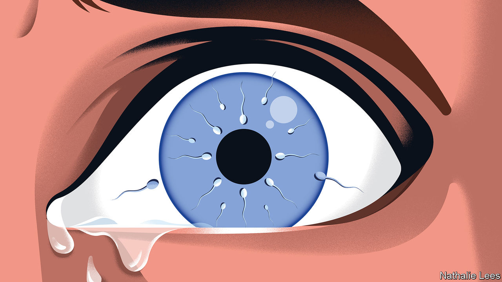

###### At the sharp end

# “The Retrievals”, a tale of agony and addiction, makes listeners squirm 

##### A new podcast explores how an American fertility clinic ignored women’s pain 

 

> Jul 18th 2023 

THE WOMEN remember pain ripping through the most intimate parts of their bodies. “It felt like someone had…gutted me,” says one. Another recalls bucking her hips wildly on the operating table. These harrowing experiences at Yale Fertility Centre are the subject of “The Retrievals”, a gripping new  from Serial Productions and the . 

Donna Monticone, a nurse, withheld fentanyl, a painkiller, from an estimated 200 women over five months in 2020. (She later admitted to stealing the drug.) Patients undergoing  (IVF) were forced to endure egg retrievals, during which a doctor pierced their vaginal wall with a needle, “stone-cold sober”. These women were betrayed twice: by the medics who, the patients say,  and by Ms Monticone, a mother who had undergone IVF treatment herself.


The tale of agony and addiction has mesmerised people across the English-speaking world and topped Apple’s podcast chart in North America. Two factors explain its success. The first concerns plot: stories about nefarious caregivers are chilling, and the podcast has a true-crime quality that is spellbinding. 

The second reason relates to the storytelling. The taut, five-part series probes personal themes of motherhood, betrayal and loss, which suit the intimacy of the format. Earbud-wearers will wince at the personal, excruciating details. This is how Serial Productions has mastered long-form audio: by presenting astounding stories that people want to hear. The same producers were behind “Serial” in 2014, a true-crime series that re-examined a murder case. Until then podcasting was a nascent industry. The show’s success—it became the first podcast to win a Peabody journalism award—helped launch the format and fuelled a boom in richly detailed, investigative productions. In 2020 the  snapped up the company for a reported $25m.

“The Retrievals”, which releases its episodes over five weeks, will soon be over, but the real-life drama will not. Sixty-eight women are suing the Yale clinic for medical malpractice and medical battery, among other allegations. Yale says it has changed some of its practices. Listeners, however, have already chosen a side. ■


