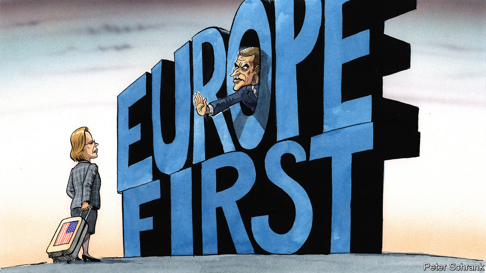

###### Charlemagne

# A spat in Brussels pits an open vision of Europe against an insular one 

##### The sorry saga of Fiona Scott Morton 

 

> Jul 19th 2023 

Paris, Rome, Amsterdam: Americans are everywhere you look in Europe these days, sweltering as they queue for tourist attractions in the midst of a heatwave. One place where they are apparently not welcome is Brussels. A proposal by the European Commission to appoint an American citizen, Fiona Scott Morton, as chief economist to its competition arm fell through on July 19th. After a week of French-led protests at the idea of éadvising the EU’s executive arm in its trust-busting efforts, the Yale professor said she was no longer interested. What could have been a signal of admirable European openness to the world has instead underlined the growing influence of those who think the continent needs a more insular, Europe-first approach. 

Ms Scott Morton’s appointment on July 11th had been something of a coup for the commission and its chief competition enforcer, Margrethe Vestager. Anti-trust regulation is a niche field, and Ms Scott Morton one of its more recognised wonks, keen to advance the interests of consumers while preserving open markets and innovation. The hiring of foreign nationals by governments anywhere is rare, and unthinkable in America. Ms Scott Morton landing the job as the result of a competitive process made the EU look quietly confident, a place happy to bring in the best and the brightest regardless of their passport. In a world dominated by American tech firms, why not tap one of their compatriots (and a one-time official in the Obama administration) for insights? The EU is about to get sweeping new policing powers over digital giants; America in recent years has refreshed its thinking on regulating antitrust as it too has started taking on Big Tech. 

In Paris, however, Ms Scott Morton’s qualities were apparently irrelevant. Minister after minister clutched their pearls and demanded to know why Europe needed to look abroad to fill jobs. Emmanuel Macron, France’s president, waded in by questioning whether the commission would lose its “autonomy of thought” if it hired one mid-level foreign adviser. A slew of MEPs and five of Ms Vestager’s fellow commissioners also criticised the appointment. The French campaign got notably little support in the EU’s 26 other capitals. But though many fellow academics came forward to defend her, few notable politicians did: her past work as a paid adviser to tech giants, although a common practice among her breed of economists (including the current holder of the job she had wanted), made her a difficult cause to crusade for.

The defenestration of a would-be Eurocrat does not merely make the EU look provincial. It is indicative of France’s success in its campaign to change the way the bloc thinks. The view from Paris, traditionally sceptical of globalisation and unduly free markets, used to be balanced out by more liberal voices. Bits of the EU apparatus in Brussels acted as a sort of liberal deep state, backed by small countries in northern and central Europe (not to mention Britain, once). The French view is now clearly dominant. Its core argument is that the EU is being naive by sticking to liberal shibboleths, since the rest of the world stopped playing by such rules a long time ago. Why, say, should the EU remain open to any and all foreign trade at a time when America and China have put up self-serving barriers at every turn? European state-aid rules prohibit subsidising “national champions” even though policymakers in Beijing and Washington gorge their firms with handouts. In short: America and China shamelessly put themselves first, so Europe should too. Liberal rules be damned.

The brief Scott Morton saga shows that the French still know how to get their way in Brussels. Four years ago Ms Vestager prompted dismay in Paris by (rightly) blocking a planned merger of the rail bits of Siemens and Alstom, two large European companies. Though she was decried in Paris as an “ayatollah” of free markets, the ruling stood, quietly backed by the open faction. That turned out to be a high point for liberal Europeans. The pandemic dented the appeal of globalisation and its world-spanning supply chains. War in Ukraine showed the risk of relying on others for vital inputs such as gas. The prospect of Trumpism rebooted has also set nerves jangling. Mr Macron’s calls for “strategic autonomy”—Europe making plans to cope if it cannot rely on others, on anything from trade to defence—have become mainstream.

Gosplan’s revenge

The results are starting to add up. Europe’s economy is looking ever-more statist, ie French. The idea of industrial policy was once taboo in Brussels. Now the need for one is accepted (the effort is led by Thierry Breton, the EU commissioner whose remit includes industry; not coincidentally he hails from France). National governments these days shower favoured firms with once-banned subsidies: Germany has spent an eye-watering €10bn ($11.2bn) to entice Intel to build a microchip plant there. Increasingly, foreign firms keen to invest in some sectors now need official approval. At EU level, central planning-style targets have been proposed for the local production of everything from heat pumps to minerals. 

Thus far, the French campaign has made steady advances against the liberal bloc rather than routed it entirely. But the momentum may shift further in France’s favour. In Brussels, rumours abound of two big impending departures. The most notable is that of Ms Vestager, who has put herself forward to run the European Investment Bank, the union’s financial arm. Another pro-globalisation heavyweight, Frans Timmermans, the Dutch commissioner in charge of the EU’s Green Deal, is said to be mulling a return to politics in the Netherlands ahead of elections in November. A new slew of commissioners will be appointed next year, giving Mr Macron an opportunity to lobby for more influence for . 

The direction of travel is clear—and worrying. Europe will not soon descend into a planned economy. But a continent lacking in economic dynamism needs all the policymaking advice it can afford. That might even mean importing it, sometimes.■


