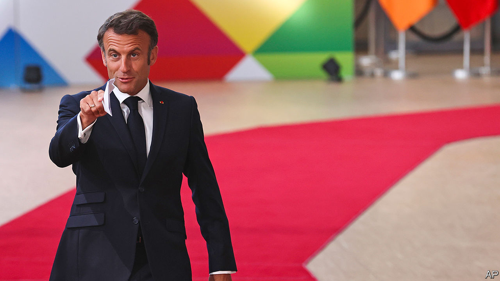

###### France’s Zeitenwende

# France’s Zeitenwende 

##### A French geopolitical shift on NATO and enlargement could reshape the future of Europe 

 

> Jul 20th 2023 

When Olaf Scholz proclaimed a , or “historic turning point” for Germany, after Russia invaded Ukraine, it startled Europe. The German chancellor’s promise to invest heavily in defence, though haltingly implemented, marked an abrupt change. Far less noticed is an equally arresting shift taking place in France. The implications of its turning point for Europe could be just as significant.

France’s  consists of a double inflection point. Each touches a fundamental precept. One is Ukraine’s membership of NATO. The other is the enlargement of the EU’s borders to the east and south. France, once sceptical about welcoming newcomers to either group, has quietly become an advocate for both.

It was in the run-up to the NATO summit in July in Vilnius, Lithuania’s capital, that many of France’s astonished allies first grasped its new approach. France lined up beside Britain, Poland and the Baltic states, arguing for a fast track into the alliance for Ukraine after the war. “We need a path towards membership,” Emmanuel Macron, the French president, declared in Bratislava, Slovakia’s capital, on May 31st. 

This set France apart from not only Germany but America, “to the apparent surprise of the Biden administration”, noted Daniel Fried, an American ex-diplomat. In 2008 France and Germany blocked Ukraine from immediate membership of the alliance. Four years ago Mr Macron told  that NATO was experiencing “”. Even after Russia sent in the tanks, Mr Macron at times seemed as worried about its future security as about Ukraine’s. Yet Europe’s eastern flank has found an unexpected new champion.

France’s second shift, on EU enlargement, is less visible. A decision on whether to open membership negotiations with Ukraine (and Moldova) is not due until December 2023, after an initial discussion in October. But talks are well under way, not least because such an expansion would require complex changes to the rules governing the EU’s internal organisation. A Franco-German working group is looking at the implications. The European Commission will report back in October on enlargement, including to the Western Balkans. 

France has traditionally been wary of enlargement, regarding expansion as a threat to its preferred strategy of “deepening” the union and forging a political project. Britain, when still a member, was an arch-enlarger, and thus viewed with suspicion in Paris for seeking to turn Europe into a mere trading zone. In 2019 France vetoed the opening of membership talks with Albania and North Macedonia.

Russia’s war has transformed Mr Macron’s approach. Last year his diplomats worked hard to secure support for the EU’s decision to grant Ukraine candidate status. France lifted its veto on the bids by Albania and North Macedonia, enabling membership negotiations to begin. The warmth of Mr Macron’s speech in Bratislava dazed central and eastern Europeans, long favourable to a broader EU. “The question for us is not whether we should enlarge,” he declared, “but how we should do it.”

Many observers remain sceptical. “It was a free lunch for Macron to back Ukraine’s NATO membership,” argues a European diplomat, noting that France knew full well that the Americans would put on the brakes. The tactical interest for Mr Macron in standing up for central and eastern Europe is plain, after the credibility he lost last year over his outreach to Vladimir Putin. France’s line on NATO was partly tactical too: a robust message to Russia, it argued, would strengthen Kyiv’s hand in any future peace negotiations.

Yet there are reasons to think that this double French shift reflects a geopolitical reassessment. Mr Macron, pro-European to the core, has long been preoccupied by the need to fortify what he calls “European sovereignty”: the continent’s capacity to determine its future amidst great-power rivalry. This concern is accentuated both by the existential threat to Europe of an expansionist Russia, and by the possibility that an America led by Donald Trump, should he win next year’s election, would be less committed to European security. 

France’s conclusion is that Europe “can no longer accept ‘grey zones’ between the EU and Russia”, says an official. Unless countries on the fringes are anchored inside the EU or NATO, they will be vulnerable to autocratic powers. The last phase of enlargement happened “when we thought that liberal democracy would spread and become the dominant model”, says Laurence Boone, France’s Europe minister: “Today that’s not the case. So we need to move to a geopolitical construction.” Enlargement becomes a tool for consolidating European sovereignty. And a wider EU is not an alternative to a deeper political project, but a means of achieving it. “This really is a structural shift,” argues Benjamin Haddad, one of Mr Macron’s deputies.

None of this means that enlargement will happen any time soon. Membership talks are proceeding grindingly slowly with four Western Balkan countries; Montenegro’s began over a decade ago. Absorbing Ukraine would be complex, long and fraught. But it is now viewed in Paris as a geopolitical imperative. Mujtaba Rahman of the Eurasia Group, a consultancy, expects EU leaders to open membership talks in December. France alone cannot dictate the choices of the 27-member club. But it remains a forceful guide to those decisions. Its could be crucial to determining the future shape of Europe. ■

