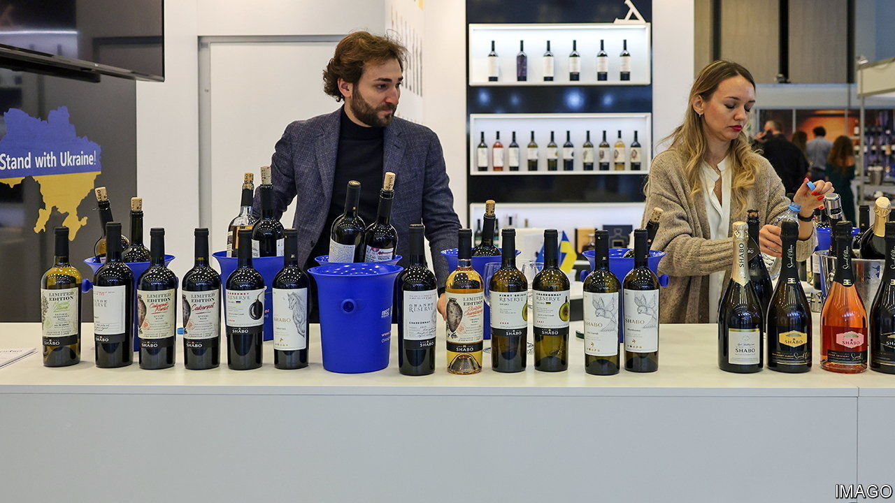
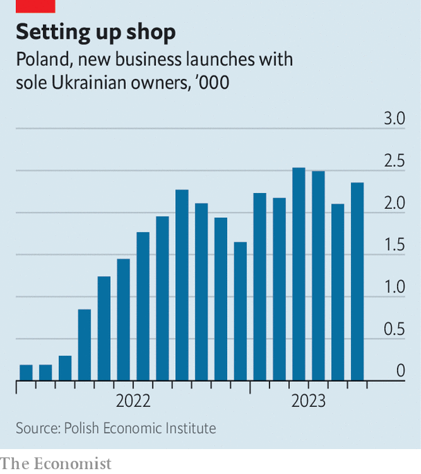

###### Chebureki beat pierogi

# How Ukrainians affect Poland 

##### Ukrainian immigrants are changing Poland’s economy—and its diet 

 

> Jul 20th 2023 


“Poles are conservative,” complains Ernest Suleimanov, who in January opened Warsaw’s first Crimean Tatar restaurant. Customers love his  (meat pastries) but have trouble with the digital menus that are ubiquitous in tech-savvy Ukraine. Mr Suleimanov is one of more than a million Ukrainians living in Poland, many of them refugees from Russia’s invasion. Now they are reshaping the country’s high street: since the war started, Ukrainians have opened some 8% of all new sole-proprietor businesses, and the number keeps rising.

 


Some Ukrainians are piloting new concepts. Olha Savchenko founded a co-working space for beauticians and hairdressers in Warsaw, with 55 beauty stations hired by freelancers. The place has a nightclub vibe, with a barista and house music, and it is a hit. Others bring Poles a taste of the unfamiliar. Natalya Gordiyenko created Kapsula, a marketplace for fashion designers. She says Polish women are less daring than Ukrainians, preferring black and white clothes over bright colours, and prioritising fabric quality over tailoring. 

Ukrainian companies have followed the émigrés. Nova Post, Ukraine’s biggest private postal service, has opened branches in 21 Polish cities. Initially it brought refugees their belongings; its next goal is delivery services for online shops. In 2022 Poland lowered administrative barriers for Ukrainians setting up businesses, putting them on the same footing as locals. That makes the country an easy gateway to European markets.

Polish companies are seeking the newcomers’ business too. Banks run Ukrainian-language services; one offers Ukrainians free accounts with no need for a Polish address or phone number. Supermarkets carry Ukrainian staples like salt-dried fish and crab-flavoured crisps. The word “Russia” has been exorcised from food labels. The potato-cheese dumplings once known as have been rebranded as  As for “Russian” mustard, it is now simply “spicy”.

