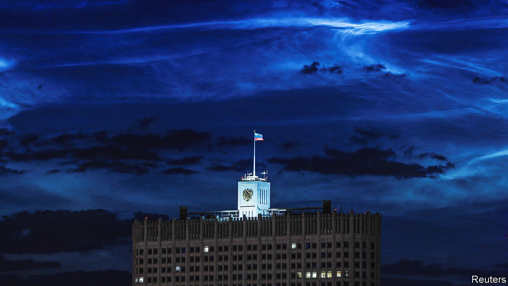

###### Kremlin black box

# Post-mutiny Moscow descends into factional murk 

##### Vladimir Putin’s authority has suffered a grave blow 

 

> Jul 18th 2023 

TWO DECADES ago , the violent ex-convict and restaurateur who heads Wagner, a Russian mercenary group, published a fairy tale he had written with his children. In it, a band of friends rescue a shrinking king by blowing a magic flute. At first he grows too fast, smashing a hole in the palace ceiling, before they bring him back down to size. “A very dangerous toy,” says the king, taking away the flute.

Mr Prigozhin long helped inflate Vladimir Putin, for example by running pro-Kremlin troll farms. Now he has cut him down to size. Last month his soldiers seized a military headquarters in the southern city of Rostov-on-Don and drove towards Moscow, downing several helicopters and a plane along the way. Mr Prigozhin said his  was meant to remove Sergei Shoigu, the defence minister, and Valery Gerasimov, head of the army, or to reverse their decision to integrate Wagner into Russia’s regular forces. But he added populist anti-corruption slogans borrowed from Alexei Navalny, Russia’s main opposition leader, pledging to purge Russia of its thieving elite. The failure of security services to prevent the plot, the army’s lack of resistance and the silence of the regime’s propagandists exposed Mr Putin’s weakness. His bewildered appearance on television amplified the humiliation. 

Under Russian law Mr Prigozhin should face prison for mutiny, recruiting mercenaries, arms trading and homicide. According to the unwritten rules of Mr Putin’s mafia state he should probably be dead. Instead, on June 29th, five days after Mr Putin vowed to crush the revolt, he met Mr Prigozhin and his commanders in the Kremlin. He regretted that they had got mixed up in a mutiny and offered to let them keep serving under a new commander.

Nobody has been charged with the deaths of some 13 pilots downed by Wagner. Mr Putin recently denied the group existed (having admitted two weeks earlier that it had been financed by the state). Mr Prigozhin is thought to be in Belarus with some of his fighters. State TV bashes him, but many of his channels on Telegram, a message app, still operate. Military officials close to Mr Prigozhin, including General Sergei Surovikin (once in charge of the invasion of Ukraine), have reportedly been detained and questioned. Some of Wagner’s arms have been taken over by the army. But as a, an independent Russian newspaper, writes, it is too early to write off the “chef”.

Whatever happens to Mr Prigozhin, his mutiny revealed the erosion of the state and the flimsiness of Mr Putin’s support base. His authority has so far relied less on mass purges than on a consensus between power groups. His political opponents have ended up dead, jailed or in exile. Meanwhile he has sown rivalries between his loyalists, prevented consolidation in the army and the security services, and created parallel structures such as Wagner. 

This worked in peacetime but faltered under the stress of war. Mr Prigozhin’s mutiny was not an under-the-carpet factional squabble but a public split within Mr Putin’s “pro-war” constituency. On one side stands the conformist elite, trying to keep up a pretence of normal life. On the other is a group of angry military patriots, most prominently Mr Prigozhin. Most worryingly for Mr Putin, the army itself seems split. 

The Levada Centre, an independent pollster, found that 92% of Russians followed the coup to some extent. Almost half sympathised with Mr Prigozhin’s criticisms of corruption, military incompetence and lies about the war, though only 22% trusted the Wagner boss himself. Many of the sympathisers did not support either side, said Denis Volkov, a sociologist at Levada; they tuned in for a fight between “a toad and a viper”.

The mutiny also showed that Telegram, and Mr Prigozhin’s network of trolls and bloggers on it, have eroded the Kremlin’s monopoly over information. While television propagandists awaited instructions, the mutiny unfolded online. Less than a quarter of young Russians trust TV. Mr Putin staged a parade of uniformed men in the Kremlin, praising them merely for not joining the mutiny, and flew to Dagestan, a Muslim region on Russia’s side of the Caucasus, for a show of adoration. An eight-year-old who supposedly cried because she did not get to see the president was flown to the Kremlin and presented with 5bn roubles ($55m) for Dagestan’s needs. 

The absence of public retribution against high-ranking military officers who sided with Mr Prigozhin suggests that Mr Putin is worried that purges could create rifts in the army. New cracks appeared on July 13th. Major-General Ivan Popov, commander of the 58th combined-arms army, one of the country’s largest and most capable units, went public after being fired for telling his superiors what was happening at the front: huge losses, inadequate rotation and inferior counter-artillery capabilities. “The forces of Ukraine could not break through our army from the front, but our senior commander hit us from the rear,” said Mr Popov in an audio message that was posted online.

What happens next depends on the battlefield. The bombing of the Kerch road bridge that connects Russia to Crimea, which Russia attributed to Ukrainian naval drones, was another blow. Mr Putin maintains that Ukraine has failed to achieve any progress in its counter-offensive. Russian commanders have defended against Ukraine’s counter-offensive well ahead of prepared fortifications, instead of falling back to defensive positions. This slows the Ukrainians’ progress. As one foreign military official put it: “It is like hitting a brick wall with a sledgehammer.” But Mr Prigozhin’s mutiny showed that if the wall crumbles, there may not be much behind it.■

