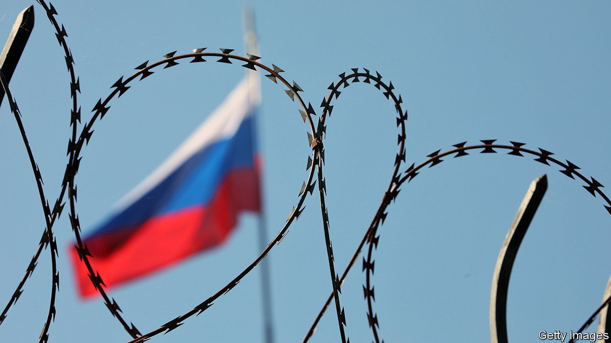

###### Come and take them

# Why the EU will not seize Russian state assets to rebuild Ukraine 

##### It fears the precedent of undermining state immunity under international law 

 

> Jul 20th 2023 


“BANK ROBBERS should not expect banks to honour their safe deposit boxes.” So write Larry Summers, formerly America’s Treasury secretary, and his co-authors in a recent article arguing in favour of seizing Russian assets in Western accounts. More than €200bn ($225bn) of Russian central-bank assets are frozen in the EU alone. Politicians in the bloc’s eastern states, not to mention in Ukraine, want them used to pay for the damages caused by Russia’s invasion. The problem is that under international law there is no clear-cut way to seize those assets without a vote in the UN Security Council, a judgment by the International Court of Justice (ICJ) or a post-war settlement. Each of those would require Russia’s agreement. 

The latest to learn this was none other than Ursula von der Leyen, president of the European Commission. During a speech to the annual Ukraine recovery conference in London on June 21st, she announced that her commission, the bloc’s executive arm, would come up with a proposal before the summer to make use of Russia’s frozen assets. At the same time the ambassadors of the EU’s 27 member states were chewing over a legal assessment of the issue by the EU’s rotating chair, Sweden. The verdict of many around the table, according to those present, was that the legal obstacles would be formidable. 

About a week later, the leaders of the EU’s countries told the commission to restrict any proposal to what was legally plausible: a windfall tax on the private firms that hold the frozen Russian assets, and thus make profits on them. Even that plan is so controversial among member states that the proposal has been postponed until after the summer, according to press reports. The European Central Bank (ECB), too, has major reservations. 

Legally, experts say, the plan is sound. Euroclear, a private clearing-house and securities depository in Belgium, had to stop all payments to Russia as a result of sanctions. It is now sitting on almost €200bn-worth of assets and cash. Smaller amounts are frozen in the accounts of similar firms elsewhere. These holdings generate gains: in Euroclear’s case, €720m of pre-tax profits in the first quarter of 2023 alone. That profit could be taxed more heavily—at a rate approaching 100%—to generate revenues. The clearing house would keep something to compensate it for the cost of managing the cash (which Euroclear says amounted to €9m in the first three months of 2023) and for any higher capital requirements that regulators prescribe. 

Yet the ECB and some finance ministers fear for the euro’s reputation. Any move against Russian central-bank assets could undermine the euro and European government bonds as a store of value for other central banks around the world, they say. At the least, the argument goes, Europe should act in tandem with other states in the G7, the club of the world’s richest democracies, to make sure the reputational loss is shared. 

Critics of the ECB’s position argue that any reputational damage is already done: the reserves became useless to Russia when they were frozen. The G7 made clear on July 12th that the freeze will remain in place until Russia pays for the damage it has done in Ukraine, providing an incentive for Russia to settle. Using revenues from the assets, it is argued, is a small additional harm. If agreement among the G7 can be found, the commission will probably present a proposal after the summer. 

Other ideas have been mooted. The EU could try to get better returns on the assets, for example by demanding that the private entities holding the Russian funds put them into higher-yielding investments, and transfer the profits to an EU fund. But that option has been taken off the table: the legal risks are higher, since the EU would take a more active role in managing Russia’s assets. If losses occurred on the investments, European taxpayers could, awkwardly, be liable for making whole the Russian central bank. 

The eu dismissed more drastic proposals out of hand. It would be a clear breach of international law to seize Russian assets unilaterally. States are immune from other countries’ legal jurisdiction and from having their property expropriated to settle debts. Under international law, sanctions on Russia are permissible only as a means to induce it to act differently. Simply confiscating assets would go beyond what global rules allow. “The rules on countermeasures contain a fine balance between what states need to be allowed to do to protect themselves and their rights, and the risk of abuse, especially by powerful states,” says Federica Paddeu of Cambridge University. Such measures must be temporary, as far as possible reversible and intended as a means to change behaviour, she adds, not as punishment.

Such scruples matter especially to the EU, a club founded on rules. Amid the geopolitical contest between America and China, where international norms seem to matter less and less, the EU is keen to uphold them where it can. In their latest attempts to becomes less dependent on China, European policymakers are at pains to find measures that comply with global trade rules. Less high-mindedly, state immunity protects the EU’s biggest country, Germany, from claims by victims of Nazi occupation. A decade ago, the ICJ ruled that Italian and Greek courts cannot award German government assets to plaintiffs in such cases. There is little chance that Germany would agree to undermining state immunity. Taxing private profits on the Kremlin’s assets may seem like too little for Ukrainians and others outraged by Russia’s atrocities. But it is the most that the EU will be willing to do. ■

