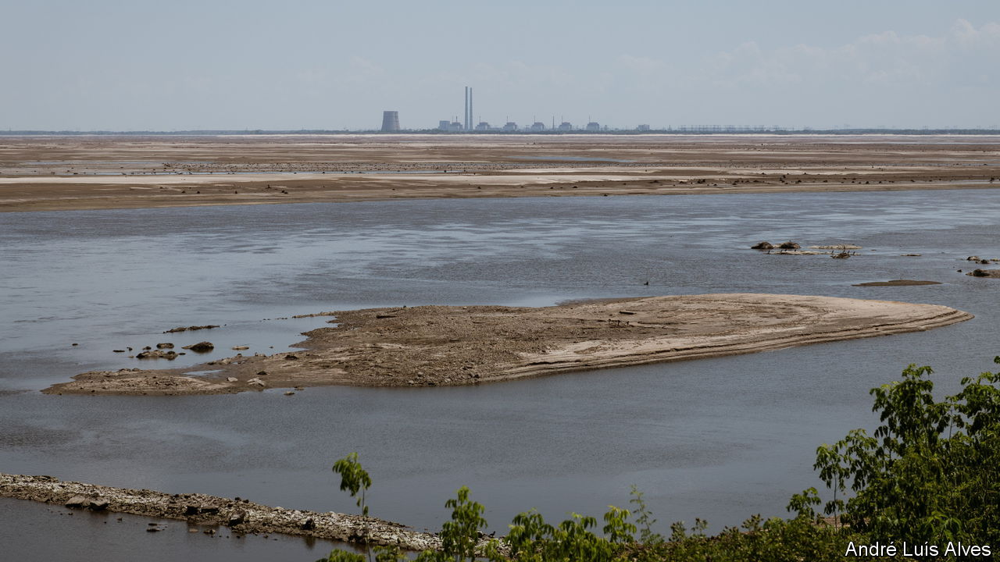

###### Waiting for the afterglow

# Zaporizhia braces itself for Russian nuclear tricks 

##### The nuclear power plant has been taken hostage to guard against Ukraine’s counter-offensive 

 

> Jul 16th 2023 


INITIALLY LIDA POPRUHA, 45, was not sure what to make of claims that Russia was preparing an attack at the nuclear power plant. She knew that her flat in Khortytsky, a district of the city of , sat inside a potential evacuation zone. But would there really be an explosion? And if so, would she be evacuated? But then came a moment of clarity. Ms Popruha recalled the humiliating experience of being caught behind Russian lines in her family home south of the town of Huliaipole a year ago. That had required a fraught escape with her two children to Zaporizhia. 

This time, she would leave before it was too late. On the morning of July 5th the Popruhas quit the city on one of two rickety third-class evacuation carriages added to the 9.45am westbound express train, filled to the brim with anxious humanity. For the second time in less than a year the family were on the move, with two bags of belongings and no plan for what would happen next. 

 


Zaporizhia has seen more of this war—its refugees, destruction and missiles—than almost any other city in Ukraine. Now it must manage its role on the nuclear front line. The huge , 50km south-west of the city, has been turned into a fortified base by the Russian occupiers. For many of those in Khortytsky, one of two neighbourhoods within the 50km evacuation zone, that has meant upping sticks and moving on. 

But others are determined to stay put, even if ordered to leave. “Where will I go, me with my walking stick?” complains Yelena Petrova, a 74-year-old pensioner selling (a fermented rye-based drink) from a keg on Khortytsky’s now-deserted main strip. Ms Petrova says she has prepared water and food and sealed her windows, just in case. But her biggest worry is that she no longer has any customers for her . “It’s really delicious, everyone says so. Perhaps you’ll take some?”

First responders say they have prepared for the worst. It is not a matter of if, they repeat mantra-like, but when—and how bad. The local children’s hospital has prepared a decontamination centre, and supplies of dry food and water for 14 days. On the first sign of nuclear danger—an intermittent rather than constant air-raid alarm—the entire hospital will move to the basement, its chief doctor says. “Each member of staff has their instructions: stay in the building, stay low, turn off ventilation, water, wash the incoming with laundry soap.” 

On June 29th Zaporizhia’s emergency services ran a dress rehearsal for a major incident, with approximately 100 local rescue workers who will be responsible for any evacuation, if it is needed. “The most important thing is to avoid chaos,” says Kyryko Kuzmenko, a specialist in the local emergency ministry. “We have new radioactive hazard suits, and we have drilled for putting out a fire at the plant if it comes to it—and if we get access.”

The worst case for Ukrainian planners is that Russia limits access to a nuclear emergency site while military action continues elsewhere. In recent weeks each side has accused the other of preparing a major incident at the plant. In early July Ukrainian military intelligence warned that Russia had mined two of the six reactor blocks and a cooling reservoir, and was intending to set off an explosion on the night of July 4th-5th. With a preposterous flourish, Russia responded that Ukraine was preparing to attack the plant with a Tochka-U ballistic missile containing radioactive waste. 

Many fear a Russian-engineered incident if the Ukrainian counter-offensive enjoys a breakthrough, either pushing from the north or across the rapidly drying Dnieper reservoir. A Ukrainian military-intelligence source insists that Ukraine would never attempt a “crazy” operation to storm the plant itself.

Earlier this month four inspectors from the International Atomic Energy Agency (IAEA) based at the plant said they had found no evidence of Ukrainian claims that Russia had mined the reactor blocks—though added that they had not been granted full access. A Ukrainian official expresses anger at the statement. How could the inspectors issue conclusions when they were not given full access? Their statements were “obviously” hamstrung by politics, he says. “They are limited in what they can say.”

The Zaporizhia nuclear power plant is the largest of its kind in Europe. At one point it employed 11,000 people; approximately 3,500 remain. Some have signed contracts with the Russian occupier, but the vast majority of top-level staff, including those with responsibility for the reactors, remain employed by Energoatom, Ukraine’s state-run nuclear firm. In phone conversations, several report a regime of “terror” and an absence of fire- and nuclear-safety protocols. 

“Maxim”, a technician who has returned to Kyiv after leaving the plant in early July (a journey that required him to travel thousands of miles through three countries), says the Russians view the power station as a perfect fortified military base. “They see the reinforced walls and doors of the reactor blocks and think, ‘Wow’, what a great place to hunker down in.” (Maxim asks not to publish his real name and position, for fear of inviting retribution on his former colleagues.) The soldiers are in charge of “everything,” he adds. “If they say they need to pour 100 tonnes of sand on the reactor roofs, or install machine-gun positions…there is no one to stop them.”

Petro Kotin, the head of Energoatom, estimates that Russia has stationed 700 soldiers at the plant. “The perimeter has been mined ever since they took control, and they mine other things when they feel like it,” he says. “Soldiers, explosives, military armour. None of this should have any place in a nuclear facility.” In theory, the plant’s design protects against disaster. All its reactors were shut down in September. Five of the six reactor blocks are in full shutdown; although contrary to Ukrainian requests, Russia maintains one in “hot standby shutdown”, meaning the fuel continues to react, albeit slowly. 

The risks of a major incident are low, for now. “If you explode what’s there now, there will be radioactive emissions,” says Mr Kotin. “But it will be 245 times less than if it were to happen on a working reactor.” The modest emissions might not even require the evacuation of people living around the plant. 

But there are other scenarios. Russia could manufacture a serious disaster within less than 24 hours, warns Mr Kotin. “They could power the reactor up, or reduce the water level in the cooling pools to critically low levels,” he says, creating the conditions for a new chain reaction, with serious consequences. It would be difficult to do this without technical assistance. But Oleh Glinsky, a Ukrainian technician who fled the plant in 2022, says it is reasonable to assume the worst. “No one thought [the Russians] would blow up the dam in , but they did.” At a minimum, he suggests, the Russians could seek to inflict enough damage to make the plant economically unviable. 

Ms Popruha, who reached her destination of Khmelnytsky, in western Ukraine, on July 5th, says there is no way of knowing what the Russians have in mind. She is simply pleased to have left Zaporizhia. Nuclear plant or no nuclear plant, it will be a long time before things get back to normal there.■


