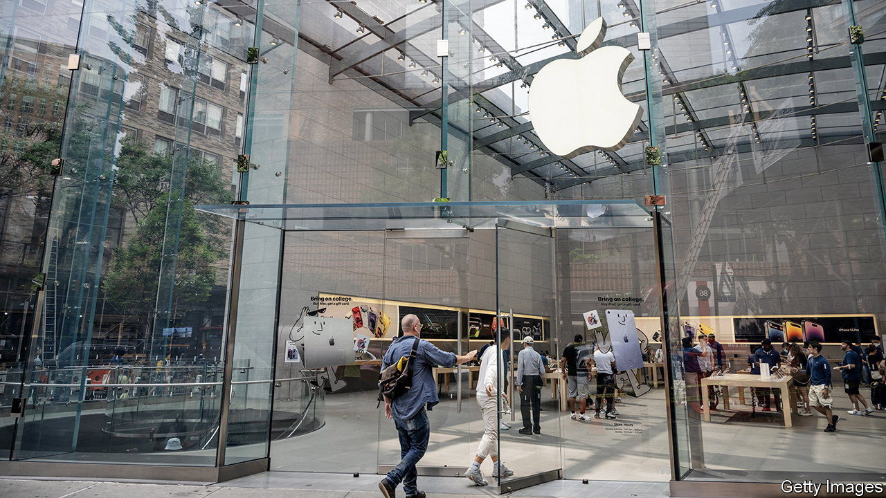

###### Balancing act

# Big tech’s dominance is straining the logic of passive investing 

##### Both index providers and fund managers must adjust to the dominance of a few firms 

 

> Jul 20th 2023 

“Don’t look for the needle in the haystack. Just buy the haystack!” So wrote Jack Bogle, who founded Vanguard Asset Management in 1975 and brought index investment to a mass market. Subsequent decades proved him right. “Passive” strategies that track market indices, rather than trying to beat them, now govern nearly a third of the assets managed by global mutual funds. Since a stockmarket index weighted by company size is just the average of underlying share owners’ performance, it is impossible for investors, in aggregate, to beat it. In the long run, even professional fund managers do not.

Yet today’s haystack has grown unusually top-heavy. Since the start of the year, America’s seven biggest corporate behemoths—Alphabet, Amazon, Apple, Meta, Microsoft, Nvidia, and Tesla—have left the rest of the stockmarket in the dust. Giddy on ai optimism, investors have raised these firms’ combined value by 69%, a much larger increase than that seen in broader indices. The “magnificent seven” now account for 29% of the market value of the s&amp;p 500, and a whopping 61% of the Nasdaq 100, up from 20% and 53%, respectively, at the start of the year.

That leaves index investors in a tight spot. On the one hand, owning shares that have done so blisteringly well that they dominate your portfolio is a nice problem to have. On the other, it is somewhat awkward. After all, part of the buy-the-haystack logic’s appeal lies in the risk-lowering benefits of diversification. Now, buying the Nasdaq 100 appears less like spreading your bets and more like placing them on a few hot companies whose prices have already soared. A supposedly passive investment strategy has come to feel uncomfortably similar to stock-picking.

Nasdaq is therefore stepping in to alleviate the discomfort. As Cameron Lilja, who runs its indexing operations, notes, the Nasdaq 100 is a “modified market-capitalisation weighted” measure. This means the weights assigned to firms’ shares are usually in proportion to each company’s total market value, but that those of the biggest firms can be scaled back if they come to represent too much of the index.

In particular, if the combined weight of shares that each account for more than 4.5% of the index exceeds 48%, as is now the case, Nasdaq’s methodology prescribes a “special rebalance” to cut this to 40%. This is designed, says Mr Lilja, to ensure funds tracking the index comply with regulatory diversification rules. And so on July 24th Nasdaq will reduce the sway of its seven biggest firms (and, conversely, increase that of the other 93 constituents).

 


The result will be a more balanced index, but also some difficult questions about just how passive “passive investing” really is. The biggest fund tracking the Nasdaq 100, Invesco’s “qqq Trust”, invests more than $200bn (roughly the value of Netflix, the index’s 14th-largest firm). Following the rebalancing, it will need to quickly sell large volumes of shares in its biggest holdings and buy more in its smaller ones. It is hard to argue that such a move simply tracks the market rather than—at the margins, at least—influencing it.

The need for rebalancing also highlights a criticism of index investing: that it is really a form of momentum play. Putting money into a fund that allocates it according to firms’ market value necessarily means buying more of the shares that have done well. Conversely, keeping money in such a fund means not taking profits from the outperformers, but continuing to hold them as they grow bigger. Even if chasing winners is often a lucrative strategy, it is not an entirely passive one.

Meanwhile, as America’s stockmarket grows ever more concentrated, some spy an opportunity. On July 13th Invesco announced an “equal-weight” nasdaq 100 fund, investing 1% of its assets in each of the index’s constituents. This sort of strategy will mainly appeal to private investors, who, unlike professional fund managers, can afford to be “index agnostic”, says Chris Mellor, one of those overseeing the launch. This year, the outperformance of the biggest companies would have left investors lagging behind. But trends like this periodically reverse—as in 2022, when the giants plunged (see chart). Mr Mellor guesses that the new fund could garner perhaps a tenth of the assets of its mainstream counterpart. Its administrators, at least, will still be making hay. ■


