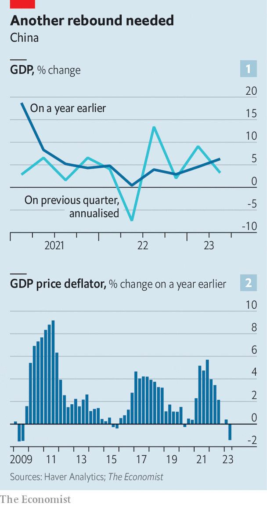

###### A feel-bad recovery

# How much trouble is China’s economy in? 

##### Growth is faltering and the country is flirting with deflation 

 

> Jul 17th 2023 

When janet yellen visited Beijing this month she did her bit for the local restaurant trade. America’s treasury secretary dined with her team at an establishment known for Yunnanese dishes, which subsequently unveiled a “God of Wealth” menu in her honour. She also hosted a lunch with female entrepreneurs and economists (including a representative of The Economist Group). Although restaurants have prospered since China dropped its covid controls at the end of last year, the gods of wealth have been less kind to the rest of the country’s economy—as gdp figures released on July 17th revealed. 

They showed that the economy grew by 6.3% in the second quarter compared with a year earlier. That looks impressive. But it was slower than expected. And the figure was flattered by a low base in 2022, when Shanghai and other cities were locked down. The economy grew by only 0.8% in the second quarter compared with the first three months of the year, an annualised rate of merely 3.2% (see chart 1).

 


Obstacles to growth were both foreign and domestic. The dollar value of China’s exports, for example, shrank by more than 12% in June, compared with a year earlier—the sharpest drop since the height of the pandemic in February 2020. “The recovery of the world economy has been sluggish,” said Fu Linghui of the National Bureau of Statistics, by way of explanation. Meanwhile, the recovery of China’s property market is lost in the cabbage patch. Sales of flats fell by 27% in June compared with a year earlier. They are now running well below the pace economists think would be justified by underlying demand, given China’s urbanisation and the widespread desire for better accommodation. 

China’s “nominal” growth, before adjusting for inflation, was also weaker than the inflation-adjusted figure; something that has happened only four times in the past 40 quarters. It suggests that the price of Chinese goods and services is falling. Indeed, it implies they fell by 1.4% in the year to the second quarter, which would be the sharpest drop since the global financial crisis (see chart 2). 

Consumer prices did not rise at all in June compared with a year earlier, and producer prices—charged at the factory gate—fell by 5.4%. China’s statisticians have blamed this weakness on changes in global commodity prices, such as the falling cost of oil. That is an unconvincing explanation for the weakness of China’s nominal growth, because gdp should count only the value added to a good in China itself, thus excluding the value of imported commodities. Perhaps deflationary pressures are spreading. Or perhaps China’s statisticians have got their sums wrong. 

Mulish response

Some members of the public feel the economy is doing even worse than the official figures suggest. There is a “temperature difference” between the macroeconomic data and “micro feelings”, as one commentator put it. In response, Mr Fu of the National Bureau of Statistics pointed out that macroeconomic data are more comprehensive and reliable than “micro feelings”—prompting a netizen to joke that if state statisticians say you are okay, you should adjust your feelings accordingly. 

The government’s own feelings towards the economy are hard to read. During the global financial crisis, when world trade fell off a cliff, China’s authorities swooped in with vast stimulus, which propelled economic growth and spilled over to the rest of the world. Today they seem in no such rush. The country’s central bank has cut interest rates a little. Tax breaks on electric vehicles have been extended. The state’s planning agency has held pep talks this month with firms ranging from Baidu, an internet giant, to Spring Tour, a tourism agency, and Donkey Meat Cao Catering, a firm serving donkey burgers. Leaders have released 31 guidelines exhorting officials to promote the private sector. But no detailed fiscal-stimulus plan has emerged.

This lack of urgency may reflect the government’s enduring confidence in the recovery. Officials may believe that the economy still has enough momentum to meet their targets for the year, including for gdp growth of around 5%. The government’s restraint may also betray its misgivings about additional stimulus. Policymakers do not want a lending and spending spree to erode the profitability of state-owned banks or undermine financial discipline among local governments.

The government can draw some comfort from the job market. China’s economic reopening so far has been led by services industries, such as restaurants, that tend to be labour-intensive. China’s cities have added 6.8m jobs in the first six months of the year, more than half of the government’s 12m target for the year. Although unemployment among urban youth increased to 21.3%, the overall jobless rate remained steady at 5.2% in June, below the target of 5.5%.

But the labour market can be a lagging indicator of economic momentum. If growth remains weak, unemployment will eventually edge up. By that point, the government will be forced to do more to revive the economy. Options include further cuts to interest rates, a weaker currency and extra support for property developers. 

The problem is that such “quick and easy” measures might not be enough, argue Yu Xiangrong and his colleagues at Citigroup, a bank. Slower, more difficult options include cash handouts to poor families, as well as additional investment in green infrastructure, financed by state-guided policy banks or even—heaven forfend—central-government bonds. Chinese policymakers are willing to tolerate a temperature difference between official data and public feelings. They will be unwilling to tolerate a glaring gap between the economy and their targets. ■


