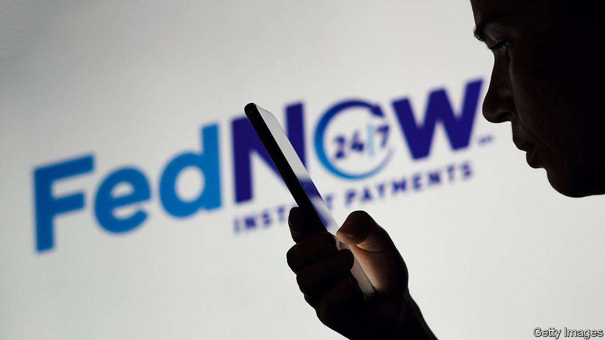

###### FedLate

# Instant payments finally reach America with FedNow 

##### The country’s banks are not entirely on board 

 

> Jul 20th 2023 

America’s financial plumbing is overdue a spot of maintenance. The current payment “rails” on which it is based—built by a group of the country’s biggest banks to replace paper cheques—are more than half a century old and run on antiquated code. Although robust, the system is painfully slow. American payments are less sophisticated than those in the rest of the rich world, and indeed those in much of the poor world, too.

It is a problem the Federal Reserve is trying to fix with a centralised instant-payments system, which it launched on July 20th. Aptly called FedNow, this will allow Americans to ping money to their compatriots, via their existing financial institutions, and for payments to settle straight away. All told, 35 banks and 16 payment providers have signed up to use the service. 

Most American bank transfers are cheap but processed in batches, often taking days to settle. Peer-to-peer networks, like Cash App, appear much quicker to customers but, beneath the surface, rely on the old system. Regulators have warned that funds held on such apps might not qualify for deposit insurance in the event of a failure. Credit cards, which offer juicy rewards at the cost of even juicier fees, also use existing rails. According to the San Francisco Fed, nearly a third of payments last year were made using plastic.

Typically, Americans use different methods for different types of payment: a water bill is paid via bank transfer; $100 owed to a friend is sent through a payment app; a purchase on Amazon is made with a credit card. A single, real-time payments solution should improve the quality of all.

JPMorgan Chase and Wells Fargo, two heavyweight banks, have signed up to FedNow. But Wall Street is not entirely on board: a longer list of institutions, including Bank of America, Citigroup and Goldman Sachs, is absent. Although the older system is slow, it is also profitable for those involved. Financial institutions can take advantage of slow settlements to park cash in interest-bearing short-term securities overnight, or merely keep the money at the Fed to accrue interest. They also pocket late-payment fees and some make money from their own instant-payment systems, such as The Clearing House, which is run by a group of banks.

Some observers, recalling the banking turmoil this spring, worry that FedNow might destabilise the financial system. A report by Moody’s, a credit-ratings agency, warns that the new scheme could make bank runs more likely by making it easier for depositors to flee. Such worries are likely to prove overblown, however. The current system, where weekends are closed for business, provided little relief to Silicon Valley Bank and others a few months ago. Moreover, since FedNow is a back-end system, participating institutions are able to set limits in line with their risk appetite. They can, for instance, cap payments or limit transactions. 

 


Other countries are also light years ahead of America—and do not appear more vulnerable to bank runs. In India, for example, instant payments are the norm, accounting for 81% of domestic electronic transactions last year (see chart). In Thailand and Brazil they accounted for 64% and 37% respectively. Emerging markets have embraced instant payments in part because of demography (consumers are younger and more open to change), in part because of a crackdown on cash (policymakers are keen to shrink the size of grey markets, and increase tax takes) and in part because, unlike in America, new payment systems did not have to push aside existing ones, and those who benefited from them.

FedNow is unlikely to transform payments immediately. The scheme will only support “push” transfers—ones that consumers initiate themselves. By contrast, FedNow’s counterparts in Europe and India also have “pull” capabilities that businesses may use when given permission (which enable, say, regular payments for electricity). Fed officials claim to have no plans to extend the system for such uses, but bankers suspect it is the next step. 

Mass adoption will face one more hurdle: the American consumer, over whom paper-based payments retain a particular hold. According to aci Worldwide, a payments firm, around a fifth of all cash transfers in the country happen via cheque. Still, it will be nice for them to have the option, just like the rest of the world. ■


