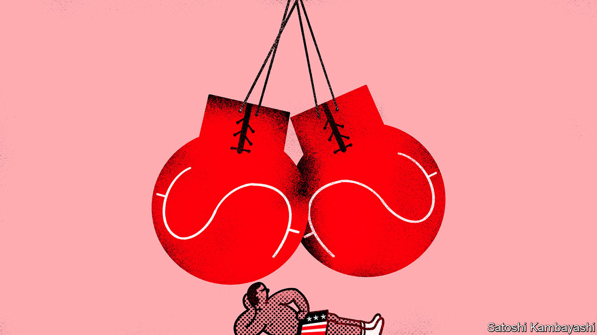

###### Buttonwood

# The dollar’s dip will not become a sustained decline 

##### Two pillars of strength hold up the greenback 

 

> Jul 20th 2023 

The ENDLESS queues, filled with American accents, outside Dishoom, a chain of upmarket British curry houses that has gained international fame thanks to TikTok, tell a story which anyone who has recently visited Paris, Rome or Tokyo can confirm: the dollar is mighty. American tourists are rushing to take advantage of bargain sterling-, euro- and yen-denominated holidays. 

Those who booked early will have scored the biggest bargains, however. The dollar is still strong by the standards of the past two decades. But since its peak in September, it has dropped by 13% against a basket of currencies. The sell-off accelerated last week, when the dollar fell by 3%—a big move for a currency. The dxy index, which measures the currency against six others, is at its lowest since April 2022, just after the Federal Reserve started to raise interest rates.

The recent weakening is welcome news for those parts of the world, particularly developing countries, which rely on financing in foreign currencies. Emerging-market issuance of dollar bonds hit an 11-year low in 2022. Frontier markets—the smallest, least liquid and often poorest such markets—issued less than $10bn of dollar bonds last year, down from $30bn in 2021. 

Sadly for these countries, there is reason to doubt the dollar’s dip is the start of a new phase. To understand why, consider what caused the fall. The recent sell-off was prompted by American inflation data, released on July 12th, which showed consumer prices rose by just 3% year-on-year in June—still above the Fed’s 2% target, but the lowest rate in over two years, and below analysts’ expectations. Investors now wonder if the Fed is about to declare victory in its fight against inflation.

Another reason for the recent decline is that inflation is falling more slowly outside America, particularly in Britain and the euro zone. Even in the land of low inflation, Japan, consumer prices rose by 3.2% year-on-year in May—higher than America’s figures a month later. Central bankers in such countries may have more fighting ahead. Higher rates would drag investment from dollar-denominated assets into higher-yielding currencies.

The third reason for the decline is middling American growth. The country’s gdp is expected to increase by a modest 1.3% this year. Stephen Jen, now of Eurizon Capital, an asset-management firm, first posited the idea of a “dollar smile” a couple of decades ago. The theory suggests that when America is powering ahead of the world, the dollar strengthens as investors pour in. But the currency can also strengthen when the world’s largest economy is in the doldrums, since a depressed American economy is a threat to global financial stability. That paradoxically adds to demand for the country’s safe Treasury bonds. Mr Jen today sees the American economy’s lukewarm growth, which puts it in the middle of the smile, as a sign of dollar weakness to come.

Yet these driving forces are hardly guaranteed to continue. Each could suddenly reverse, causing the dollar to strengthen once more. If inflation proves to be stickier than expected in America, for instance, and stops dropping quite so rapidly, Fed policymakers have made clear that they would be willing to keep raising interest rates aggressively. Moreover, it is still possible that America’s economy will slow under the weight of higher interest rates, despite the remarkable resilience it has so far displayed.

Indeed, it may transpire that other rich economies are simply running a few months behind America. American prices rose more rapidly than those elsewhere in 2021, and the Fed began raising interest rates earlier than most central banks the next year. Britain’s latest inflation figures, released on July 19th, showed prices rising by 7.9% year-on-year in June, below the 8.2% forecast. Whether an investor believes the surge in inflation was caused by a transitory burst of supply-side factors, or is the result of monetary and fiscal largesse, they will think there is a good chance inflation elsewhere will follow America’s downwards trend. If this does happen, monetary policy in America and the rest of the world would look more similar. 

The global situation would also look similar to that found—with the exception of recent years—since the dollar’s sharp rally in late 2014 and throughout 2015. Now, as then, the American economy is stronger than its competitors and American stocks are more favoured than those elsewhere. With these two pillars of strength in place, it is difficult to imagine a markedly weaker dollar.■


