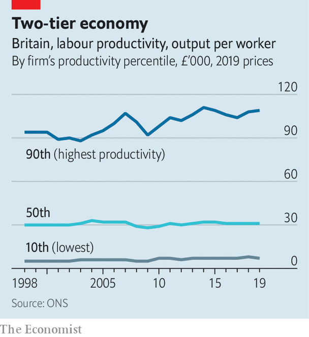
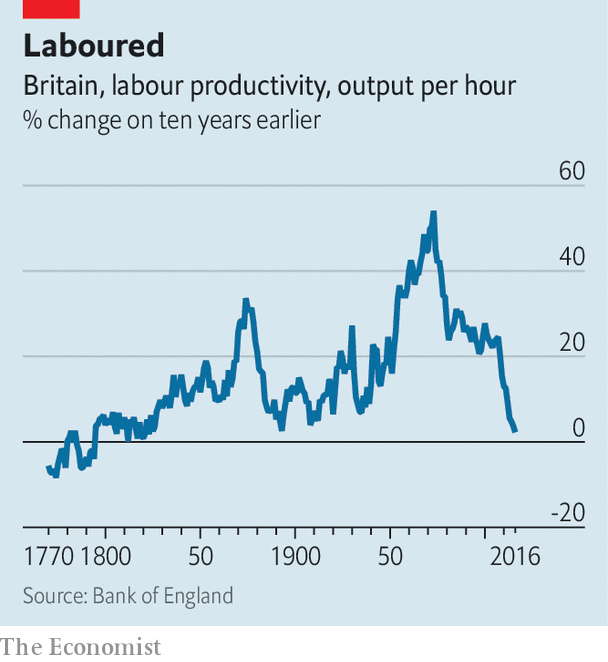

###### Machine dreams

# Your employer is (probably) unprepared for artificial intelligence 

##### That is bad news for your earnings—and the broader economy 

 

> Jul 16th 2023 

To understand the impact that artificial intelligence may have on the economy, consider the tractor. Historians disagree about who invented the humble machine. Some say it was Richard Trevithick, a British engineer, in 1812. Others argue that John Froelich, working in South Dakota in the early 1890s, has a better claim. Still others point out that few people used the word “tractor” until the start of the 20th century. All agree, though, that the tractor took a long time to make a mark. In 1920 just 4% of American farms had one. Even by the 1950s less than half had tractors. 

Speculation about the consequences of ai—for jobs, productivity and quality of life—is at fever pitch. The technology is awe-inspiring. And yet ai’s economic impact will be muted unless millions of firms beyond tech centres like Silicon Valley adopt it. That would mean far more than using the occasional chatbot. Instead, it would involve the full-scale reorganisation of businesses, as well as their in-house data. “The diffusion of technological improvements”, argues Nancy Stokey of the University of Chicago, “is arguably as critical as innovation for long-run growth.” 

The importance of diffusion is illustrated by Japan and France. Japan is unusually innovative, producing on a per-person basis more patents a year than any country bar South Korea. Japanese researchers can take credit for the invention of the qr code, the lithium-ion battery and 3d printing. But the country does a poor job of spreading new tech across its economy. Tokyo is far more productive than the rest of the country. Cash still dominates. In the late 2010s only 47% of large firms used computers to manage supply chains, compared with 95% in New Zealand. According to our analysis, Japan is roughly 40% poorer than would be expected based on its innovation. 

France is the opposite. Although its record on innovation is average, it is excellent at spreading knowledge. In the 18th century French spies stole engineering secrets from Britain’s navy. In the early 20th century Louis Renault visited Henry Ford in America, learning the secrets of the car industry. More recently, former ai experts at Google and Meta founded Mistral ai in Paris. France also tends to do a good job of spreading new tech from the capital to its periphery. Today the productivity gap in France between a top and a middling firm is less than half as big as in Britain. 

During the 19th and 20th centuries businesses around the world became more French, with new technologies diffusing ever faster. Diego Comin and Martí Mestieri, two economists, find evidence that “cross-country differences in adoption lags have narrowed over the last 200 years.” Electricity swept across the economy faster than tractors. It took just a couple of decades for personal computing in the office to cross the 50% adoption threshold. The internet spread even faster. Overall, the diffusion of technology helped propel productivity growth during the 20th century.

 


Since the mid-2000s, however, the world has been turning Japanese. True, consumers adopt tech faster than ever. According to one estimate TikTok, a social-media app, went from zero to 100m users in a year. Chatgpt was the fastest-growing app in history until Threads, a rival to Twitter, launched this month. But firms are increasingly cautious. In the past two decades all sorts of mind-blowing innovations have come to market. Even so, according to the latest official estimates, in 2020 just 1.6% of American firms employed machine learning. In America’s manufacturing sector just 6.7% of companies use 3d printing. Only 25% of business workflows are on the cloud, a number that has not budged in half a decade.

Horror stories abound. In 2017 a third of Japanese regional banks still used cobol, a programming language invented a decade before man landed on the moon. Last year Britain imported more than £20m-($24m-) worth of floppy disks, MiniDiscs and cassettes. A fifth of rich-world firms do not even have a website. Governments are often the worst offenders—insisting, for instance, on paper forms. We estimate that bureaucracies across the world spend $6bn a year on paper and printing, about as much in real terms as in the mid-1990s.

Best and the rest

The result is a two-tier economy. Firms that embrace tech are pulling away from the competition. In 2010 the average worker at Britain’s most productive firms produced goods and services worth £98,000 (in today’s money), which had risen to £108,500 by 2019. Those at the worst firms saw no rise. In Canada in the 1990s frontier firms’ productivity growth was about 40% higher than non-frontier firms. From 2000 to 2015 it was three times as high. A book by Tim Koller of McKinsey, a consultancy, and colleagues finds that, after ranking American firms according to their return on invested capital, the 75th percentile had a return 20 percentage points higher than the median in 2017—double the gap in 2000. Some companies see huge gains from buying new tech; many see none at all. 

 


Although the economics can sound abstract, the real-world consequences are familiar. People stuck using old technologies suffer, along with their salaries. In Britain, average wages at the least productive 10% of firms have fallen slightly since the 1990s when adjusted for inflation—even as average wages at the best firms have risen strongly. According to Jan De Loecker of ku Leuven and colleagues, “the majority of inequality growth across workers is due to increasing average wage differences between firms”. What, then, has gone wrong?

Three possibilities explain lower diffusion: the nature of new technology, sluggish competition, and growing regulation. Robert Gordon of Northwestern University has argued that the “great inventions” of the 19th and 20th centuries had a far bigger impact on productivity than more recent ones. The problem is that as technological progress becomes more incremental, diffusion also slows, since companies have less incentive and face less competitive pressure to upgrade. Electricity provided light and energy to power machines. Cloud computing, by contrast, is needed only for the most intensive operations. Newer innovations, like machine learning, may be trickier to use, requiring more skilled workers and better management. 

Business dynamism fell across the rich world in the first decades of the 21st century. Populations aged. Fewer new firms were set up. Workers moved companies less frequently. All this reduced diffusion, since workers spread tech and business practices as they move across the economy. 

 


In industries run or heavily managed by the government, technological change happens slowly. As Jeffrey Ding of George Washington University notes, in the centrally planned Soviet Union innovation was world-beating—think of Sputnik—but diffusion was non-existent. The absence of competitive pressure blunted incentives to improve. Politicians often have public-policy goals, such as maximising employment, that are inconsistent with efficiency. Heavily regulated industries make up a big chunk of Western economies today: such sectors, including construction, education, health care and utilities, account for a quarter of American gdp.

Could ai break the mould, diffusing across the economy faster than other recent technologies? Perhaps. For almost any firm it is easy to dream up a use-case. No more administration! A tool to file my taxes! Covid-19 may have also injected a dose of dynamism into Western economies. New firms are being set up at the fastest pace in a decade, and workers are swapping jobs more often. Tyler Cowen of George Mason University adds that weaker firms may have a particular incentive to adopt ai, because they have more to gain.

ai can also be incorporated into existing tools. Many coders—maybe most—already use the technology on a daily basis owing to its integration in everyday coding instruments through Github’s Copilot. Word processors, including Google Docs and Microsoft Word, will soon roll out dozens of ai features. 

Not a dinner party

On the other hand, the most significant benefits from new forms of ai will come when firms entirely reorganise themselves around the new technology; by adapting ai models for in-house data, for example. That will take time, money and, crucially, a competitive drive. Gathering data is tiresome and running the best models expensive—a single complex query on the latest version of Chatgpt can cost $1-2. Run 20 in an hour and you have passed the median hourly American wage. 

These costs will fall, but it could take years for the technology to become sufficiently cheap for mass deployment. Bosses, worried about privacy and security, regularly tell that they are unwilling to send their data to modify models that live elsewhere. Surveys of small businesses are not encouraging. One, by GoDaddy, a web-hosting company, suggests that around 40% of those in America are uninterested in ai tools. The technology is undoubtedly revolutionary. But are businesses ready for a revolution? ■


