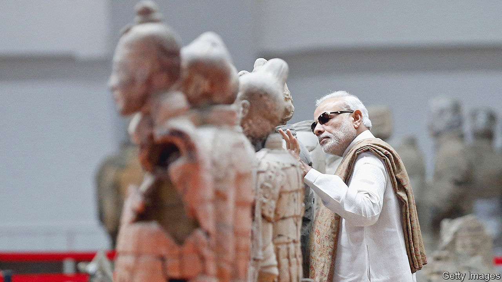
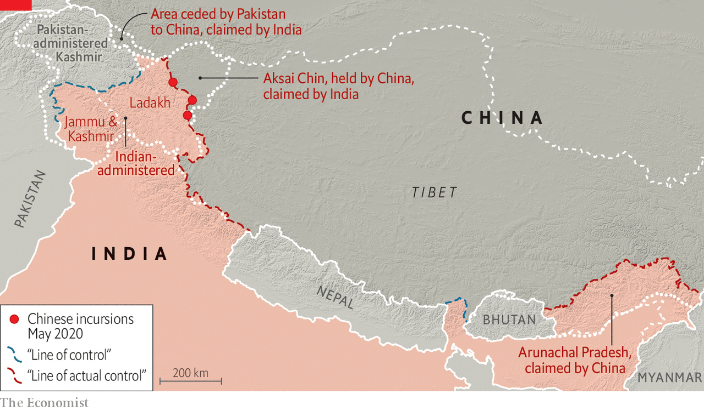
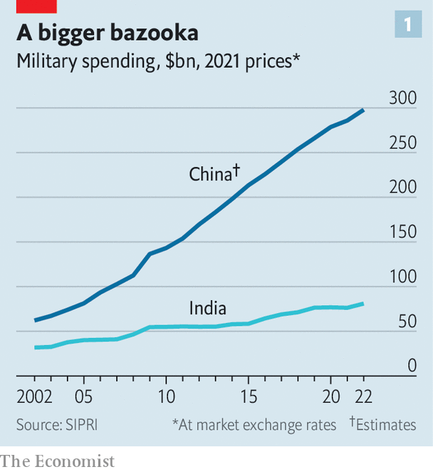
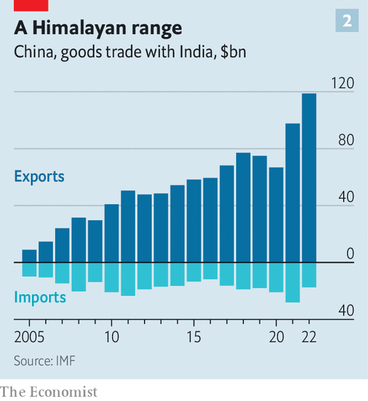

###### Asia’s biggest beasts

# What if China and India became friends? 

##### Setting aside their border dispute could transform their relationship—and geopolitics 

 

> Jul 19th 2023 

China’s rulers like to look down on India. They scorn its turbulent politics, its creaky infrastructure and its poverty.  has looked across with a combination of fear and envy, hoping in vain to be treated . Now the tectonics of the trans-Himalayan relationship are shifting. Recent border bloodshed suggests mounting hostility. But blossoming economic ties tell a different story that could trouble America and its allies.

When India’s most revered poet toured China in April 1924, Chinese intellectuals were unimpressed. Rabindranath Tagore had been feted globally as the first non-European Nobel literature laureate. A fierce critic of British rule in India, he hoped to rebuild an ancient cultural bond between Asia’s oldest civilisations. 

For leading Chinese thinkers, however, his call for a revival of Eastern values and spirituality rang hollow. The Chinese, they argued, could only resist the West by learning from it—and rejecting their own traditional culture. China’s youth should not become “Indianised”, wrote Chen Duxiu, a co-founder of the Chinese Communist Party. “Unless, that is, they want their coffins to lie one day in a land under the heel of a colonial power.”

Almost a century later, a sense of disdain still infuses perceptions of India among Chinese officials and scholars. Just look at the data, they say. At its independence in 1947, India’s GDP per head was higher than China’s (on a purchasing-power basis). But by the early 1990s, China had moved ahead on that and many other measures. By 2022, their populations were roughly equal but China’s economy was more than three times bigger. 

China’s generals tend to dismiss India, too. China’s crushing victory in a border war in 1962 is recalled with pride. And they contrast China’s current arsenal of home-grown modern weaponry with India’s continuing reliance on Russian imports. “There’s no way that India can catch up with China in the next 20-30 years,” says Senior Colonel Zhao Xiaozhuo of China’s Academy of Military Science.

Yet the fundamentals of the China-India relationship—military and economic—are now changing in ways that are forcing the world’s biggest democracy and its largest autocracy to reassess how they deal with each other, and with the rest of the world. The hope among American and allied officials is that India’s continuing frontier friction with China is pushing it irreversibly into a democratic coalition determined to constrain Chinese power. The question is: what if they find a way to shelve the border dispute?

 


Consider the military equation first. India has been drawing closer to America since they signed a civil nuclear co-operation pact in 2008. But their alignment has accelerated since a series of clashes on the Indian frontier with China, including one in 2020 that killed 20 Indian troops and at least four Chinese ones. That was the bloodiest skirmish there since 1967 and brought to an end a three-decade period of relative stability on the border. 

India’s armed forces have since undergone a historic shift of focus away from Pakistan. They have transferred about 70,000 troops as well as fighter jets and surface-to-air missiles to the frontier with China. They have also expanded joint exercises with America and its allies, especially Australia and Japan. America has provided some intelligence and high-altitude training for Indian border forces too.

The war in Ukraine has provided another spur. Indian commanders fret about their dependence on Russian arms. India wants to buy advanced American weaponry and to make more in India. In Washington in June the prime minister, Narendra Modi, made progress, with deals to buy armed aerial drones and to jointly manufacture fighter-jet engines in India.

China’s exact motivations on the border are murky. It may have been responding to recent Indian road-building, which enabled more extensive patrolling, or to frustration at a lack of progress in negotiations on a settlement. Or it may have wanted to penalise India for its earlier rapprochement with America, to expose the relative weakness of Indian forces and to show that they cannot rely on American help. 

China sees itself as in another league from India, competing directly with America, says Deependra Singh Hooda, a former chief of the Indian Army’s Northern Command, which oversees part of the Chinese border. China’s message appears to be: “You’re no match for the PLA (People’s Liberation Army)…You’re just a sideshow.” 

A two-sided triangle

For whatever reason, Xi Jinping, China’s leader, seems to think the fallout manageable. India’s redeployments mean it can impose greater costs on China if it tries another border incursion. But China will for years keep enough military superiority to deter India from trying to recoup any perceived losses (see chart 1). And though India can help America in some areas, notably the Indian Ocean, it balks at a formal alliance and is unlikely to join a conflict over Taiwan or the South China Sea.

 


Nonetheless, Mr Xi has strong incentives to stabilise the border, as America steps up efforts to circumscribe Chinese power. So does Mr Modi. He seems keen to play down the frontier issue, knowing he has few military options. He is wary of drawing domestic attention to any perceived loss of territory. And compromise seems possible. After 18 rounds of talks between military commanders, troops have pulled back from five flashpoints, establishing “buffer zones” where neither side patrols. Two major flashpoints remain. 

China is pushing for another round of talks and urging India not to let the border issue define the bilateral relationship. India’s foreign minister, Subrahmanyam Jaishankar, met his Chinese counterpart in Jakarta on July 14th and discussed the frontier. In recent weeks he has stressed that without a peaceful and stable border, normal business ties cannot be resumed.

 


A survey of the economic landscape, however, puts such Indian warnings in perspective. Commerce between China and India was negligible for most of their modern history. But by 2020 trade in goods had surged to $88bn, with China enjoying a surplus of $46bn and ranking as India’s biggest trade partner (see chart 2). China had also become a big source of investment, notably in technology, property and infrastructure. Chinese brands are popular, too. Oppo and Xiaomi are among the bestselling mobile phones.

The border skirmish in 2020 put that all at risk. India banned some 320 Chinese apps, launched tax raids on several Chinese companies and introduced new rules requiring the Indian government’s approval for Chinese investments. Indian officials say they since have rejected 157 relevant applications. And yet bilateral goods trade grew by 43% in 2021 and 8.6% last year. Chinese investment is finding ways in too, sometimes via Singapore. Shein, a Chinese online fashion company whose app was among those banned by India in 2020, is relaunching there soon in partnership with Reliance Industries, India’s biggest private company. 

Indian officials want to rely less on Chinese imports and to woo more investment from elsewhere, notably big multinational manufacturers looking for an alternative to China. “We need to stop looking for a China fix,” Mr Jaishankar, the Indian foreign minister, said in May. “Indian growth cannot be built on Chinese efficiency.”

Privately, though, many of India’s business leaders predict that it will depend on Chinese imports for years to come if the Indian government is to achieve its goals in developing infrastructure and manufacturing. India’s pharmaceutical industry, for instance, relies on China for roughly 70% of its active ingredients.

That does, in theory, make India vulnerable to the kind of economic coercion that China has inflicted on others. But China’s leverage may be waning as it faces an economic slowdown, a shrinking population and an increasingly hostile West. Chinese companies now see India, whose population overtook China’s this year, as an important source of growth, with Goldman Sachs predicting that Indian GDP will be second only to China’s by 2075. 

There are economic synergies in other areas too. India is the biggest borrower from the Beijing-based Asian Infrastructure Investment Bank, which China set up in 2016 as an alternative to Western-led lending institutions. India is also a member of the Shanghai-based New Development Bank, formed by Brazil, Russia, India, China and South Africa (the BRICS) in 2015.

Hearty economic exchanges are no guarantee against further border bloodshed—or even war. Both countries are led by men who feed off nationalism and historical grievances. Other tensions include China’s growing influence in South Asia, its damming upstream of rivers vital to India, and the sanctuary that India affords the Dalai Lama, Tibet’s spiritual leader. 

Still, the burgeoning business ties will weigh ever heavier in both sides’ decision-making. And stabilising the border issue, as was achieved for three decades after Rajiv Gandhi visited China as Indian prime minister in 1988, would leave ample room for co-operation. Both countries want a bigger role in global governance, reject Western criticism on human rights and climate change and share concerns about Islamic extremism. Both refuse to condemn Russia’s invasion of Ukraine. 

Also noteworthy is that before the recent frontier flare-up, Mr Modi seemed determined to build a close relationship with Mr Xi, taking the unusual step of hosting him in his home state of Gujarat in 2014. India and China shared similar aspirations, challenges and opportunities, Mr Modi said in Beijing the following year. “In the global uncertainties of our times, we can reinforce each other’s progress.” 

Such a prospect may not please Americans and others who see India as a counterweight to China. Nor is it what Tagore had in mind in 1924, when he urged China to reject Western materialism and “free the human soul from the dungeon of the machine”. But it may be the more realistic path towards a sustainable, mutually beneficial relationship between Asia’s titans. ■

