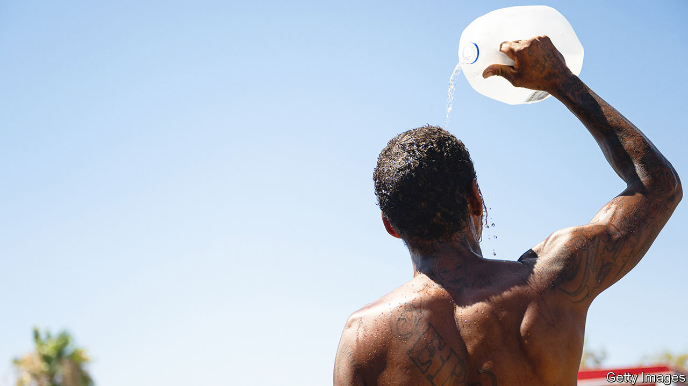

###### Too darn hot

# How cities can respond to extreme heat 

##### Officials from Beijing to Phoenix are grappling with unbearable temperatures 

 

> Jul 20th 2023 

The best thing that has happened in Phoenix, Arizona, since the beginning of July is that the electricity grid has kept functioning. This has meant that during a record-breaking run of daily maximum temperatures above 43°C (110°F), still in progress as went to press, the houses, indoor workplaces and publicly accessible “cooling stations” in the city have been air-conditioned. There have been deaths from heat stroke and there will be more; there has been a lot of suffering; and there will have been real economic losses. But if Arizona’s grid had gone out, according to an academic quoted in “”, a new book, America would have seen “the Hurricane Katrina of extreme heat”. 

It is not just the United States, where 100m people are under heat-advisory notices, that is suffering. There is currently a spate of such heatwaves around the world. Much of the Mediterranean is in similar straits, with temperatures exceeding 40°C (104°F) from Madrid to Cairo (which is suffering power cuts). In Beijing July 18th saw a 23-year-old record broken by a 27th consecutive day with a maximum temperature above 35°C. By increasing the odds of a wide range of extreme events,  also increases the chances that they will come in waves.

Unbearable heat does damage in various ways, including killing crops and livestock, but the immediate challenge it poses to human health is greatest in cities. Less vegetation, more sunlight-absorbing tarmac and more waste heat produce what is called the urban-heat-island effect, exacerbating temperatures. Cities also often have poor air quality, particularly in the places where the poorest people live; extreme heat on top of dirty air can stretch already hard-pressed lungs and hearts too far. 

There are things to do as soon as the mercury rises. Get homeless people to cooling stations; encourage people to look in on elderly neighbours and relatives (the old, especially women over 80, dominate the excess deaths associated with heatwaves); make it possible for those who must work outside to do so very early in the morning; put hospitals on an emergency footing. The appointment of  empowered to co-ordinate such things in American cities, and farther afield, is a welcome trend.

There are also things to be done in advance. It is crucial to work out where the people at greatest risk live. One thing that can help is deciding where to plant trees, which both provide shade and, as water evaporates through their leaves, cool the air. (It is probably best to work out how to keep them green using wastewater, too, especially if, like the people of Phoenix, you live in a desert.) There are smart choices to be made about the built environment, from the best sort of pavement and courtyards designed for passive cooling to the prevalence of white roofs; there are building codes to update so as to make those choices easier, as well as regulations to change so that workers are not endangered by midday heat.

All these measures are easier to take when a city has resources to devote to them. In the developing world, where a lack of air conditioning makes heat all the more deadly, such resources are scarce. All the more need for leaders to take the issue seriously and for local politicians to see cooling plans as a way to compete for votes. Unfortunately, such a strategy works best in places where voters have already felt the consequences of failing to act. That makes studies which reveal that many places are at increasing risk of vicious heatwaves but have yet to experience one particularly troubling. Phoenix at least knows what to expect—and what it will have to go on expecting for decades to come.■


