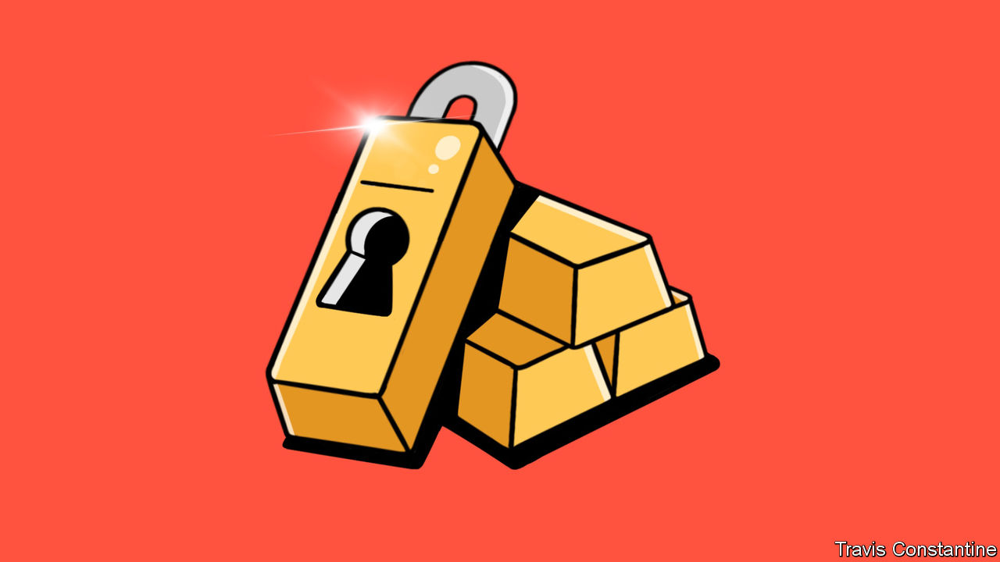

###### Sanctions and reparations

# Should Ukraine get Russia’s frozen reserves? 

##### How to make Russia pay for the war while upholding international law 

 

> Jul 20th 2023 

Ever since  in February 2022 Western governments have made a show of clamping down on private Russian assets held abroad, from  oligarchs’ yachts to forcing the sale of Russian-owned football clubs. But there remains a huge question mark over the really big money. Some $300bn of Russian central-bank assets are frozen in Western accounts as a result of sanctions. Given the horrors that Russia has inflicted on its neighbour, the idea of tapping this pot to help compensate and rebuild Ukraine has naturally arisen. 

The moral case to make Russia pay is obvious. It has waged war without provocation, without regard to civilian lives and in frequent violation of international law. The damage to Ukraine has been vast: the cost of  has hit $411bn, according to the latest estimates from the World Bank, which were compiled before the destruction of the Kakhovka dam. These sums are far beyond the capacity of Ukraine, which now has a gdp of about $150bn. Western taxpayers should not have to foot all the bill.

Yet it is vital that any measures the West takes comply with international law. For Ukrainians and their backers, the war is not just about defending one country against an aggressor but also about upholding the post-1945 global order, which underpins the world’s economy and security. Whatever the West does with Russia’s frozen assets will set a precedent that will shape global behaviour for decades to come.

 are protected from seizure under international law, and typically under domestic law, too . There are exceptions to this doctrine of sovereign immunity, but lawyers have advised America and the European Union that they may not apply in Russia’s case. A vote in the un Security Council could provide a clear legal basis for seizing the assets, but Russia has a veto there. Reparations can be part of a peace deal, but that requires the agreement of both sides. 

What to do? The best approach involves three steps. The first is to seize the income that the Russian assets generate and hand it over to Ukraine. Euroclear, a Belgian clearing house and depository that holds almost $225bn of frozen Russian assets, makes profits from investing them. Taxing those at a 100% rate could generate over $3bn per year, and is legal. At a minimum Ukraine could be assured of a recurring stream of income worth 2% of its present gdp. As a one-off this is peanuts; received each year in perpetuity it is well worth having.

The second step is to make the payment of reparations by Russia a condition of any eventual release of its reserves (or easing of sanctions). The two must go in lockstep. Estimates of Russia’s capacity to pay should take account of its frozen reserves: think of them as a bit like collateral being held against a future claim. The g7, a group of rich countries, has recently adopted this position. The more countries that do so, the better. 

Finally, patient, relentless work is needed to expand the legal case against Russia. It is still possible that a watertight case for immediate seizure can be built. Further votes at the un General Assembly in favour of this would help: although the assembly can only make recommendations, this can sometimes be deemed a stand-in for the Security Council if the latter fails to exercise its primary responsibility to maintain international peace and security.

At the same time, laying the groundwork for a future reparations process is vital. The arbiter of Ukraine’s claims could be the International Court of Justice (icj) or a un compensation commission like the one set up by the Security Council after Iraq’s invasion of Kuwait in 1990. To try to justify its invasion, Russia has claimed that Ukraine was committing genocide against Russian-speakers in the east of the country. Ukraine wisely asked the icj to rule on this, and the verdict was clear: there was no such genocide, so Russia’s pretext is bunk. The West should continue to support the meticulous recording of war crimes and damage to ensure this evidence is available for any eventual financial showdown.

It would, of course, be simpler just to grab all Russia’s frozen assets; but that is what dictatorships do. Far better to take the legal path, which guarantees Ukraine a stream of income, secures priority for its claim on Russia’s reserves and enhances its already strong case for reparations. It is possible to help Ukraine, make Russia pay—and uphold international law. ■

